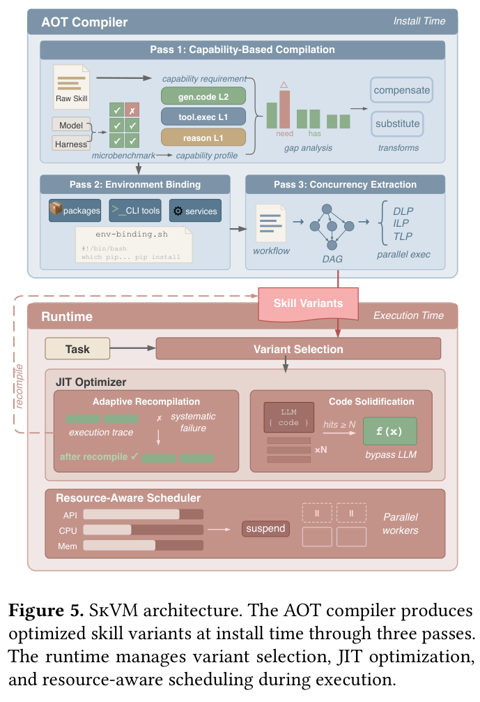
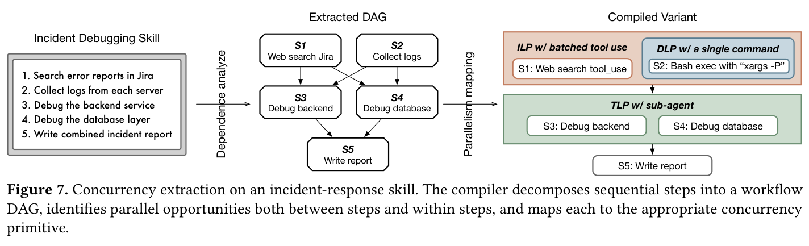
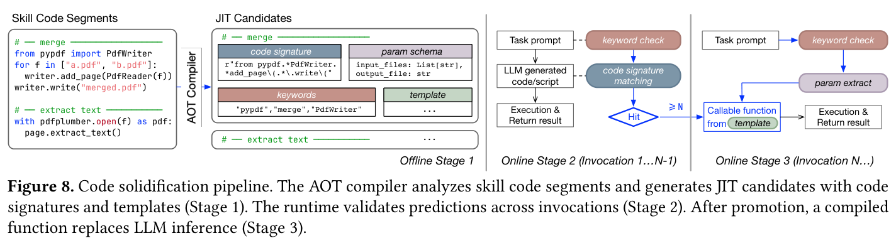
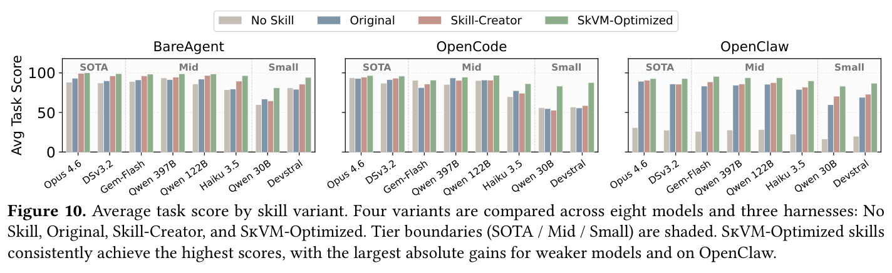

---
tags:
  - papers/agent-systems
aliases:
  - "SkVM"
date: 2026-04-11
doi: 10.48550/arXiv.2604.03088
---

# SkVM: Revisiting Language VM for Skills across Heterogenous LLMs and Harnesses

## 核心信息

- 标题: SkVM: Revisiting Language VM for Skills across Heterogenous LLMs and Harnesses
- 作者: Le Chen, Erhu Feng, Yubin Xia, Haibo Chen
- 机构: Shanghai Jiao Tong University
- 发表时间: 2026-04-11
- 会议/期刊: arXiv preprint
- DOI: 10.48550/arXiv.2604.03088
- 论文链接: http://arxiv.org/abs/2604.03088
- 代码仓库: 未明确公开
- 领域: 智能体系统 / 软件工程

## 原文摘要翻译

大语言模型智能体越来越多地将技能作为可复用的组合单元。虽然技能可以在不同的智能体平台之间共享，但当前系统将技能视为原始上下文直接传递给模型，导致同一技能在不同智能体上表现不一致。这种脆弱性损害了技能的可移植性和执行效率。为应对这一挑战，本文分析了 118,000 个技能，并从传统编译器设计中汲取灵感，将技能视为代码、将大语言模型视为异构处理器。为使可移植性具有可操作性，本文将技能的需求分解为一组原始能力，并衡量每个模型-框架组合对这些能力的支持程度。在此基础上，本文提出 SkVM，一个为可移植和高效技能执行而设计的编译与运行时系统。编译时，SkVM 执行基于能力的编译、环境绑定和并发提取；运行时，SkVM 应用即时代码固化和自适应重编译进行性能优化。实验在八个不同规模的大语言模型和三个智能体框架上评估了 SkVM，结果表明 SkVM 显著提升了不同模型和环境下的任务完成率，同时将词元消耗降低高达 40%，并行加速高达 3.2 倍，通过代码固化实现 19–50 倍的延迟降低。

## 创新点

1. **将编译器理论引入智能体技能执行**：首次系统性地将技能类比为"代码"、大语言模型类比为"异构处理器"，构建了从 AOT 编译到 JIT 优化的完整编译与运行时栈，为技能在异构目标上的可移植执行提供了理论框架。

2. **原始能力抽象**：定义了 26 个跨四大类别的原始能力（primitive capabilities），从需求侧抽象出技能执行所需的基本能力集合，使得编译器可以根据目标模型-框架对的能力画像进行针对性的技能适配，而非硬编码特定模型的优化逻辑。

3. **三趟 AOT 编译管线**：系统性地将技能与目标之间的不匹配分解为三类问题（能力不匹配、环境不匹配、并发缺失），并用三趟编译分别处理，每趟闭合一种特定的差距。

4. **JIT 代码固化机制**：观察到智能体在运行时反复生成结构相同的代码片段，将高频代码模式固化为可直接执行的函数，完全绕过大语言模型推理，实现 19–50 倍的延迟降低。

5. **大规模技能生态分析**：对 118,000+ 技能进行了迄今最大规模的系统分析，量化了技能在异构目标上的脆弱性（15% 任务因启用技能反而性能下降），为 SkVM 的设计动机提供了坚实的实证基础。

## 一句话总结

SkVM 的核心贡献是将编译器思想引入智能体技能执行领域：通过 AOT 编译将技能适配到异构模型-框架目标，通过 JIT 运行时优化弥补编译时未能覆盖的执行时不确定性，从而将技能从"脆弱的提示片段"提升为"可移植的编译产物"。标题中的"Language VM"略有夸张——SkVM 更接近一个面向自然语言程序的编译优化框架，而非传统意义上的虚拟机。

## 研究问题

智能体技能生态系统面临一个根本性矛盾：技能作为自然语言编写的领域知识，被设计为跨平台共享的可复用单元，但当前系统将技能仅作为额外的上下文注入模型提示，缺乏任何编译或适配机制。

具体而言，论文识别了三类不匹配问题：

- **P1 模型能力不匹配**：技能假设的能力（如复杂 shell 管道、多步推理）可能超出目标模型的实际能力。在八个模型上的实验显示，启用技能在 15% 的任务上反而导致性能下降（Opus 4.6 为 7%，Qwen3-30B 高达 25%）。
- **P2 框架不匹配**：不同智能体框架（harness）提供的工具集和执行能力差异显著。BareAgent 仅提供最小化的系统提示注入，OpenCode 提供丰富的代码执行工具，OpenClaw 支持复杂的多步任务编排。同一技能在不同框架上表现差异巨大。
- **P3 环境不匹配**：技能依赖的外部库、命令行工具或系统服务可能在目标环境中不可用，弱模型往往无法自行解决依赖缺失问题。

现有的技能优化手段（如 Anthropic 的 Skill-Creator）仅在语言层面对技能进行润色，而未系统性地解决上述三类不匹配问题。

## 数据与任务定义

### 技能生态分析

论文从两个主流分发平台收集了 118,000+ 技能：clawhub.ai（28,990 个）和 skills.sh（89,280 个）。分析发现技能生态极度不均衡——skills.sh 上 89% 的技能下载量不足 10 次，大量技能实际上从未被有效使用。

### 原始能力定义

从 15,063 个技能中，通过两阶段流程提取了 26 个原始能力，分布在四大类别中。典型示例：

| 原始能力 | 低级 | 中级 | 高级 |
|---|---|---|---|
| `gen.code.shell` | 基础命令（`ls`, `cat`） | 管道、重定向、循环 | 复杂管线（`sed`, `awk`） |
| `reason.arithmetic` | 单步运算 | 多步运算 | 复合运算 |
| `tool.exec` | 单个命令 | 带参数和相对路径 | 链式多步执行 |
| `follow.procedure` | 3 步顺序执行 | 5–7 步含分支 | 循环和验证 |

每个原始能力须出现在至少 1% 的语料中才会被纳入，以排除稀有的领域特定需求。

### 评估基准

评估任务来自 SkillsBench 和 PinchBench 的扩展集，涵盖代码生成、数据分析、文档创建和系统管理等 14 个任务类别。每个任务生成 5 个多样化输入实例，测量平均任务完成率、词元消耗和端到端延迟。

## 方法主线

### 机制流程

SkVM 的核心架构由两大部分组成：AOT 编译器和运行时系统。整体执行链如下：

1. **技能安装时的 AOT 编译**：用户首次安装技能时，AOT 编译器分析技能文本，针对目标（模型、框架、宿主环境）生成一个或多个优化后的技能变体。编译分三趟执行，每趟闭合一种特定的差距。

2. **运行时变体选择与执行**：任务到达时，运行时根据当前（模型、框架）组合选择对应的编译变体，通过渐进式披露机制加载。执行过程中，JIT 优化器监控执行结果，代码固化器将高频模式编译为可直接调用的函数。

3. **自适应重编译**：当 JIT 检测到 AOT 编译遗漏的能力差距或系统性失败时，触发重编译——将积累的失败日志和模型自恢复轨迹作为输入反馈给编译器，生成针对性的补偿变换。

4. **资源感知调度**：并发提取产生的并行注解在运行时与实际资源可用性对接，调度器在需求超过容量时节流或挂起并发子智能体。

### AOT 三趟编译

**第一趟：基于能力的编译。** 编译器离线为每个目标运行微基准测试，获得目标的能力画像（capability profile）。将画像与技能的能力需求进行差距分析（gap analysis），根据差距类型选择优化策略：

- 对于目标"具备但较弱"的能力，进行**补偿变换**——例如将复杂 shell 管线拆分为多个简单步骤。
- 对于目标"完全不具备"的能力，进行**替代变换**——例如将 shell 脚本改写为 Python 调用。

这里的关键设计是原始能力定义在需求侧，独立于任何具体模型，这使得编译器无需为每个模型硬编码优化逻辑。

**第二趟：环境绑定。** 编译器从第一趟输出的技能和显式的前置条件中提取依赖清单（外部库、命令行工具、系统服务），然后生成环境绑定脚本，确保运行时依赖项已满足。

**第三趟：并发提取。** 编译器将技能中的子任务改写为独立的子智能体块（sub-agent block），每个块有明确的任务描述、声明的输入上下文和预期输出。编译器在三个粒度上提取并行性——数据级并行（DLP）、指令级并行（ILP）和线程级并行（TLP）——类比传统编译器中的并行性提取。

### JIT 代码固化

代码固化（code solidification）是 SkVM 最具工程洞察力的优化之一。核心观察是：智能体在执行技能时，经常让大语言模型反复生成结构几乎相同的代码片段（如 PDF 合并脚本、SQL 查询模板）。SkVM 的处理分三个阶段：

1. **离线阶段**：AOT 编译器分析技能中的代码段，用正则表达式签名识别潜在的 JIT 候选。
2. **在线学习阶段**（前 N-1 次调用）：每次大语言模型生成代码时，运行时用关键字检查和代码签名匹配来判断是否命中已知候选。命中后记录实际代码。
3. **在线执行阶段**（第 N 次及之后）：当同一候选被命中足够多次后，运行时将其固化为可调用函数模板。后续调用直接抽取参数、填充模板并执行，完全绕过大语言模型推理。

### 资源感知调度

并发提取在编译时注入了并行性注解，但实际的 API 并发限制、CPU/内存可用性在运行时才可知。资源感知调度器做两件事：

- **节流**：当资源紧张时，推迟新子智能体的启动，避免引入额外的并发压力。
- **选择性挂起**：对已运行的子智能体，SkVM 选择性地挂起部分子智能体以释放资源给更关键的任务。

## 关键结果

### 编译有效性

Fig. 9 和 Fig. 10 展示了 SkVM 优化技能在八个模型和三个框架上的效果。核心发现：

- **SkVM 优化技能在所有模型-框架组合上一致性地取得最高分数**，尤其在弱模型上提升最大。在 BareAgent 上，SkVM 比 Skill-Creator 为 Qwen3-30B 提升了 25%，为 Devstral-Small 提升了 10%。
- **原始技能反而有害的问题被有效解决**：未优化的原始技能在 14 个类别中有 11 个表现不如完全不使用技能，而 SkVM 优化后大幅逆转了这一趋势。
- **模型能力越弱，SkVM 的增益越大**，这符合编译优化在弱处理器上价值更高的直觉。

### 渐进优化分解

Fig. 11 展示了 14 个任务类别在六个优化阶段（无技能 → 原始技能 → AOT 编译 → JIT 第一轮 → JIT 第二轮 → JIT 第三轮）的得分变化。关键观察：

- AOT 编译本身就带来了显著提升，但部分任务在 AOT 后仍有回归。
- JIT 的三轮迭代逐步修复了 AOT 遗漏的问题。例如某个任务中 AOT 编译后的技能触发了 Python 环境路径错误，经过三轮 JIT 修复后才最终解决。
- 这验证了 AOT + JIT 互补的设计合理性。

### 效率优化

- **词元消耗降低高达 40%**：编译后的技能结构更紧凑，减少了冗余的半结构化代码片段和工作流格式。
- **代码固化延迟降低 19–50 倍**：高频代码模式被固化后完全绕过大语言模型推理。
- **并发执行加速高达 3.2 倍**：通过编译时并发提取和运行时资源调度，将原本顺序执行的子任务并行化。

### 负面发现

论文也诚实地报告了一些负面结果：

- Fig. 12 的散点图显示，少数模型-框架组合出现了"质量下降但词元减少"或"质量下降且词元增加"的情况，说明 SkVM 的编译并非在所有组合上都正面。
- 对于 SOTA 级别的模型（如 Opus 4.6），SkVM 的改进空间本身就有限（原始技能的退化幅度只有 7%），编译的边际收益不大。

## 深度分析

### 真正贡献是什么

SkVM 的真正价值不在于某个具体的编译趟或优化技术，而在于提出了一个**系统性的框架**来思考技能的可移植性问题。将技能类比为代码、将模型类比为处理器这个隐喻本身就很有启发性——它让我们可以复用编译器领域几十年积累的概念（能力画像、AOT/JIT 互补、环境绑定、并发提取）来分析一个全新领域的问题。

论文的实证分析（118,000 技能、15% 的技能有害率）也为整个社区提供了重要的参考数据。在此之前，"技能是否真的有用"这个问题缺乏大规模的量化回答。

### 编译类比的洞察与局限

编译类比在以下方面是恰当的：

- 技能确实存在"源码"（自然语言描述）与"目标"（具体模型-框架对）之间的适配需求。
- AOT 和 JIT 的互补逻辑在技能场景下依然成立——编译时能解决的静态问题提前解决，运行时才显现的动态问题延迟处理。

但这个类比也有其局限：

- 传统编译器处理的是形式化的源语言，而技能是自然语言，编译过程本身引入了非确定性——这是论文在讨论部分承认的。
- 传统编译器的"编译"是确定性的语义保持变换，而 SkVM 的"编译"本质上是让另一个大语言模型改写技能文本——改写结果是否语义等价没有形式化保证。
- "原始能力"作为技能的"字节码"这个类比有些勉强——JVM 字节码有完整的形式语义，而原始能力更接近一种人工定义的能力分类体系。

### 哪些地方容易被误读

- **SkVM 不是传统意义上的虚拟机**。它不提供指令级的解释执行或即时编译。"VM"这个名称更多是一个类比，而非精确的技术描述。
- **编译和 JIT 优化本身依赖大语言模型**。SkVM 的 AOT 编译器用大语言模型来改写技能，JIT 中的自适应重编译也需要调用大语言模型。这意味着编译质量本身受限于所使用的编译大语言模型的能力。
- **实验中所有模型的"编译"均使用高能力模型完成**。论文的评估展示的是编译后技能在不同模型上的执行效果，但编译本身的成本和对编译器模型的依赖在论文中讨论较少。

## 局限

1. **编译的非确定性**：以自然语言为输入的编译过程天然引入非确定性。论文用回滚机制和多趟优化来缓解，但无法从根本上消除。多次编译同一技能可能产生不同的变体。

2. **编译成本**：AOT 编译需要调用大语言模型，产生词元成本。论文论证这些成本可以在多次调用中摊销，编译产物也可以跨用户共享，但对于仅使用少次的技能，编译成本可能不值得。

3. **能力覆盖的可扩展性**：当前的 26 个原始能力覆盖了 15,063 个技能，但随着技能生态持续增长和多样化，需要持续维护和扩展能力目录。论文提出可以迭代扩展，但这本身是一个需要持续投入的工程问题。

4. **评估局限**：实验仅在三个开源框架上进行，且所有实验在单一硬件（Mac Mini M4 16GB）上完成。尚不清楚结论是否能推广到更大规模的生产环境和更多样的框架。

5. **缺少与更多基线的对比**：论文仅对比了 No Skill、Original、Skill-Creator 三个基线。如果有更多基于提示工程或微调的技能优化方法作为对比，结论会更有说服力。

## 我的笔记

- **最有价值的可复用思路**：原始能力作为需求侧的抽象词汇表这个设计很有启发性。它提供了一种在不了解具体模型内部机制的前提下对模型能力进行量化刻画的方式，可以推广到智能体系统的其他场景。

- **值得质疑的假设**：论文假设用一个能力更强的大语言模型来"编译"技能，可以稳定地产出适配弱模型的优化变体。但当编译大语言模型本身对目标弱模型的实际行为理解有限时，编译质量可能不可靠。

- **值得复现的实验**：Fig. 11 中 14 个任务类别的渐进优化分解（无技能 → 原始技能 → AOT 编译 → JIT 三轮迭代）是一个很好的分析范式，可以用来评估其他类型的智能体优化技术。

- **相关工作对比**：可以与 Anthropic 的 Skill-Creator、OpenAI 的工具使用优化、以及更广泛的提示工程自动优化文献（如 DSPy）对比阅读，以理解 SkVM 在这个领域中的定位。

## 引用

- Anthropic. Claude Opus 4.6 Technical Report. 2025.
- Anthropic. Skill-Creator. 2025.
- Yang et al. SWE-Agent: Agent-Computer Interfaces Enable Automated Software Engineering. 2024.
