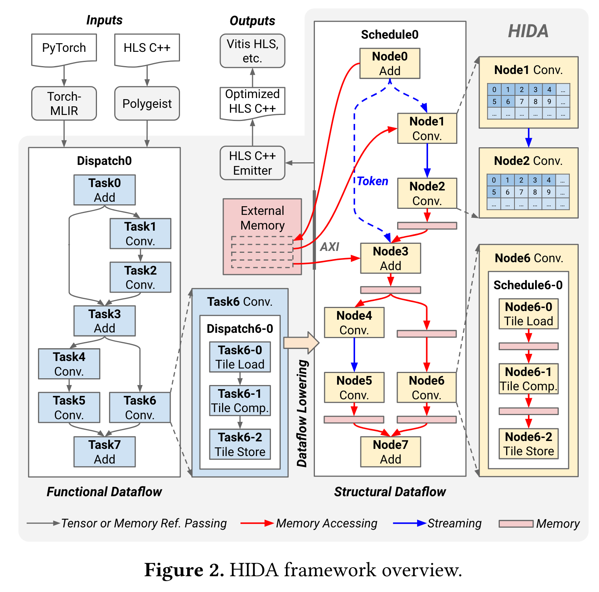
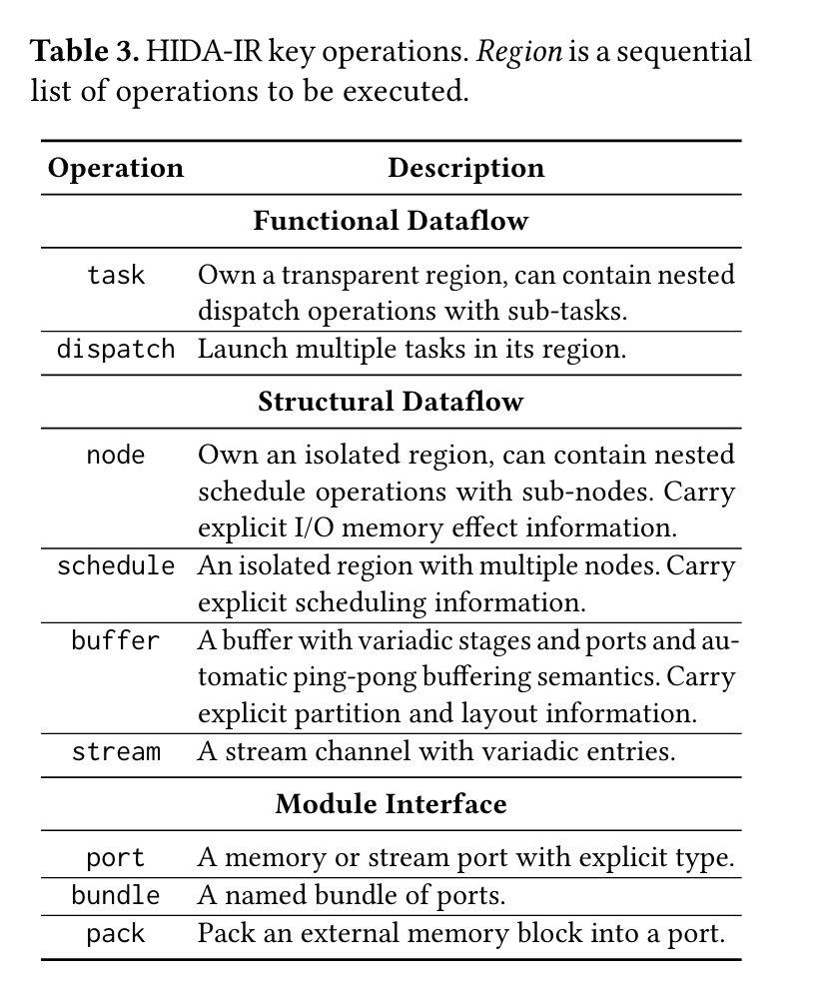
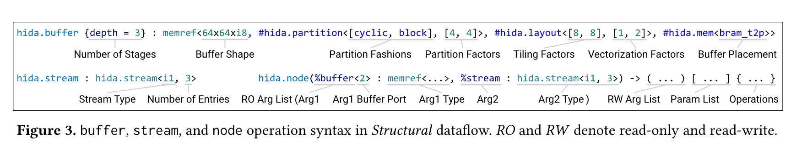
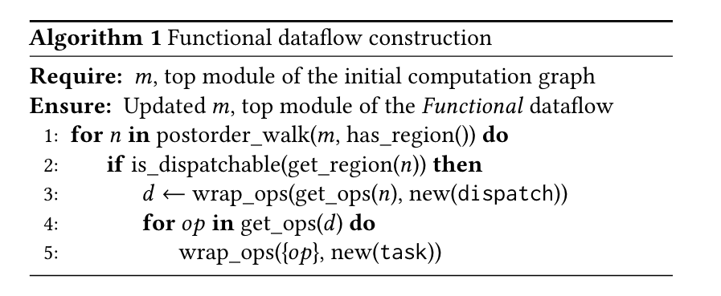
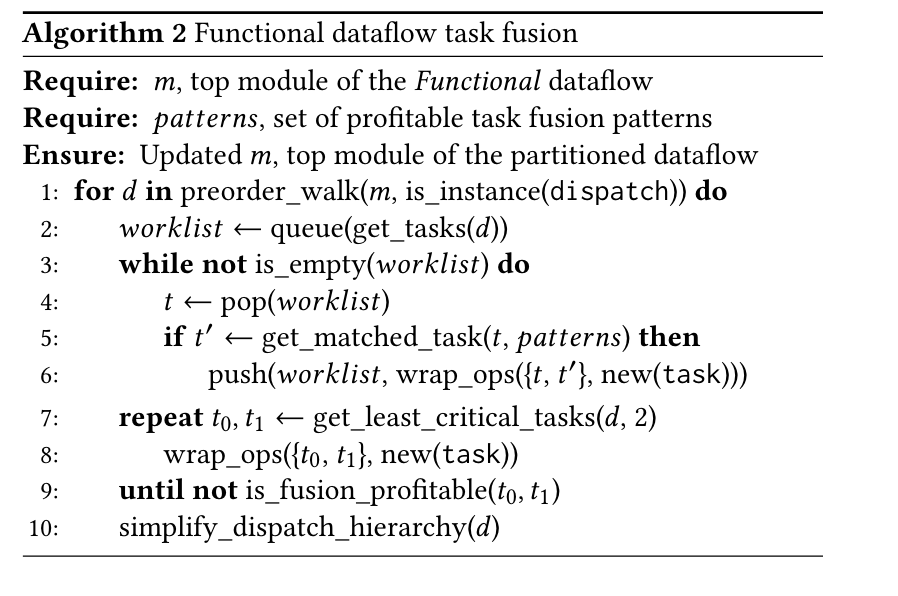

# HIDA: A Hierarchical Dataflow Compiler for High-Level Synthesis

这篇 paper 是基于数据流分析生成 HLS 代码的文章。这篇文章可以将算法经过数据流分析转换成高效的 HLS 代码。

## Introduction

因为摩尔定律不像之前一样每年都有一个大的性能提升。HLS 是一个有前途的方法将高级算法描述转变为 HDL 描述。
- **Dataflow Architecture.** 定制硬件加速器的一个重要架构是数据流，它能够并行执行粗粒度任务。与冯诺依曼架构不同，数据流架构可以利用任务之间的片上通信来避免频繁的外部内存访问。
- **Unexplored Opportunties.** 尽管目前的 HLS 工具可以启用 dataflow 设计，但它仍然很大依赖于用户来做困难的设计，包括但不限制于并行策略，切分策略，内存层级，数据排布等等。除此之外，数据流中的不同任务的设计空间彼此紧密耦合。有以下两个原因：
    - 有效率的数据流架构需要考虑不同任务间的负载均衡。
    - 任务间通信通常通过 streaming channels 或者 on-chip buffers 而不是共享内存。同时，大规模数据流通常倾向于分层结构，因为数据流任务自然地由嵌套图表示，这进一步使设计空间变得复杂。
- **HIDA Approach.** HIDA 是一个使用层次化数据流 IR 的 HLS 框架。实现硬件算法描述到高效的数据流结构。主要贡献如下：
    - 提出了 HIDA-IR，在两个不同的抽象层级对数据流进行建模：**Functional** 和 **Structural** 来捕获数据流特征和多层数据结构，从而实现有效的优化。
    - 提出了 HIDA-OPT 数据流优化器。
    - 提供了 end-to-end，可以支持 Pytorch 和 C++ 输入。

## Overview

HIDA 构建在 MLIR 基础设施上，可以采用 Pytorch 或者 HLS C++ 代码作为输入。

## HIDA IR

当前的 HLS 工具使用串行 IR 来时表示 HLS 结构。然而，因为缺乏并行特征和数据流的微架构，这些架构限制了优化数据流的能力。HIDA 提出了 **Functional** 和 **Structural** 来表示两级表示，Functional 被设计用来捕获高纬度信息，Structural 被设计用来表示微架构信息。

### Functional Dataflow

- **Hierarchical Structure.** 在 Functional dataflow 中，引入了一个 `dispatch` 操作包含要被调度的计算图。在调度操作中，所有图节点被分成多个任务操作表示调度策略。加速器经常有多级数据流实现更高级别的并行，HIDA-IR 支持层次数据结构通过支持递归的 `task`和 `dispatch` 操作。在 Figure 2 中 Task 6 中包含三个子任务。
- **Transparent from Above.** 在 Functional level 中，tasks 经常需要进行操作，因为调度策略不同会导致非常不同的 trade-offs。基于观察，`dispatch` 和 `task` 被设计为可移植的并且共享全局上下文，简化融合和切分任务的流程。

### Structural Dataflow

- **Memory-Mapped and Stream Buffer.** 为了精准捕获 on-chip 和 off-chip 的内存访问行为，我们提出了两种 buffers，memory-mapped buffer 和 stream-buffer。Figure 3 展示了它们的形式，`%` 表示 SSA。缓冲区操作的嵌入式转换和数据格式被设计为 semi-affine maps，便于做基于多面体的分析和转换。Figure 2 中红色的 box 和蓝色的箭头分别表示 memory-mapped buffer 和 stream buffers。
- **Isolated from Above.** 在 Structural dataflow 中，我们引入了 `schedule` 和 `node` 操作作为 `dispatch` 和 `task` 对应的部分。和 Functional 类似，Structural 也有层次数据结构，schedule 和 node 是和 external context 互相隔离的。因此 external values 必须被传递到 schedule 和 node 中作为参数。

## HIDA-OPT

尽管之前的工作通过 dataflow 开启了 inter-task 并行，但是它们不能进行 dataflow-oriented optimizations。

### Functional Dataflow Construction

### Functional Dataflow Optimization

### Structural Dataflow Construction
