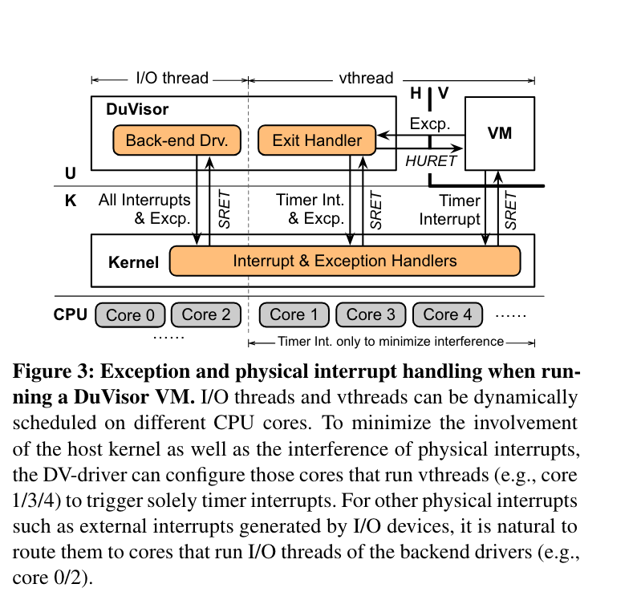

# Security and Performance in the Delegated User-level Virtualization

## Introduction/Motivation

首先介绍了 Hypervisor 的三个发展阶段，第一个阶段 hypervisor functions 实现在内核态。第二阶段主流的 hypervisors 将一些 hypercvisor functions 卸载到用户态，然而一些指令模拟和内存虚拟化还是在内核态。第三阶段使用了硬件虚拟化（Intel VMX 和 AMD SVM），通过将虚拟化函数转移到硬件可以显著减少虚拟化消耗。一般硬件虚拟化会有 Kernel module 和 User Helper，例如 KVM 和 QEMU。

然而现在 kernel module 已经逐渐成为 Host 安全的主要威胁。一旦 KVM 被 hacked，攻击者就可以获取到整个系统的权限并且带来安全攻击。

因此这篇文章的 motivation 主要是在 runtime 将所有的 hypervisor 组件直接移到用户态，这样可以最小化安全的影响并且发现在 user-mode 下的可靠性问题。

## Problems

面临的一些挑战：
- 权限限制：当前的硬件虚拟化仅仅可以在 kernel mode 下配置，例如设置 VM 的两阶段页表。
- 安全威胁：仅仅将 VM 的硬件资源移到用户态将会扩大供给面。例如如果允许 QEMU 修改 VM 两阶段页表将会带来严重的安全威胁。
- 性能消耗：VM exits 现在将从 kernel 转发到 user 处理。然后控制流必须返回 kernel 再次消耗 VM 执行，导致过多的性能损耗。

### Vulnerabilities of Hypervisors

一些遭受到的威胁：

- **Large Vulnerability Quantity.** host DoS, privilege escalation of guest VM
- **Servere Security Threats.** 由于内核组件的高特权，它们可能会摧毁整个系统。例如 NULL 指针接引用或者越界发起 DoS 攻击。
- **Low Exploit Costs.** 

### Limitations of Deprivileged Execution

一些工作(NOVAm DeHype) 尝试通过将一些 hypervisor 的功能卸载到用户模式来解决这些问题。

- **Non-eliminable In-kernel Vulnerabilities.** 由于硬件的限制，例如特权寄存器的访问，所以实际上无法消除影响。
- **Redundant and Costly Mode Switching.** 由于 Hypervisor 必须使用内核组件来扩展硬件虚拟化扩展，因此将大部分内核组件移至用户控件将导致 VM 和 Hypervisor 之间的交互会更加频繁和昂贵，将导致更高的性能开销。

## Proposed Methods

基于 RISC-V 提出了 **Delegated Virtualization Extension(DV-Ext)** 通过将将存在的硬件虚拟化机制暴露给用户模式。基于 DV-Ext，所有的 VM-plane functions 都被卸载到用户态的 Duvisor 进程中。

Duvisor 在用户态有效率地提供了不同的虚拟化函数。对于 CPU 虚拟化，DuVisor 对于每个 vCPU 都会创建 vthread，并且 vthread 将会利用 DV-Ext 在用户态处理 VM extis。对于内存管理，DuBisor 对于每个 VM 配置一个两阶段页表并且在用户态处理页错误。

### Intuition: Why should it be better than other methods?

## Design

Duvisor 这篇文章中引入了 **delegated virtualization** 来安全保护整体安全性和虚拟化的可靠性。Duvisor 将 VM plane 从 hypervisor plane 中分离并且卸载所有的 VM-plane functions 到 user-mode Duvisor。

代理虚拟化主要包含三个部分：
- DV-Ext
- per-VM DuVisor hypervisor process
- global DV-driver in the kernel

DV-Ext 必须安装在硬件上，它授权 host kernel 是否将硬件虚拟化代理到 HU mode。如果开启了代理模式，非特权软件就可以访问硬件虚拟化接口而无需陷入 kernel。如果未启用，DV-Ext 和传统虚拟化一致。

HU-mode DuVisor 利用 DV-Ext 暴露的硬件接口控制未修改的 VM。为了支持 VM 的正常执行，DuVisor 动态虚拟化物理资源处理 VM exits。此外，为了支持 HU-mode 下的内存虚拟化。DuVisor 为 VM 构建第二阶段页表。如果第二阶段页表映射丢失或者无效，它将会动态更新和添加 entries。

一个 tiny DV-driver 被嵌入到 host-kernel 中作为 Hypervisor-Plane，偶尔参与 DuVisor 的物理资源管理，不会干扰 runtime VM exits。DV-driver 使用 DV-Ext 来 enable/disable 委托模式和分配至元。为了降低安全风险，它还限制 DuVisor 的物理内存 view 并处理紧急情况。

### Delegated Virtualization Extension
Duvisor 设计了 DV-Ext 硬件，将原本内核中才能够使用的虚拟化硬件接口如寄存器，指令等安全地导入到了用户态，从而使得用户态软件可以直接获得虚拟机下陷信息并操作虚拟机的部分行为。DV扩展还能够让虚拟机下陷可被宿主内核配置为直接下陷到用户态，而不再是内核态。

### Duvisor Design

#### Handling VM Exits

一般情况下 VM exits 会重新陷入到 kernel 态的 hypervisor 进行处理，但在 Duvisor 中所有的终端陷入到用户态的 Duvisor 进程。在 VM 执行环境中，后端驱动的 IO 线程和 vthreads 会被调度到不同的 CPU cores。分发后 Duvisor 执行 HURET 进入 V mode 并且开始运行 guest code 直到 VM exit。随后根据异常的原因访问 DV-Ext 提供的不同的 HU mode 下的寄存器并执行 VM exit。

#### Restrited Memory Virtualization

传统的 hypervisor 在内核态进行两阶段页管理，DuVisor 在 HU mode 进行两阶段页管理，不需要参与 kernel。为了建立 GPA 内存映射，DuVisor 在 HU mode 建立两阶段页表映射。

一个挑战是如何确保在用户态的两阶段页表不被攻击。Duvisor 允许 HU mode 下管理真正的两阶段页表，使用物理内存保护（PMC）方法限制 VM 能够访问的物理内存范围。通过 PMC，Duvisor 可以让 UH 来配置第二阶段页表并检查 PMC。

Figure 4 展示了 GVA 如何翻译到 HPA 并且最终到达物理内存。首先通过 MMU 将 GVA -> GPA，随后通过 Duvisor 的 S2PT 翻译到 HPA，最终 PMC 检查输出的 HPA。如果超出了范围，PMC 将生成一场并唤醒 DV-driver 处理。

#### IO and Interrupt Virtualization

Duvisor 的 IO 虚拟化和其他工作类似，都支持 virtio 和模拟设备。。但因为不支持 IOMMU 所以不能够进行 passthrough。对于每个 PV 和模拟设备，Duvisor 在 VM 初始化时生成线程，例如对于网卡接收队列在 HU mode 下不断轮询并向 VM 发布虚拟外部中断。

Figure 5 展示了一个 vEXT 是如何使用用户态中断派发的。举例来说，在 core0 上的 IO thread 要往 vCPU0 上发送一个 vEXT，于是写了对应的 `hu_virt`。DV-Ext 然后找到了 vCPU0 在 core2 上然后在 core2 上生成了一个 vEXT。如果发送线程尝试发送一个错误的 VCPUID 或者从 reveiver 接收到不懂得 VMID，将会触发错误并唤醒 DV-driver 处理。

## Conclusions

介绍了第一盒代理虚拟化结构，能够将所有 VM-plane 的虚拟化函数带了到用户空间而不需要陷入内核，能够最小化攻击接口。介绍了 DV-Ext 和 DuVisor 用来启动代理虚拟化。在 RISC-V 上实现了 DV-Ext 和 DuVisor 的原型。

### 安全验证

### 性能验证

#### Micro Benchmarks

#### Real World Benchmarks

