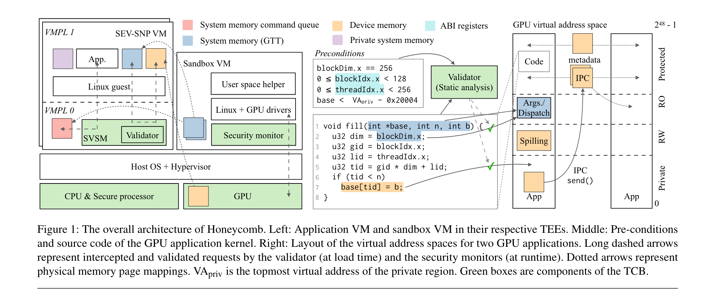
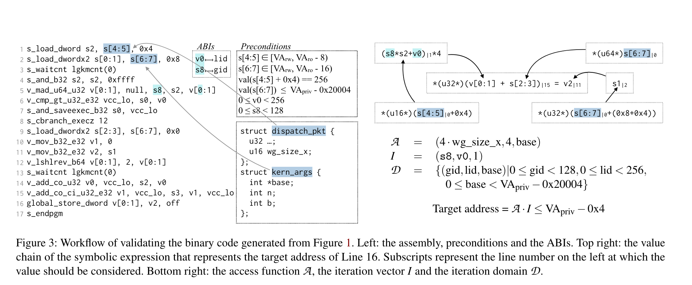

# Honeycomb: Secure and Efficient GPU Executions via Static Validation

## Motivations
首先说明一下这篇文章的 motivations，也就是为什么做这个工作。由于 GPU 工作在 LLM 和自动驾驶，涉及到隐私数据，因此需要做安全考虑。之前的工作都需要修改硬件以及在生产环境部署需要很长时间。HoneyComb 是基于软件的 TEE，关键点在于可以在加载时静态分析 GPU 和验证应用的安全性。

## Introduction
HoneyComb 使用静态分析分析可变的 GPU 应用并且将其限制在 enclaves。这将会带来一些好处：
- 静态验证可以静态分析 kernel function。 对于一些低成本的硬件如树莓派没有 MMU，因此可以静态分析内存访问并组织攻击。
- 可以讲检查从运行时转到加载时，减少了上下文切换的时间。
- HoneyComb 强调每个应用的安全不变性，断言所有应用都是好公民。当前的 GPU TEE 强调强隔离，每个 GPU 应用是独占的，通信通过验证过的共享内存，开销很大。

## Background
**一些相关的背景知识**

现代 GPU 使用 SIMT，为了运行 workload，应用提交一个 lanuch 请求到 GPU 请求队列中，请求会说明二进制函数(GPU kernel)，参数，线程数量，和可选的用户可控的共享内存大小。

典型的 GPU 包含数以千计的 processing elements(PE) 被组织成三层层级。最底层是 warp，包含 32/64 个逻辑 PE 使用 lock-step 执行。Warps 进一步被组织成计算单元(CU)。CU 由向量寄存器池和共享内存组成。最后，单个 GPU 将多个 CU 组织在一起。

硬件调度器跨应用程序复用硬件资源，最小的调度单元是 warp，它始终调度同一 CU 块内的所有线程束，因此一个块内所有线程划分向量寄存器池并且在 CU 内共享同样分配的共享内存。调度器不断调度所有的 blocks 和 grids 直到任务完成。

GPU 驱动为每个应用程序创建一个虚拟地址空间。它从主机的 Graphics Translation Table(GTT) 中为参数和命令队列分配缓冲区。缓冲区被映射到虚拟地址空间，在这里 GPU kernel 直接读参数和 grids 和 blocks 的 layout。

**AMD SEV-SNP.** AMD SEV-SNP 为 untrusted cloud system hypervisor 上运行的 VM 提供硬件级别的增强安全特性。存储器控制器中的专用硬件引擎在将数据发送到片外内存时对其进行加密。SEV-SNP 使用反向映射表(RMP)最终每个物理页面的所有权确保只有所有者可以向内存区域写入。它进一步验证页面映射，防止将一个页面映射到多个所有者。除此之外，SEV-SNP 通过 Virtual Memory Privilege Levels(VMPLs) 标记每个物理页，和 x86 中的 Ring 0-3 中类似。一个例子是 Secure VM Service Module(SVSM) 运行在 VMPL 0, guest os 运行在 VMPL 1。SVSM 能够拦截系统调用和内存操作并充当内存监控器。

## Overview

Honeycomb 为应用的 CPU 和 GPU 部分提供统一的 TEEs。Honeycomb 在 AMD SEV-SNP TEE VM 中开启一个应用。它首先在 VMPL0 开启 SVSM，SVSM 启动 BIOS，guest Linux kernel 并且最终在 VMPL1 启动用户态应用。在 Honeycomb 设备内存被明文存储，当它们被送到 host 的时候被加密。

应用程序通过请求 GTT(Graphics Translation Table) 来和 GPU 交互。Honeycomb 将 GPU 隔离在沙盒 VM 中，在沙盒中的 security monitor(SM) 是一个运行在 Linux kernel 下的 hypervisor。SM 会管理驱动和 GPU 间的所有交互，确保 GPU 进行预期的初始化，追踪设备内存的所有权，防止在不同应用间共享设备内存。

为了执行 GPU kernels，应用首先将 GPU kernel 的二进制代码加载到设备内存中。Validator 将  GPU kernel 的二进制代码和先决条件作为输入。它会验证 GPU kernel 中的每条内存指令是否只能访问某些特定的虚拟地址空间。有些时候一些地址的值不能立刻确定，需要基于参数确定(例如 Figure 1 中的 `base`)，因此 Honeycomb 需要在 runtime 的时候检查先决条件确保攻击者无法破坏分析。

Validator 将 GPU kernel 解码成控制流和数据流，使用 scalar evolution 和 polyhedral models 将每个内存指令的目标地址作为一个符号表达式。它插入前提条件来推理目标地址的边界，并确保该地址位于指定区域内。对于非直接内存访问例如 `a[b[i]]`，Honeycomb 需要开发者注释并且添加运行时检查来通过验证。Validator 将虚拟地址分为四个区域：只读、读写、保护、私有。

## Validator

在 Honeycomb 中 validator 检查每个 GPU kernel 代码并确保有以下安全不变形：
- 没有 dangling accesses
- 所有内存访问都在它们自己的内存区域内
- 控制流完整性

- **检查未初始化的值.** validator 开始解析 GPU kernel 的二进制代码并且将其构建为 SSA 表示，对于每个 kernel 将其构建为控制流图（CFG）。validator 通过检查 SSA 表示是否有效来检查悬垂访问。
- **检查内存访问.** 对于每个内存指令，validator 将会构建一个符号表达式并且提取每个内存指令的目标地址。算法混合了 scalar evolution analyise 和多面体模型，是流敏感和路径敏感的。Validator 可以通过 iteration vector, iteration domain 等信息组成内存访问信息。
- **强迫控制流完整.** 由于现代 GPU 具有 RISC 风格指令集，因此解码 GPU kernel 较为简单。Validator 仅仅验证所有分支指令是否跳转到有效的指令，validator 不支持间接分支。根据经验，间接分支很少使用，开发者可以修改间接分支转变为一系列目标明确的分支。

## Security monitors
在 Honeycomb 中有两种类型的 security monitors 来和 GPU 进行交互。每个应用运行在自己的 TEE VM 中。SVSM 调节应用程序与 GPU 之间的交互。在 sandbox VM 中的 security monitor(SM) 用来管理驱动和 GPU 之间的交互。SM 也会跟踪物理页所有权组织以外的内存共享。

## Secure and efficient IPC
Honeycomb 能够使两个 enclaves 在设备内存中安全交换纯文本数据。为了做 IPC，Honeycomb 将 IPC buffer 映射到 sender 的保护区域和 receiver 的 RO 区域。

