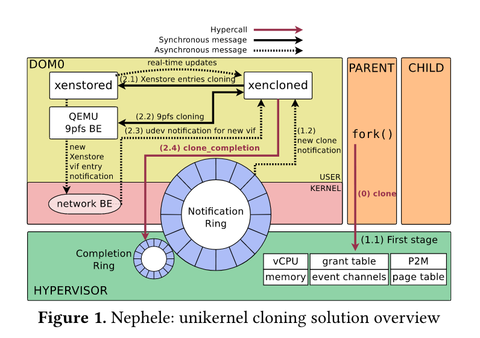

# Nephele: Extending Virtualization Environments for Cloning Unikernel-based VMs

## Introduction/Motivations

当前 Unikernel 获得很多关注，因为它是专门针对某一种应用的，资源消耗少。但是 unikernel 集群不一定要比容器少，因为容器可以共享内存。因此，缺少 `fork()` 原语带来了新的挑战。

虚拟化是云计算的关键推动者，它可以在不受信任的租户之间安全共享硬件。半虚拟化与虚拟化硬件的支持使得虚拟化的计算和 IO 接近裸机。

由于大部分 VM 都运行一个或几个应用，因此使用专用的虚拟机是一个趋势，用来提高性能和减少资源消耗。然而当前的 Unikernels 不支持 `fork()` 系统调用。**Fork-based Cloning 不仅有助于可移植性，而且可以在使用同一基础映像运行多个虚拟机时显着降低资源消耗。** 云服务商通常会维护大量的 VM 来处理新的请求因为按需启动新虚拟机将花费太长时间。

在 unikernels 上移植 POSIX 应用带来了巨大的挑战：`fork()` 在 unikernel 中应该怎么行为？然而在单进程操作系统中与 unikernel 的定义相反。NGINX 用 fork() 提高吞吐量；Redis 通过 fork() 制造 COW 快照用于持久化存储。

在这篇文章中提出了克隆基于 unikernel VM 的解决方案同时不违背 unikernel 的基本原则。Nephele 通过添加了一个 hypercall 来处理克隆相关操作。

## Problems

在 Unikernel 中不提供进程只提供线程，但仅有线程不够，因为无法进行资源隔离，例如 NGINX 和 Redis。

改造方案不是为 unikernel 添加进程，而是克隆现有的 unikernel 并运行在同一台物理机器上。本篇文章主要解决了以下问题：
- 提高性能
- 迁移操作
- I/O 克隆
- VM 间通信

## Propose Methods

**为什么比其他方法好？**

为 unikernel 添加进程将会破坏 unikernel 定义，同时对于性能造成很大影响。

基于 VM fork 的方法首先由 Snowflock 引入，可以解决在 Xen 上的多进程 HVM guests 问题。Nephele 基于它扩展了内存克隆过程。I/O 克隆也是一个严峻的挑战，之前的操作需要重写 I/O 相关的 guest 状态。

## Design

Nephele 为 Xen hypervisor 实现了克隆支持。Nephele 为每个实例化进程的组件添加了拷贝语义。

### Fisrt stage: Hypervisor operation

Unikernel VM 请求克隆时会创建一个与原有相同地址空间的 unikerel。与 `fork()` 相似，
unikernel 内存在父级和子级共享相同物理内存并进行 COW。**Private Memory** 不在克隆的范围，
根据使用方式，私有页面要么被复制要么被重写，例如构建子页表的私有页。

### Second stage: Host domain operation

Nephele 在第二阶段开始处理 I/O 状态的克隆，并且不会影响性能。克隆的第二阶段由 `xencloned` 来协调，
xencloned 是一个运行在 host 的 toolstack，用来完成克隆状态的用户控制操作。
**寻找合适的方法来 clone IO 具有挑战性，因为不同设备的行为和状态信息可能存在差异**。

前端驱动使用 shared ring 与后端驱动交换信息。要克隆共享环有两种选择：父与子共享或者创建一个新环。
共享不是一个好选择,因为父子可能会并发访问环造成冲突。也不能简单的复制环，需要考虑不同设备，在网络设备中
复制环因为它们和 guest 的状态密切相关；对于 console 设备则不复制，因为复制会妨碍输出与调试。

### Inter-process communication vs Inter-domain communication

在调用 `fork()` 引入了 inter-domain communication(IDC) 用来进程间通信。解决方案不会为 unikernel
添加任何限制。Nephele 为 unikernel 设计了一个内部 API，利用 hypervisor interface 专门针对 IDC
共享内存和通知。

## Details

Nephele 首先克拷贝和编辑父 VM 的 data structures，随后克隆 vCPU 状态，memeory，event channels
和 grant tables。完成后 hypervisor 将在 notification ring buffer 填充条目并向 xencloned daemon
发送一个新的虚拟中断。收到中断后，xencloned 首先将新的 domain 引入到 xenstored daemon。然后写入从父 daemon
克隆的信息。在 Xen 上对于 Xenstore 进行更新后，后端的驱动会收到通知，例如创建新的网络接口。

### Analysis of the cloning process

- **vCPU**：CPU affinity 和用户寄存器会被复制，除了 `rax` 寄存器。
- **Memory**: 重用并扩展了 `Snowflock` 为 HVM guest 引入的页面共享机制。共享页面时，所有权将从
原有域转移到 `dom_cow`，并进行引用计数。当发生 Page Fault 时所有权将从 `dom_cow` 转移到错误的 domain。
- **Cloning I/O devices**: Xen 使用 Xenstore 来做设备发现，因此需要克隆 Xenstore，为前端和后端驱动写入
新的 xenstore entry。Nephele 对于不同种类型的设备使用不同方法进行克隆：
    - **Console devices**：克隆 console 仅仅添加一个新 xenstore entry，无需对代码进行修改。
    - **Network devices**: 对网络设备的目标需要保持与原有设备相同，这意味着 MAC 地址与 IP 地址也需要相同。
    有两种解决方案，一种是 Linux bond，另一种是 Open vSwitch groups。

## Conclusions

Nephele 介绍了一种完整的在 unikernel VMs 中进行 clone 的方案，可以提供内存和 I/O 克隆支持。
通过在 Xen 上添加一个 hypercall，并通过 xencloned 来完成大部分繁重的工作。

克隆 VM 要比启动 VM 快 8 倍，并且可以支持 NGINX 和 Redis 应用，性能与 process forking 相当。
并且可以实现更高效的 fuzzing 和 Function as a Service frameworks。 