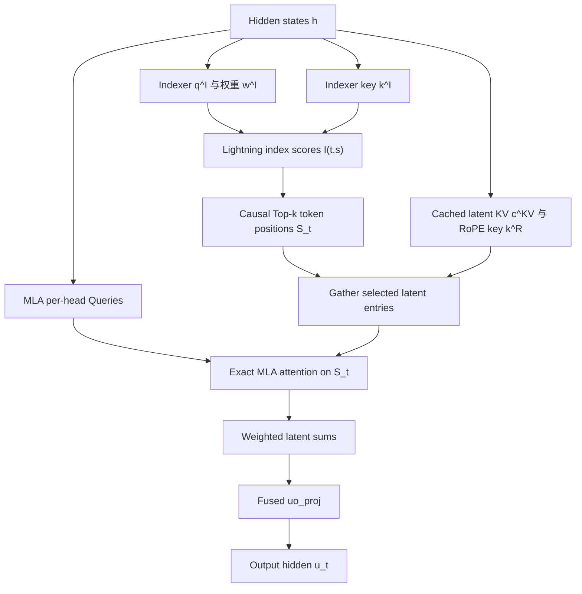
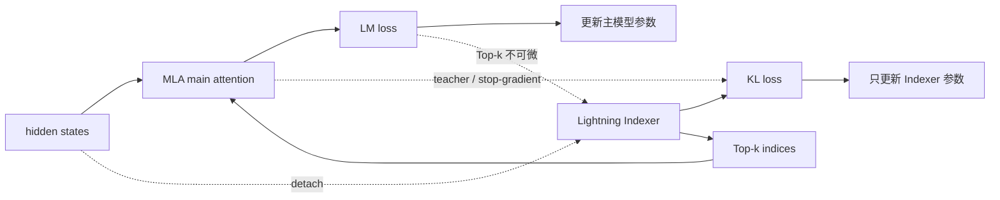

---
tags:
  - papers/LLM
  - topics/sparse-attention
  - topics/MLA
  - topics/indexer
aliases:
  - "DSA"
  - "DeepSeek Sparse Attention"
  - "Lightning Indexer"
date: 2026
---

# DeepSeek Sparse Attention (DSA) 算法流程

> 主要来源：[DeepSeek-V3.2](https://arxiv.org/abs/2512.02556)，第 2.1 节与附录 A
>
> MLA 来源：[DeepSeek-V2: A Strong, Economical, and Efficient Mixture-of-Experts Language Model](https://arxiv.org/abs/2405.04434)
>
> 对比笔记：[MSA Indexer 与 DSA Lightning Indexer 的差别](../minimax-msa/msa-vs-dsa-indexer.md)

## 一句话结论

DSA 用一个低成本 Lightning Indexer 为每个 query token 从全部历史 token 中选出 2048 个位置，然后在这些位置对应的 MLA latent KV entries 上执行真正的多头注意力。Indexer 由 KL loss 单独训练，主模型由 language modeling loss 训练，离散 Top-k 使两条反向路径天然分离。

最重要的边界是：

> **Indexer score 只决定“选谁”；MLA attention score 决定“选中后给多少权重”；`uo_proj` 只生成最终输出，不恢复任何 score。**

---

## 1. DSA 解决什么问题

设序列长度为 $L$。普通 dense attention 的主注意力需要处理所有因果 token pairs，复杂度为：

$$
O(L^2).
$$

DSA 的目标是让昂贵的 MLA 主注意力只读取固定数量 $k$ 的 KV entries：

$$
O(Lk),\qquad k=2048\ll L.
$$

为此，它额外运行一个计算更便宜的 Indexer。Indexer 本身仍然要给 token pairs 打分，因此仍含 $O(L^2)$ 项，但其 head 数、特征维度和精度都远小于主 MLA attention。DSA 并没有从渐近意义上消灭平方项，而是把昂贵的平方计算替换成系数很小的检索计算。

---

## 2. 符号表

| 符号 | 含义 |
|---|---|
| $h_t\in\mathbb R^d$ | 位置 $t$ 的输入 hidden state |
| $H_I$ | Lightning Indexer 的 query/scorer head 数 |
| $d_I$ | 每个 Indexer head 的维度 |
| $q_{t,j}^I$ | query token $t$ 的第 $j$ 个 index-query |
| $w_{t,j}^I$ | 第 $j$ 个 index-query 的标量权重 |
| $k_s^I$ | 历史 token $s$ 的 index-key |
| $I_{t,s}$ | Indexer 对 token pair $(t,s)$ 的标量分数 |
| $\mathcal S_t$ | query $t$ 选中的 Top-k token 位置集合 |
| $c_s^{KV}$ | MLA 将 token $s$ 的 K/V 信息联合压缩后的 latent code |
| $k_s^R$ | decoupled RoPE 的共享 key 部分 |
| $a_{t,s,i}$ | 主注意力第 $i$ 个 Query head 的真实 logit |
| $p_{t,s,i}$ | 在 $\mathcal S_t$ 上 softmax 后的主注意力概率 |
| $u_t$ | 注意力层最终输出 |

---

## 3. 总体数据流



前半段可以理解为检索器，后半段才是真正改变 residual stream 的主注意力。

---

## 4. Forward：Lightning Indexer 如何选择 token

### 4.1 产生多头 index-query 和共享 index-key

对 query token $h_t$，Indexer 产生：

$$
\left\{q_{t,j}^{I}\in\mathbb R^{d_I}\right\}_{j=1}^{H_I},
\qquad
\left\{w_{t,j}^{I}\in\mathbb R\right\}_{j=1}^{H_I}.
$$

对每个历史 token $h_s$，Indexer 产生：

$$
k_s^{I}\in\mathbb R^{d_I}.
$$

可以把 $q_{t,j}^{I}$ 看成不同的低成本检索视角，把 $w_{t,j}^{I}$ 看成 query 根据当前内容动态决定每个视角的重要程度。

### 4.2 计算 token-pair index score

论文公式 (1)：

$$
I_{t,s}
=
\sum_{j=1}^{H_I}
w_{t,j}^{I}
\operatorname{ReLU}
\left(q_{t,j}^{I}\cdot k_s^{I}\right).
$$

逐步理解：

1. 每个 Indexer head 计算一个 dot product；
2. ReLU 将负相关项截为 0，论文选择它主要是出于吞吐考虑；
3. 用 query-dependent $w_{t,j}^I$ 加权；
4. 对 $H_I$ 个 scorer heads 求和，得到一个标量 $I_{t,s}$。

因此，虽然 Lightning Indexer 内部是 multi-head，最终却不是每个 head 一份 Top-k，而是每个 query token 只有一张 token 排名表。

因果 attention 只允许 $s\le t$；未来位置必须在 Top-k 前被 mask 掉。

### 4.3 Top-k token selection

$$
\mathcal S_t
=
\left\{
s\mid
I_{t,s}\in
\operatorname{TopK}(I_{t,:},k)
\right\},
\qquad k=2048.
$$

Top-k 只需要比较 index scores，不需要先对整条序列做 softmax。它的输出是整数 token indices，因此对普通反向传播不可微。

### 4.4 Gather latent KV entries

论文把被选中的主分支数据写作：

$$
\{c_s\mid s\in\mathcal S_t\}.
$$

这里的 $c_s$ 不是普通 MHA 的一个 Key，也不是一个 Value，而是 token $s$ 的 **MLA latent KV entry**。工程上还要配套读取该 token 的 decoupled RoPE key 部分 $k_s^R$。

因此，Top-k 选择的单位仍然是“原始 token 位置”，只是该位置在 KV cache 中对应的是压缩 latent 表示，而不是展开后的所有 per-head K/V vectors。

---

## 5. 什么是 latent KV entry

### 5.1 MLA 先联合压缩 K 与 V

MLA 不直接为每个 token 缓存所有 heads 的普通 K/V，而是先下投影：

$$
c_s^{KV}=W^{DKV}h_s,
\qquad
c_s^{KV}\in\mathbb R^{d_c}.
$$

$c_s^{KV}$ 是同一 token 的 Key/Value 信息的联合低维编码。概念上：

```text
一个原始 token h_s
        ↓ W_DKV
一个 latent code c_s^KV
```

它不是：

- 一个压缩了多个 token 的“超级 token”；
- 普通意义上的单个 Key vector；
- 普通意义上的单个 Value vector；
- DSA Indexer 自己使用的 $k_s^I$。

### 5.2 MHA-mode 可以把 latent 展开成 per-head K/V

第 $i$ 个主注意力 head 可以从 latent 恢复 content Key 和 Value：

$$
k_{s,i}^{C}=W_i^{UK}c_s^{KV},
\qquad
v_{s,i}^{C}=W_i^{UV}c_s^{KV}.
$$

如果真的先执行这两次上投影，再运行普通 multi-head attention，就是 MLA 的 MHA-mode 表达。

### 5.3 实际 cache 还包含 decoupled RoPE key

为了让低秩压缩与 RoPE 兼容，MLA 将位置相关部分分离出来。可以把每个 token 的逻辑 KV entry 理解为：

$$
\left[c_s^{KV};k_s^R\right].
$$

- $c_s^{KV}$：共享的压缩 content KV；
- $k_s^R$：应用 RoPE 后的位置 key 部分，也在 heads 间共享。

DSA 选中 token $s$ 后，主注意力需要读取这两部分。

---

## 6. MLA 的 MQA-mode 如何避免展开 K/V

DeepSeek-V3.2 的 DSA 并不是“先把 latent KV 全部恢复成普通 K/V，再做注意力”。它利用线性代数把上投影吸收到 Query 和输出两侧。

### 6.1 `uk_proj` 吸收到 Query 侧

普通 content score 为：

$$
(q_{t,i}^{C})^\top k_{s,i}^{C}
=
(q_{t,i}^{C})^\top W_i^{UK}c_s^{KV}.
$$

利用结合律：

$$
(q_{t,i}^{C})^\top W_i^{UK}c_s^{KV}
=
\left((W_i^{UK})^\top q_{t,i}^{C}\right)^\top c_s^{KV}.
$$

定义 absorbed query：

$$
q_{t,i}^{A}
=
(W_i^{UK})^\top q_{t,i}^{C}.
$$

于是无需显式构造 $k_{s,i}^{C}$，第 $i$ 个 Query head 可以直接与所有 heads 共享的 $c_s^{KV}$ 做 dot product。

### 6.2 加上 decoupled RoPE 后的真实 attention logit

对选中位置 $s\in\mathcal S_t$，第 $i$ 个主 Query head 的真实 attention logit 可写成：

$$
a_{t,s,i}
=
\frac{
(q_{t,i}^{A})^\top c_s^{KV}
+
(q_{t,i}^{R})^\top k_s^{R}
}{\sqrt{d_{attn}}}.
$$

然后只在 selected support 上归一化：

$$
p_{t,s,i}
=
\frac{\exp(a_{t,s,i})}
{\sum_{u\in\mathcal S_t}\exp(a_{t,u,i})},
\qquad s\in\mathcal S_t.
$$

这里才是主模型真正使用的 attention score / probability。它与 Indexer score $I_{t,s}$ 是两个不同量。

### 6.3 `uv_proj` 与 `o_proj` 吸收到输出侧

如果显式恢复每个 head 的 Value，输出是：

$$
o_{t,i}
=
\sum_{s\in\mathcal S_t}
p_{t,s,i}W_i^{UV}c_s^{KV}.
$$

因为 $W_i^{UV}$ 是线性的：

$$
o_{t,i}
=
W_i^{UV}
\left(
\sum_{s\in\mathcal S_t}
p_{t,s,i}c_s^{KV}
\right).
$$

先在 latent 空间聚合：

$$
z_{t,i}
=
\sum_{s\in\mathcal S_t}
p_{t,s,i}c_s^{KV}.
$$

再把 $W_i^{UV}$ 与按 head 分块后的 output projection $W_i^O$ 融合：

$$
W_i^{UO}=W_i^O W_i^{UV},
$$

$$
u_t
=
\sum_i W_i^{UO}z_{t,i}.
$$

代码中常见的 `uo_proj` 对应的就是这类融合输出映射。

因此：

> `uk_proj` 被吸收到 Query 侧，用来计算 per-head attention score；`uv_proj` 与 `o_proj` 融合成 `uo_proj`，用来把加权 latent representation 映射回 hidden space。

`uo_proj` 不会恢复 Indexer score，也不会恢复 attention logits。

### 6.4 为什么它不是 vanilla MQA

vanilla MQA 让所有 Query heads 直接共用一组普通 K/V。MLA MQA-mode 共享的是 latent memory $[c_s^{KV};k_s^R]$，但每个 Query head 仍然拥有：

- 不同的 $q_{t,i}^{A}$；
- 不同的 $q_{t,i}^{R}$；
- 不同的 softmax 分布 $p_{t,:,i}$；
- 不同的 $W_i^{UO}$ 输出映射。

所以“所有 heads 共享 latent entry”不意味着所有 heads 的注意力行为相同。

---

## 7. DSA 主注意力的完整 Forward

论文公式 (2) 的抽象写法是：

$$
u_t
=
\operatorname{Attn}
\left(
h_t,
\left\{
c_s\mid I_{t,s}\in\operatorname{TopK}(I_{t,:})
\right\}
\right).
$$

把它展开后，一个 query token 的推理流程是：

```text
输入 h_t 与历史 cache

1. 计算 Indexer queries q_t,j^I 和动态权重 w_t,j^I
2. 与所有可见 index keys k_s^I 计算 I_t,s
3. 对 I_t,: 做 causal Top-2048，得到 S_t
4. 按 S_t gather [c_s^KV; k_s^R]
5. 对每个 MLA Query head i：
   a. 计算 absorbed query q_t,i^A 与 RoPE query q_t,i^R
   b. 在 S_t 上计算真实 logits a_t,s,i
   c. 对 2048 个 logits 做 softmax，得到 p_t,s,i
   d. 在 latent 空间求 z_t,i = Σ_s p_t,s,i c_s^KV
6. 使用各 head 的 fused uo_proj，把 z_t,i 映射并汇总成 u_t
7. u_t 进入 residual stream
```

注意：第 3 步得到的一份 $\mathcal S_t$ 会被第 5 步的所有 Query heads 共享，但第 5b、5c、5d 步仍然逐 head 不同。

---

## 8. 三种“分数/表示”不能混为一谈

| 名称 | 公式或表示 | 作用 | 是否进入 `uo_proj` |
|---|---|---|---|
| Indexer score | $I_{t,s}$ | Top-k 排序，决定候选 token | 否 |
| Main attention logit | $a_{t,s,i}$ | 在候选集合内计算 softmax | 否 |
| Main attention probability | $p_{t,s,i}$ | 对 latent values 加权 | 间接决定输入 |
| Weighted latent output | $z_{t,i}=\sum_s p_{t,s,i}c_s^{KV}$ | `uo_proj` 的直接输入 | 是 |
| Final output | $u_t=\sum_iW_i^{UO}z_{t,i}$ | 写回 hidden/residual space | 已是结果 |

最容易出现的错误表述是：

```text
DSA 算 score → uo_proj 恢复 score
```

正确表述应是：

```text
DSA Indexer 算近似检索分数并选 token
→ MLA 在 selected latent entries 上重算真实 attention scores
→ softmax 后加权 latent values
→ uo_proj 生成最终 output
```

---

## 9. Backward：为什么需要单独训练 Indexer

### 9.1 Top-k 切断 LM gradient

主前向依赖：

```text
I_t,: → integer Top-k indices S_t → gather latent KV → main output → LM loss
```

Top-k 输出离散整数下标。只要排名不变，小幅修改 $I_{t,s}$ 不改变 $\mathcal S_t$；跨越排名边界时结果又跳变。因此 language modeling loss 无法通过普通链式法则训练 Lightning Indexer。

### 9.2 用主注意力构造教师分布

DSA 将主 attention 信息跨所有 attention heads 聚合，再沿历史序列轴做 L1 normalization，得到一份共享教师分布：

$$
p_{t,:}\in\mathbb R^t.
$$

之所以跨所有 heads 聚合，是因为 DSA 最终也只产生一份供所有 Query heads 共用的 Top-k token list。

Indexer 学习的目标是：

$$
\operatorname{Softmax}(I_{t,:})
\approx
p_{t,:}.
$$

### 9.3 两个损失训练两条路径



前向上两者互相依赖：Indexer 决定主模型看到哪些 token，主模型又给 Indexer 提供教师分布。反向上则刻意隔离：

| 损失 | 更新对象 | 为什么到不了另一侧 |
|---|---|---|
| LM loss | 主模型 | Top-k 不可微，无法到达 Indexer |
| Indexer KL $\mathcal L_I$ | Lightning Indexer | Indexer 输入 detach；教师分布不参与反传 |

---

## 10. 训练阶段一：Dense Warm-up

DeepSeek-V3.2 从已经扩展到 128K context 的 DeepSeek-V3.1-Terminus checkpoint 继续训练。新加入的 Lightning Indexer 还没有选择能力，因此先执行短暂 dense warm-up。

### 10.1 前向方式

- 主分支继续运行 dense attention，不让随机 Indexer 控制路由；
- 冻结除 Lightning Indexer 之外的全部模型参数；
- 对第 $t$ 个 query，将主注意力量跨所有 heads 求和；
- 沿序列维做 L1 normalization，得到 $p_{t,:}$。

### 10.2 训练目标

论文公式 (3)：

$$
\mathcal L_I
=
\sum_t
D_{KL}
\left(
p_{t,:}
\;\middle\|\;
\operatorname{Softmax}(I_{t,:})
\right).
$$

教师在前，Indexer 分布在后。直观上，主注意力认为重要但 Indexer 低估的 token 会受到更强惩罚。

### 10.3 配置

| 项目 | 取值 |
|---|---|
| 学习率 | $10^{-3}$ |
| 步数 | 1000 steps |
| 每步数据 | 16 sequences $\times$ 128K tokens |
| 总 token 数 | 约 2.1B |
| 可训练参数 | 仅 Lightning Indexer |
| 主注意力 | Dense |

这个阶段的目标不是让主模型适应稀疏性，而是先让 Indexer 学会模仿一个稳定的 dense teacher。

---

## 11. 训练阶段二：Sparse Training

Warm-up 后正式启用 Top-2048 token selection，并让主模型适应稀疏 support。

### 11.1 前向方式

对每个 query token：

$$
\mathcal S_t
=
\left\{
s\mid I_{t,s}\in\operatorname{TopK}(I_{t,:},2048)
\right\}.
$$

主 MLA attention 只读取 $\mathcal S_t$ 对应的 latent KV entries。教师与学生也只在 selected support 上比较。

### 11.2 Indexer loss

论文公式 (4)：

$$
\mathcal L_I
=
\sum_t
D_{KL}
\left(
p_{t,\mathcal S_t}
\;\middle\|\;
\operatorname{Softmax}(I_{t,\mathcal S_t})
\right).
$$

这里 $p_{t,\mathcal S_t}$ 表示主注意力在 selected support 上形成的教师目标。

### 11.3 梯度隔离

论文明确说明：

- detach Indexer input；
- Indexer 只接收 $\mathcal L_I$ 的训练信号；
- 主模型只按 language modeling loss 优化；
- 不尝试让 LM loss 穿过 Top-k。

### 11.4 配置

| 项目 | 取值 |
|---|---|
| 学习率 | $7.3\times10^{-6}$ |
| 稀疏预算 | 每个 query 选择 2048 个 KV tokens |
| 步数 | 15,000 steps |
| 每步数据 | 480 sequences $\times$ 128K tokens |
| 总 token 数 | 943.7B |
| 主模型更新 | 仅 LM loss |
| Indexer 更新 | 仅 KL loss |

---

## 12. Dense Warm-up 与 Sparse Training 对比

| 维度 | Dense Warm-up | Sparse Training |
|---|---|---|
| Main attention support | 全部因果历史 | Top-2048 tokens |
| Indexer 是否控制路由 | 否 | 是 |
| KL support | 全部因果历史 | selected set $\mathcal S_t$ |
| 主模型是否更新 | 否，冻结 | 是，只用 LM loss |
| Indexer 是否更新 | 是，只用 KL | 是，只用 KL |
| 主要目的 | 初始化可靠检索器 | 让模型与 Indexer 共同适应稀疏模式 |

这个日程解决了冷启动闭环：如果第 0 步就让随机 Indexer 决定主模型能看到什么，主模型会基于错误 support 产生教师信号，Indexer 又用这个受污染的教师学习。

---

## 13. 推理阶段保留和删除什么

训练完成后，推理不需要 KL teacher：

```text
保留：Indexer projection
保留：token-pair index score
保留：causal Top-2048
保留：latent KV gather
保留：selected MLA attention
保留：uo_proj

删除：teacher distribution 构造
删除：KL loss
删除：所有 backward / detach 语义
```

所以线上额外成本来自 Indexer 与 Top-k，而不是蒸馏。

---

## 14. 复杂度与效率边界

### 14.1 Main attention

Dense MLA 主注意力：

$$
O(L^2).
$$

DSA 主注意力：

$$
O(Lk),\qquad k=2048.
$$

### 14.2 Lightning Indexer

Indexer 仍对 token pairs 评分：

$$
O(L^2 H_I d_I).
$$

它能更快的关键不是复杂度阶数，而是：

- $H_I$ 较小；
- $d_I$ 较小；
- 可以使用 FP8；
- 打分函数由 dot product、ReLU、标量加权和组成；
- 相比完整 MLA，不需要执行大规模 per-head softmax 与 Value aggregation。

### 14.3 token-level selection 的硬件代价

DSA 的 2048 个位置可能高度离散。为了让 gather 值得做，官方实现依赖：

- MLA 的小型 latent KV cache；
- 所有 Query heads 共享同一批 selected entries；
- 一个 latent entry 被多个 queries/heads 复用；
- 针对 MQA-mode 的专用 sparse kernel。

这也是为什么官方实例化使用 MLA MQA-mode，但 DSA 的抽象算法本身并不被 MQA 数学限制。

---

## 15. 伪代码

### 15.1 推理 Forward

```python
def dsa_forward(h_t, index_cache, mla_cache, k=2048):
    # Lightning Indexer
    q_idx, w_idx = index_query_proj(h_t)          # [H_I, d_I], [H_I]
    k_idx = index_cache.visible_keys(t)           # [t, d_I]

    pair_scores = relu(q_idx @ k_idx.T)           # [H_I, t]
    index_scores = (w_idx[:, None] * pair_scores).sum(dim=0)
    selected = causal_topk(index_scores, k)        # integer token positions

    # Gather MLA latent entries selected by DSA
    c_kv, k_rope = mla_cache.gather(selected)

    # Exact main attention, one distribution per MLA Query head
    q_absorbed, q_rope = mla_query_proj(h_t)
    logits = q_absorbed @ c_kv.T + q_rope @ k_rope.T
    probs = softmax(logits, dim=-1)

    # Aggregate in latent space, then recover final hidden output
    latent_outputs = probs @ c_kv
    u_t = uo_proj(latent_outputs)
    return u_t
```

这段伪代码只表达数据依赖，不代表官方 kernel 的具体布局、融合边界或矩阵方向。

### 15.2 训练损失

```python
main_output, main_attention = dsa_or_dense_attention(...)
lm_loss = language_modeling_loss(main_output, labels)

teacher = aggregate_heads_and_normalize(main_attention).detach()
student = softmax(index_scores_on_current_support)
indexer_loss = kl_divergence(teacher, student)

# 梯度边界：
# lm_loss      -> main model only
# indexer_loss -> indexer only, because indexer input / teacher are detached
```

---

## 16. 容易混淆的六个问题

### 16.1 DSA 的 $H_I$ 个 Indexer heads 等于主 attention heads 吗

不等于。它们是轻量检索器内部的多个打分视角，最后会求和成一个 $I_{t,s}$；主 MLA Query heads 是另一组头。

### 16.2 DSA 是每个主 Query head 独立 Top-k 吗

不是。官方 DeepSeek-V3.2 实例化中，每个 query token 只有一份 Top-k token list，所有主 Query heads 共享。

### 16.3 selected latent entry 是否包含多个 token

不包含。一个 latent KV entry 对应一个原始 token，只是该 token 的 K/V 信息被联合压缩。

### 16.4 Indexer score 是否就是 attention score

不是。$I_{t,s}$ 是近似检索分数；入选后，每个主 Query head 会重新计算 $a_{t,s,i}$。

### 16.5 `uo_proj` 是否恢复 attention score

不是。它把 softmax 加权后的 latent output $z_{t,i}$ 映射回 hidden space。score 在它之前已经完成使命。

### 16.6 DSA 是否必须是 MQA

原型不必须。DeepSeek-V3.2 的官方实现选择 MLA MQA-mode，是为了让每个不规则 latent KV entry 被所有 Query heads 共享，提高 kernel 复用和吞吐。

---

## 最终记忆模型

```text
Lightning Indexer：
“我便宜地估计哪些历史 token 值得看。”

Top-k：
“只把排名最高的 2048 个 token 地址交给主分支。”

MLA MQA-mode：
“所有 Query heads 共享这些 token 的 latent KV entry，
 但每个 head 仍计算自己的真实 attention 分布。”

uo_proj：
“把加权后的 latent 表示恢复成注意力层输出，不恢复 score。”

KL：
“因为 Top-k 不可微，用主注意力分布单独教会 Indexer。”
```

完整链路：

> **Indexer score → Top-2048 token indices → gather latent KV entries → per-head exact MLA logits → softmax → weighted latent sums → `uo_proj` → output。**

## 相关笔记

- [MSA Indexer 与 DSA Lightning Indexer 的差别](../minimax-msa/msa-vs-dsa-indexer.md)
- [MiniMax Sparse Attention (MSA)](../minimax-msa/msa.md)
- [MSA 中的 KL 对齐与局部知识蒸馏](../minimax-msa/msa-kl-distillation.md)
