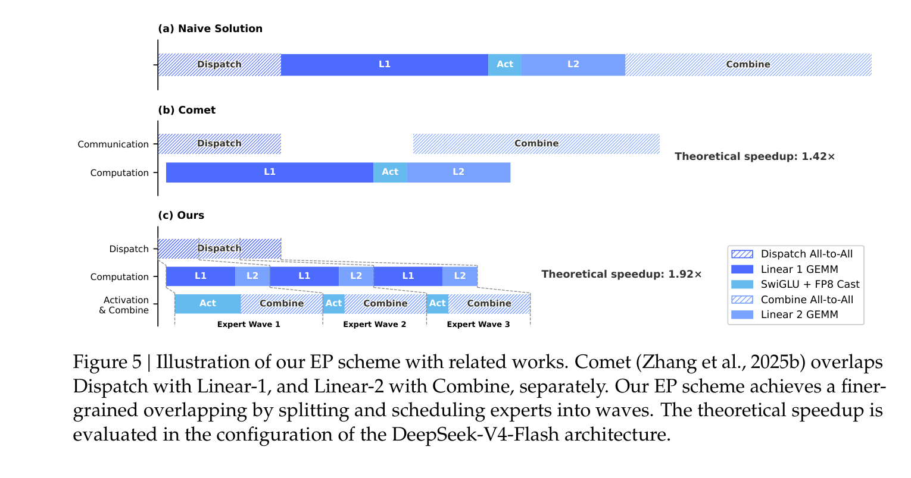
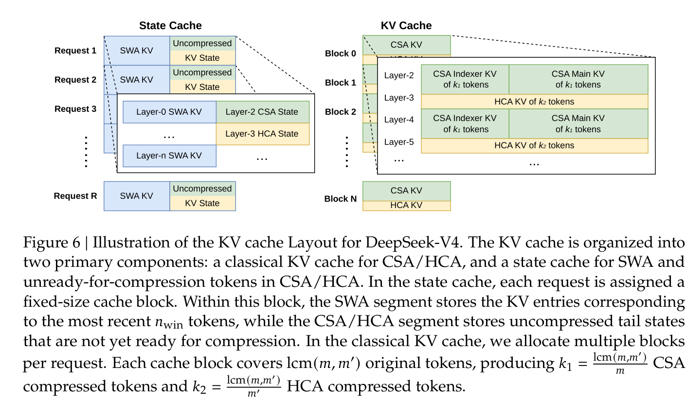
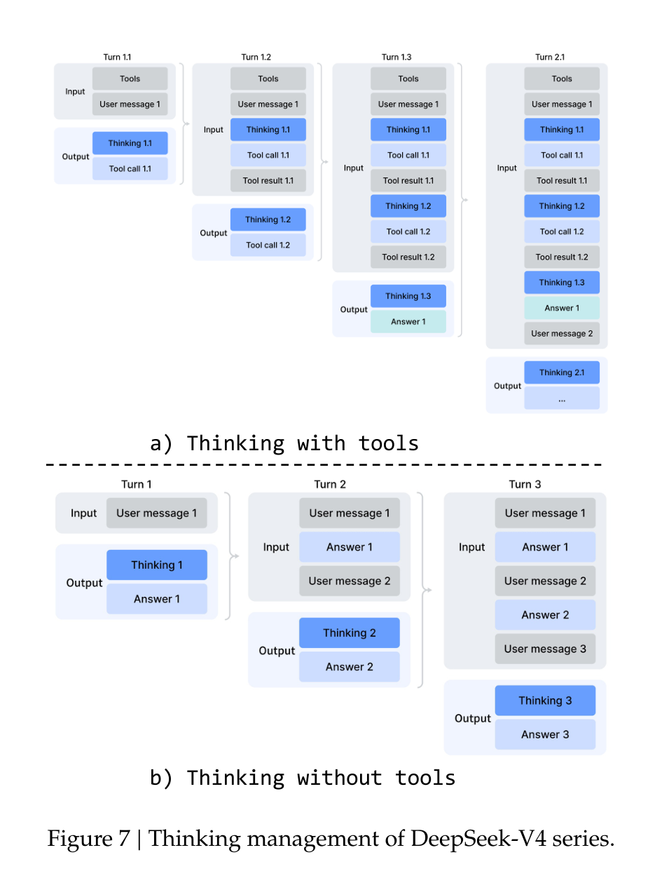
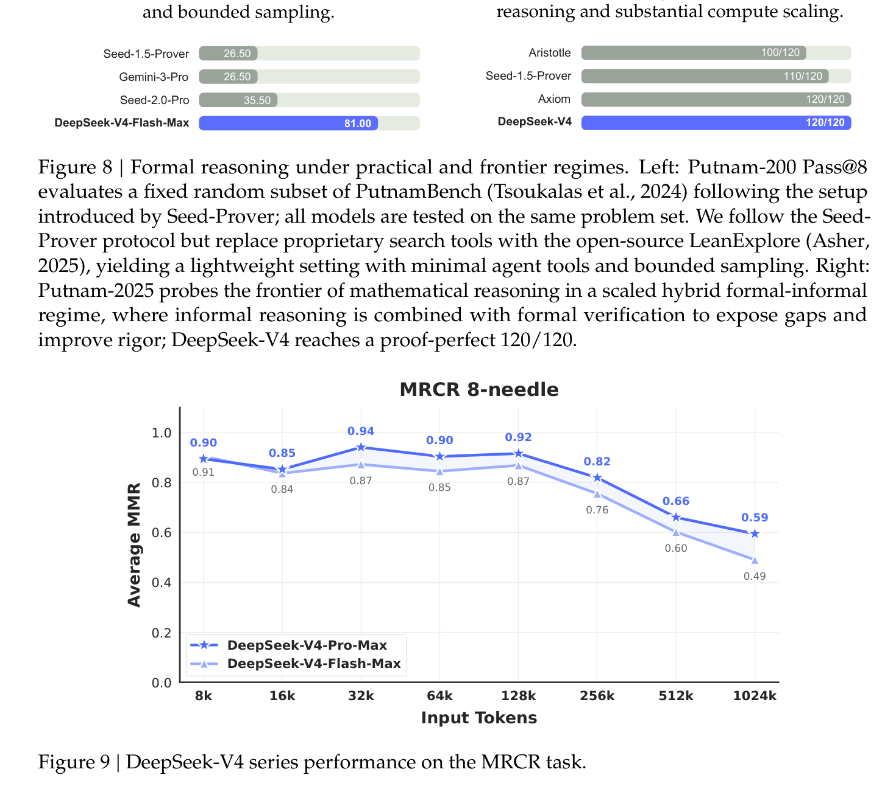
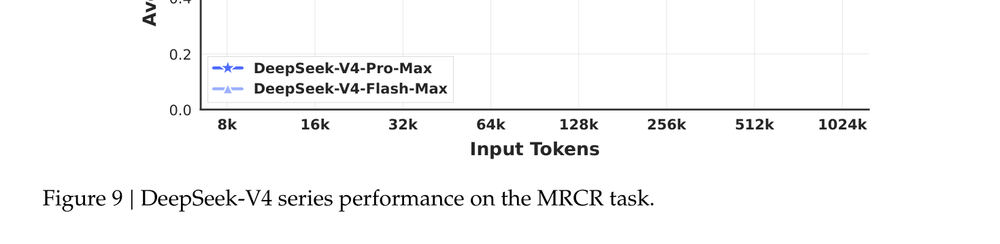
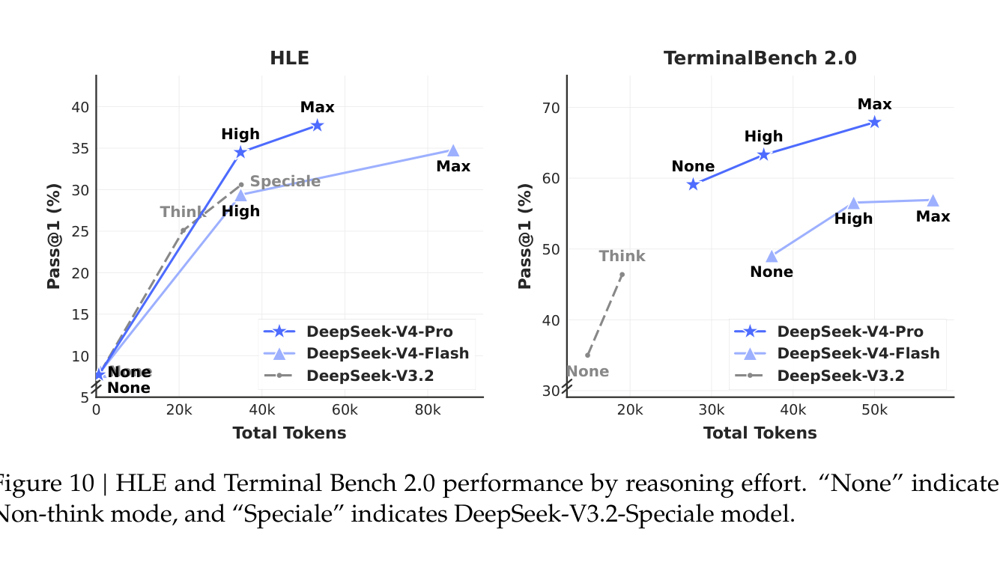

---
tags:
  - papers/LLM
aliases:
  - "DeepSeek-V4"
date: 2026
---

# DeepSeek-V4: 迈向高效百万级上下文智能

## 核心信息

- **标题**: DeepSeek-V4: Towards Highly Efficient Million-Token Context Intelligence
- **作者**: DeepSeek-AI
- **机构**: DeepSeek
- **发表时间**: 2026
- **类型**: 技术报告（预览版）
- **模型下载**: [HuggingFace](https://huggingface.co/collections/deepseek-ai/deepseek-v4)
- **开源内核**: [MegaMoE (DeepGEMM)](https://github.com/deepseek-ai/DeepGEMM/pull/304)
- **领域**: 大语言模型 / 长上下文推理 / 系统优化

---

## 这篇论文在讲什么？（给初学者的概述）

### 背景知识：为什么长上下文很重要？

想象你在阅读一本 500 页的书，但你一次只能记住最近几页的内容。当有人问你第 50 页的细节时，你不得不翻回去重新读。这就是目前大多数大语言模型（LLM）面临的窘境——它们的"记忆窗口"（上下文长度）有限。

**上下文长度**指的是模型一次能"看到"的 token 数量。一个 token 大约对应一个英文单词或一两个中文字。当前主流模型的上下文长度在 8K~128K tokens，但如果你想让 AI 做这些事情：

- 阅读一本完整的技术手册并回答问题
- 在长达数小时的编程任务中保持一致的思维链
- 分析上百份法律文件找出关键条款

你就需要**百万级 token** 的上下文长度。

### 问题在哪？

传统的注意力机制（Attention）是大语言模型的核心组件，它让模型中的每个 token 都能"看到"所有其他 token。但这带来了一个严重的问题：**计算量随序列长度的平方增长**。也就是说：

- 处理 1K tokens → 需要 100 万次计算
- 处理 1M tokens → 需要 1 万亿次计算（增长了 **100 万倍**）

这种二次方复杂度让百万级上下文在实际中几乎不可行——不仅算力需求暴增，存储每个 token 的 Key-Value（KV）缓存所需的**内存**也会爆炸式增长。

### DeepSeek-V4 的解法

DeepSeek-V4 的核心思路可以用一句话概括：**先压缩，后选择**。

不让每个 token 都去关注所有历史 token，而是：
1. 把历史 token 的信息**压缩**成少量的摘要（4 倍压缩 + 128 倍压缩）
2. 从压缩后的摘要中**选出最相关的**来关注

最终结果：在 100 万 token 的上下文下，KV 缓存降至传统方法的 **2%**，推理计算量降至前代的 **10~27%**。这不是小幅改进，而是**量级跃变**。

---

## 一句话总结

DeepSeek-V4 通过混合压缩注意力（CSA + HCA）从架构层面根本性地解决了百万级上下文的效率瓶颈，配合流形约束超连接（mHC）和 Muon 优化器的工程突破，在保持开源模型性能前沿的同时将长上下文推理的算力和内存开销压缩到前代的十分之一量级。

---

## 模型配置速览

DeepSeek-V4 包含两个版本：

| 配置项 | V4-Flash（经济版） | V4-Pro（旗舰版） |
|--------|---------------------|-------------------|
| Transformer 层数 | 43 | 61 |
| 隐藏维度 $d$ | 4096 | 7168 |
| 总参数 | **284B** | **1.6T** |
| 每 token 激活参数 | **13B** | **49B** |
| CSA 压缩率 $m$ | 4 | 4 |
| HCA 压缩率 $m'$ | 128 | 128 |
| 注意力 top-k | 512 | 1024 |
| 路由专家数 / 激活数 | 256 / 6 | 384 / 6 |
| 专家中间维度 | 2048 | 3072 |
| mHC 扩展因子 $n_\text{hc}$ | 4 | 4 |
| 预训练 token 量 | 32T | 33T |
| 上下文长度 | **1M** | **1M** |

核心理念：V4-Flash 面向成本敏感场景（参数量只有 V3.2 的 42%，但性能更强）；V4-Pro 追求性能极致。


---

## 第一部分：架构创新

### 整体架构

DeepSeek-V4 保留了 Transformer 的基本框架和 Multi-Token Prediction（MTP）模块，但在三个关键位置做了升级：

1. **注意力层** → 用 CSA + HCA 混合压缩注意力替代传统注意力
2. **残差连接** → 用 mHC（流形约束超连接）替代标准残差连接
3. **前馈层** → 沿用 DeepSeekMoE（混合专家系统）
4. **优化器** → 用 Muon 替代 AdamW


每个 Transformer Block 的执行流程：
1. **Pre-Block Mixing**（$A_l$ 映射）→ 从 mHC 残差流中提取当前层的输入
2. **CSA 或 HCA 注意力** → 对压缩后的 KV 缓存进行注意力计算
3. **Post-Block Mixing** → 将注意力输出融合回残差流
4. **Pre-Block Mixing** → 提取 FFN 层的输入
5. **DeepSeekMoE** → 1 个共享专家 + 6 个被激活的路由专家
6. **Post-Block Mixing** → 融合回残差流
7. **Residual Mixing**（$B_l$ 变换）→ 双随机矩阵约束的残差变换

---

### 1.1 压缩稀疏注意力（CSA）——先压缩后选择

#### 初学者背景：什么是 KV Cache？

在标准注意力中，每个 token 都会产生一个 Key（键）和一个 Value（值），所有历史 token 的 K 和 V 会被缓存起来供后续 token 查询。这就是 **KV Cache**。对于 100 万 token 的序列，你需要存储 100 万对 KV——这占用了巨大的 GPU 显存。

#### CSA 的核心思路

CSA 的解决方案分两步：

**第一步：Token 级压缩（4 倍压缩）**

将每连续 $m=4$ 个 token 的 KV 条目通过加权求和压缩为**一个**条目：

$$C_i^\text{Comp} = \sum_{j=mi}^{m(i+1)-1} S_j^a \odot C_j^a + \sum_{j=m(i-1)}^{mi-1} S_j^b \odot C_j^b$$

其中权重 $S$ 通过 Softmax 归一化（含可学习位置偏置）。注意 $C_a$ 和 $C_b$ 的索引有重叠，这使得压缩过程考虑了相邻窗口的信息。

通俗理解：把每 4 页的内容压缩成一个"摘要段落"。100 万 token 的 KV 缓存变成了 25 万个压缩条目。

**第二步：闪电索引器（Lightning Indexer）— top-k 稀疏选择**

压缩后仍有 25 万条目，全部参与注意力计算仍然代价高昂。闪电索引器为每个查询 token 快速计算索引分数，只选出最相关的 top-k 个条目：

$$I_{t,s} = \sum_{h=1}^{n_h^I} w_{t,h}^I \cdot \text{ReLU}(q_{t,h}^I \cdot K_s^{I\text{Comp}})$$

- V4-Flash 选 top-512，V4-Pro 选 top-1024
- 索引器注意力在 **FP4 精度**下计算，进一步加速

选出的条目通过**共享 KV 的多查询注意力（MQA）**完成最终计算——每个压缩 KV 条目同时充当 key 和 value。


---

### 1.2 重压缩注意力（HCA）——更激进的压缩

HCA 与 CSA 的压缩机制类似，但在两个方面截然不同：

| 对比项 | CSA | HCA |
|--------|-----|-----|
| 压缩率 | $m=4$（温和） | $m'=128$（极端） |
| 稀疏选择 | top-k 选择 | 无（密集注意力） |
| 重叠压缩 | 有 | 无 |
| 100 万 token → | 25 万条目 | **~7800 条目** |

HCA 将 100 万 token 的 KV 缓存压缩至约 7800 条目，对所有条目执行**密集注意力**（不做稀疏选择）。

**设计哲学**：CSA 和 HCA 形成互补——
- CSA：温和压缩 + 稀疏选择 → 擅长捕获**局部精细依赖**
- HCA：激进压缩 + 密集注意力 → 擅长捕获**全局宏观依赖**

两者在 Transformer 层中**交替配置**（前 2 层特殊处理，后续层 CSA-HCA 交替）。


---

### 1.3 注意力的其他工程细节

**部分旋转位置编码（Partial RoPE）**：仅对查询和 KV 条目的最后 64 维应用 RoPE。由于 KV 同时充当键和值，注意力输出会携带绝对位置编码，因此对输出也应用**反向 RoPE** 使其转为相对位置编码。

**滑动窗口分支**：为 CSA 和 HCA 各引入一个补充滑动窗口注意力分支（窗口大小 $n_\text{win}=128$），弥补压缩导致的局部细粒度依赖缺失。每个查询 token 额外产生 128 个未压缩 KV 条目对应最近 128 个 token。

**注意力沉积（Attention Sink）**：引入可学习的沉积 logit $z'_h$，允许每个注意力头将总注意力分数调整为不等于 1 甚至接近 0：

$$s_{h,i,j} = \frac{\exp(z_{h,i,j})}{\sum_k \exp(z_{h,i,k}) + \exp(z'_h)}$$

**混合精度存储**：RoPE 维度使用 BF16，其余维度使用 FP8，KV 缓存大小减半；索引器注意力在 FP4 精度下计算。

---

### 1.4 效率数据

在 100 万 token 上下文下的效率对比：

| 指标 | V4-Pro vs V3.2 | V4-Flash vs V3.2 |
|------|----------------|-------------------|
| 单 token 推理 FLOPs | **27%** | **10%** |
| KV Cache 大小 | **10%** | **7%** |
| vs BF16 GQA8 基线 KV Cache | **~2%** | 更低 |

以 BF16 GQA8（head_dim=128）为基线，DeepSeek-V4 系列的 KV 缓存在 1M 上下文下降至基线的约 **2%**。

---

### 1.5 流形约束超连接（mHC）

#### 初学者背景：什么是残差连接？

在深度神经网络中，"残差连接"就是把某一层的**输入直接加到输出**上：$y = f(x) + x$。这个简单的设计让深层网络的训练成为可能（否则梯度容易消失）。但标准残差连接的表达能力有限——它只是做简单的加法。

#### 超连接（Hyper-Connections）的想法

超连接（HC）将残差流宽度扩展 $n_\text{hc}$ 倍（V4 中 $n_\text{hc}=4$），提供额外的缩放轴。但原始 HC 在深层堆叠时频繁出现**数值不稳定**。

#### mHC 的核心创新

mHC 将残差映射矩阵 $B_l$ 约束到**双随机矩阵流形**（Birkhoff 多面体）上：

$$B_l \in \mathcal{M} = \{M \in \mathbb{R}^{n \times n} \mid M\mathbf{1}_n = \mathbf{1}_n,\ \mathbf{1}_n^T M = \mathbf{1}_n^T,\ M \geq 0\}$$

通俗理解：双随机矩阵就像一个"公平分配器"——每行每列之和都等于 1，所有元素非负。这保证了：
- $\|B_l\|_2 \leq 1$（谱范数不大于 1，即非扩张映射）
- $\mathcal{M}$ 对矩阵乘法**封闭**：多层堆叠后仍然稳定

具体实现通过 **Sinkhorn-Knopp 算法**（20 次迭代）将无约束参数投影到 $\mathcal{M}$ 上。三个映射（$A_l$、$B_l$、$C_l$）均采用动态参数化——分解为输入依赖的动态分量和静态偏置的叠加。mHC 的额外运行时开销仅为流水线阶段的 **6.7%**。

---

### 1.6 Muon 优化器

#### 初学者背景：什么是优化器？

训练神经网络就是不断调整模型参数以最小化损失函数。优化器决定了"如何调整"——调多少、往哪个方向调。AdamW 是目前最主流的优化器，而 Muon 是一种更新的方法，通过对梯度做**正交化**（让更新方向更均匀）来加速收敛。

#### DeepSeek-V4 的 Muon 实现

大多数模块使用 Muon 优化器（嵌入层、预测头和 RMSNorm 仍用 AdamW）。Muon 的核心是对梯度动量进行近似正交化：

$$O'_t = \text{HybridNewtonSchulz}(\mu M_t + G_t)$$

混合 Newton-Schulz 迭代分两阶段进行：
- **前 8 步**：系数 $(a, b, c) = (3.4445, -4.7750, 2.0315)$ → 驱动**快速收敛**
- **后 2 步**：系数 $(2, -1.5, 0.5)$ → 将奇异值**精确稳定**到 1

这是 Muon 首次被应用于**万亿参数 MoE 模型**的训练。

关键工程适配包括：
- 为密集参数设计**背包算法**分配 ZeRO 桶以适配 Muon 的全梯度矩阵需求（填充开销 <10%）
- MoE 参数按专家独立优化，自动合并同形状参数以批量执行 Newton-Schulz 迭代
- 通过 BF16 随机舍入压缩 MoE 梯度通信量减半
- Muon 在 BF16 矩阵乘法下保持稳定，无需更高精度
- 注意力架构允许直接对 Q 和 KV 应用 RMSNorm，无需 QK-Clip 技巧

---

## 第二部分：基础设施工程

这部分往往被忽视，但对 DeepSeek-V4 的实际可行性至关重要。

### 2.1 MoE 细粒度通信-计算重叠

#### 初学者背景：什么是 MoE？

MoE（Mixture of Experts）是一种让模型"只用一小部分参数处理每个 token"的技术。V4-Pro 有 384 个路由专家，但每个 token 只激活 6 个——这大幅降低了计算量，同时保持了模型容量。

但 MoE 有一个工程难题：专家分布在不同 GPU 上，需要通过网络通信将 token 发送到正确的专家（Dispatch），计算完再收集回来（Combine）。这个通信开销很大。

#### V4 的解法：波级调度

V4 将 MoE 层分解为四个阶段：Dispatch（通信）、Linear-1（计算）、Activation（计算）、Linear-2（计算）、Combine（通信），然后将通信**完全隐藏在计算背后**。

关键洞察：通信延迟能否被隐藏取决于**计算-通信比**，而非带宽本身。当 $C/B \leq 2d = 6144$ FLOPs/Byte 时，通信可以被完全隐藏——超过这个阈值后增加带宽收益递减。

实测效果：在 NVIDIA GPU 和华为昇腾 NPU 上实现 **1.50~1.96 倍加速**（RL rollout 等小批量场景加速尤为显著）。



---

### 2.2 TileLang 领域专用语言

V4 复杂的模型架构本应产生数百个细粒度的 Torch ATen 算子。团队使用 TileLang（一种领域专用语言 DSL）开发了一组融合内核来替代它们。

关键技术点：
- **Host Codegen**：将主机端逻辑生成为 C++ 代码，CPU 侧调用开销从数十微秒降至**亚微秒级**
- **Z3 SMT 求解器集成**：使用形式化整数分析解锁更复杂的编译优化（向量化、barrier 插入、代码简化）
- **数值精度保证**：默认禁用 fast-math，提供 IEEE-754 兼容的精确运算指令
- **Bitwise 可复现性**：对齐 TileLang 和 NVCC 的代数简化规则，确保与手写 CUDA 内核 bit-identical

---

### 2.3 批次不变性与确定性内核

DeepSeek-V4 实现了端到端的 **bitwise 可复现性**——这对于调试、稳定性分析和一致的后训练行为至关重要。

**批次不变性**：任何给定 token 的输出与其在 batch 中的位置无关（bit 级一致）。需要解决的挑战：
- **注意力**：开发了双内核策略——一个内核在单 SM 上计算完整序列（高吞吐），另一个用多 SM 处理部分填充波（低延迟），两个内核的累加顺序严格一致
- **矩阵乘法**：端到端使用 DeepGEMM 替代 cuBLAS（后者无法保证批次不变性），在大多数场景下不使用 split-k 技术

**确定性**：解决了三个非确定性来源：
- 注意力反向传播中的 `atomicAdd` → 分配独立累加缓冲区 + 全局确定性求和
- MoE 反向传播中的多 rank 写入 → token 顺序预处理 + buffer 隔离
- mHC 小矩阵乘法的 split-k → 分别输出各 split 部分 + 后续确定性规约

---

### 2.4 FP4 量化感知训练（QAT）

在后训练阶段引入 FP4（MXFP4）量化感知训练，应用于两个组件：

1. **MoE 专家权重**：FP32 主权重 → 量化到 FP4 → 反量化到 FP8 计算。关键洞察：FP4 到 FP8 的反量化**无损**（FP8 有 2 个额外指数位），因此整个流程完全复用现有 FP8 训练框架
2. **CSA 索引器的 QK 路径**：QK 激活缓存、加载和乘法全部在 FP4 下完成，加速长上下文下的注意力分数计算

额外优化：索引分数从 FP32 量化到 BF16，top-k 选择器获得 **2 倍加速**，同时保持 **99.7%** 的 KV 条目召回率。

推理和 RL 采样时直接使用真实 FP4 量化权重（非模拟量化），确保采样行为与线上部署完全一致。

> 注意：FP4 × FP8 的峰值算力在当前硬件上与 FP8 × FP8 相同，理论上的 1/3 额外效率提升需要等待未来硬件支持。

---

### 2.5 训练框架

#### Muon 与 ZeRO 的适配

Muon 要求完整梯度矩阵来计算更新，但 ZeRO 将参数分片到多 rank 上。解决方案：
- **密集参数**：用背包算法将参数矩阵分配到有限数量的 ZeRO rank，确保负载均衡，填充开销 <10%
- **MoE 参数**：按专家独立优化，展平所有同类投影矩阵后均匀分配，无需限制 ZeRO 并行度

#### mHC 的高效实现

mHC 增加了激活内存和流水线通信量。三项优化将其墙钟开销控制在 6.7%：
1. 训练和推理的融合内核
2. 选择性检查点重计算策略（重计算层间隐状态和归一化输入，避免重计算计算密集型操作）
3. 调整 DualPipe 1F1B 方案以适应增加的流水线通信

#### 长上下文的上下文并行

传统 Context Parallelism 将序列维度分片，但压缩注意力带来两个挑战：
- 压缩后的 KV 长度在各 rank 间不一致
- 压缩需要 $m$ 个连续 KV 条目，可能跨越 rank 边界

解决方案：两阶段通信——
1. 第一阶段：rank $i$ 将最后 $m$ 个未压缩 KV 条目发送给 rank $i+1$，后者将其与本地条目一起压缩
2. 第二阶段：all-gather 收集所有本地压缩条目，然后用融合 select-and-pad 算子重组为完整的压缩 KV

#### 张量级激活检查点

传统的激活检查点在模块粒度上工作（要么保存要么重计算整个模块输出）。V4 实现了**张量级**检查点——开发者只需在前向传播中标注需要检查点的张量，框架通过 TorchFX 自动追踪计算图，对每个标注张量反向遍历找到最小重计算子图，无需手动实现反向传播逻辑。

---

### 2.6 推理框架

#### 异构 KV 缓存管理

混合注意力机制产生了多种类型的 KV 条目（CSA 压缩、HCA 压缩、索引器、滑动窗口），大小和更新规则各不相同。这打破了 PagedAttention 的基本假设。

V4 将 KV 缓存分为两个主要组件：

1. **状态缓存（State Cache）**：固定大小，存储滑动窗口 KV 条目和未完成压缩的尾部 token。每个请求分配一个固定大小的 cache block
2. **经典 KV 缓存**：动态分配，存储 CSA/HCA 压缩条目。每个 block 覆盖 $\text{lcm}(m, m')$ 个原始 token，产生 $k_1$ 个 CSA 压缩 token 和 $k_2$ 个 HCA 压缩 token



#### 磁盘 KV 缓存存储

为消除共享前缀请求的重复 prefilling，设计了三种 SWA KV 条目的磁盘缓存策略：

| 策略 | 存储开销 | 计算冗余 | 适用场景 |
|------|----------|----------|----------|
| **Full SWA Caching** | 高（存储所有 SWA KV） | 零 | 存储不是瓶颈时 |
| **Periodic Checkpointing** | 中（每 $p$ 个 token 存一次） | 中 | 可调参数 $p$ 权衡 |
| **Zero SWA Caching** | 零 | 高（重计算最后 $n_\text{win} \cdot L$ 个 token） | 存储极度稀缺时 |

CSA/HCA 的压缩 KV 条目直接存储到磁盘；命中前缀时读取压缩条目复用，仅对尾部不完整 block 的 token 需要重计算。

---

## 第三部分：预训练

### 3.1 数据构建

在 DeepSeek-V3 预训练数据基础上多维度增强：

- **网页数据**：增加过滤策略去除批量自动生成和模板化内容，缓解**模型塌缩**风险
- **数学和编程**：核心组件，额外在中期训练阶段引入**智能体数据**增强代码能力
- **多语言数据**：扩大规模以捕获不同文化的**长尾知识**
- **长文档数据**：重点策展科学论文和技术报告等具有独特学术价值的材料
- 采用 sample-level attention masking（不同于 V3 的跨文档注意力）
- 词汇表大小保持 128K，沿用 token-splitting 和 Fill-in-Middle 策略

总预训练语料超过 **32T tokens**。

### 3.2 训练配置

**序列长度调度**：4K → 16K → 64K → 1M，逐步扩展。

**稀疏注意力引入**：前 1T tokens 使用密集注意力热身，在 64K 序列长度阶段引入稀疏注意力，先短暂热身闪电索引器，然后保持稀疏注意力至训练结束。

**学习率**：
- V4-Flash：峰值 $2.7 \times 10^{-4}$，末期 cosine 衰减至 $2.7 \times 10^{-5}$
- V4-Pro：峰值 $2.0 \times 10^{-4}$，末期衰减至 $2.0 \times 10^{-5}$

**MTP 损失**：权重 0.3（大部分训练），学习率衰减开始后降至 0.1。

### 3.3 训练稳定性的两个实用技巧

万亿参数 MoE 模型的训练稳定性是重大挑战，DeepSeek-V4 发现 loss 尖峰总是与 MoE 层的异常值相关，且路由机制会加剧这些异常值。

**1. 预见性路由（Anticipatory Routing）**

核心思想：解耦骨干网络和路由网络的同步更新。在第 $t$ 步用当前参数 $\theta_t$ 做特征计算，但用历史参数 $\theta_{t-\Delta t}$ 的路由索引。

实现方式：在第 $t-\Delta t$ 步提前获取第 $t$ 步的数据，"预见性地"计算并缓存路由索引供后续使用。额外开销约 20%，通过自动检测机制仅在出现 loss 尖峰时触发，之后恢复标准训练。

**2. SwiGLU 截断**

将 SwiGLU 线性分量截断在 $[-10, 10]$ 范围内，门控分量上界截断为 10。

> 论文坦承这两个技巧虽有效但"理论机制尚未充分理解"。

### 3.4 预训练评估结果

| 类别 | 代表基准 | V3.2-Base | V4-Flash-Base | V4-Pro-Base |
|------|----------|-----------|---------------|-------------|
| 世界知识 | MMLU-Pro | 65.5 | 68.3 | **73.5** |
| 世界知识 | Simple-QA Verified | 28.3 | 30.1 | **55.2** |
| 世界知识 | FACTS Parametric | 27.1 | 33.9 | **62.6** |
| 推理 | BBH | **87.6** | 86.9 | 87.5 |
| 编程 | HumanEval | 62.8 | 69.5 | **76.8** |
| 数学 | MATH | **60.5** | 57.4 | 64.5 |
| 长上下文 | LongBench-V2 | 40.2 | 44.7 | **51.5** |

核心发现：
- V4-Flash-Base 仅用 284B/13B 参数（V3.2 为 671B/37B）就在多数基准上超越 V3.2-Base
- V4-Pro-Base 在知识密集型评估上实现跃升级提升

---

## 第四部分：后训练

### 4.1 后训练流程总览

后训练分为**两阶段范式**：

```
阶段一：专家独立培养
  ├── 数学专家 ─── SFT → GRPO RL
  ├── 编程专家 ─── SFT → GRPO RL
  ├── 智能体专家 ── SFT → GRPO RL
  ├── 指令跟随专家 SFT → GRPO RL
  └── ...（超过十个领域）

阶段二：On-Policy Distillation 合并
  └── 多教师 OPD → 单一统一模型
```

关键创新：用**多教师 On-Policy Distillation（OPD）完全替代了混合 RL 阶段**。

### 4.2 专家独立培养

每个领域专家依次经过 SFT（监督微调）和 GRPO 强化学习。

**推理模式设计**：三种推理努力程度——

| 推理模式 | 特点 | 典型场景 | 响应格式 |
|----------|------|----------|----------|
| Non-think | 快速直觉响应 | 日常任务、低风险决策 | `</think> summary` |
| Think High | 有意识的逻辑分析 | 复杂问题、中风险决策 | `<think>...thinking...</think> summary` |
| Think Max | 推理能力的极限发挥 | 探索模型推理边界 | 特殊系统提示 + `<think>...thinking...</think> summary` |

Think Max 模式会在系统提示中注入特殊指令，要求模型"详尽分解问题、严格压力测试逻辑、记录每一个中间步骤和被拒绝的假设"。

**生成式奖励模型（GRM）**：对于难以验证的任务（无法用简单规则或测试用例判定对错），不再使用传统的标量奖励模型。而是让模型自身充当 GRM，同时优化模型的评判能力和生成能力——模型的推理能力被融入评判过程，只需少量人类标注就能泛化到复杂任务。

**交错思维（Interleaved Thinking）**：利用 1M 上下文窗口，在**工具调用场景**中完整保留所有推理历史（包括跨用户消息边界），让模型在长周期智能体任务中维持累积的思维链。一般对话场景仍在新用户消息到来时丢弃推理历史。



**Quick Instruction**：在聊天机器人场景中，搜索触发、意图识别等辅助任务通常需要单独的小模型处理。V4 通过在输入序列末尾追加特殊 token（如 `<|action|>`、`<|query|>`、`<|domain|>`），直接复用已计算的 KV 缓存，避免重复 prefilling，显著降低首 token 延迟（TTFT）。

### 4.3 On-Policy Distillation（OPD）

OPD 的目标函数：

$$\mathcal{L}_\text{OPD}(\theta) = \sum_{i=1}^{N} w_i \cdot D_\text{KL}(\pi_\theta \| \pi_{E_i})$$

其中 $\pi_\theta$ 是学生模型，$\pi_{E_i}$ 是第 $i$ 个教师专家，$w_i$ 是领域权重。关键设计决策：

**为什么用全词汇表 logit 蒸馏？** 先前方法将 KL 散度简化为 token 级估计（仅看采样 token 的概率比），虽然资源高效但梯度方差高、训练不稳定。V4 采用完整的词汇表分布（$|V| > 100K$），梯度估计更稳定、蒸馏更忠实。

**工程挑战与解法**：
1. **教师权重管理**：所有教师权重卸载到中央分布式存储，按需加载（ZeRO 式分片）
2. **logit 重建**：不缓存完整 logit（100K+ 词汇表太大），而是缓存教师最后一层隐状态，训练时按需通过 prediction head 重建 logit
3. **教师调度**：训练样本按教师索引排序，确保每个 mini-batch 中每个教师 head 只加载一次
4. **KL 计算**：使用 TileLang 专用内核加速精确 KL 散度计算

### 4.4 RL/OPD 基础设施

**可抢占容错 Rollout 服务**：实现了 token 粒度的 Write-Ahead Log（WAL），被抢占时保存 KV 缓存和已生成 token，恢复时从断点继续。重新生成未完成请求在数学上是**不正确的**——因为较短的回复更可能完整生存，重新生成会引入长度偏差。

**百万级上下文的 RL 扩展**：将 rollout 数据格式分解为轻量级元数据和重量级 per-token 字段。元数据用于全局 shuffle 和 packing 布局计算；per-token 字段通过共享内存数据加载器消除节点内冗余，按 mini-batch 粒度即时释放。

**DSec 沙箱平台**：用于智能体后训练和评估的生产级沙箱平台。由三个 Rust 组件构成（API 网关、节点代理、集群监控），管理**数十万并发沙箱实例**。提供四种执行基底（Function Call / Container / microVM / fullVM），统一 API 接口。

---

## 第五部分：评估结果

### 5.1 标准基准评估

**知识与推理**：

| 基准 | Opus-4.6 | GPT-5.4 | Gemini-3.1-Pro | K2.6 | GLM-5.1 | V4-Pro-Max |
|------|----------|---------|----------------|------|---------|------------|
| SimpleQA-Verified | 46.2 | 45.3 | **75.6** | 36.9 | 38.1 | 57.9 |
| Chinese-SimpleQA | 76.4 | 76.8 | **85.9** | 75.9 | 75.0 | 84.4 |
| GPQA Diamond | 91.3 | **93.0** | 94.3 | 90.5 | 86.2 | 90.1 |
| HLE | 40.0 | 39.8 | **44.4** | 36.4 | 34.7 | 37.7 |
| LiveCodeBench | 88.8 | - | 91.7 | 89.6 | - | **93.5** |
| Codeforces | - | 3168 | 3052 | - | - | **3206** |
| Apex Shortlist | 85.9 | 78.1 | 89.1 | 75.5 | 72.4 | **90.2** |
| IMOAnswerBench | 75.3 | **91.4** | 81.0 | 86.0 | 83.8 | 89.8 |

核心发现：
- V4-Pro-Max 在编程竞赛（Codeforces 3206，人类排名第 23）和数学推理（Apex Shortlist 90.2）上领先
- 在知识类评估上大幅缩小与 Gemini-3.1-Pro 的差距，但仍有差距
- 综合推理能力仍落后于 GPT-5.4 和 Gemini-3.1-Pro 约 3-6 个月

**形式化推理**：



V4-Flash-Max 在 Putnam-200 Pass@8 上达到 81.00（Seed-2.0-Pro 仅 35.50）。在 Putnam-2025 的 hybrid formal-informal 设置下达到 **120/120 满分**。

**百万 Token 上下文**：



V4-Pro 在 MRCR 1M 上（83.5 MMR）超越 Gemini-3.1-Pro（76.3），但落后于 Claude Opus 4.6（92.9）。在 128K 内检索性能高度稳定。

**推理模式对比**：

| 基准 | V4-Pro Non-Think | V4-Pro High | V4-Pro Max |
|------|-------------------|-------------|------------|
| HLE | 7.7% | 34.5% | **37.7%** |
| GPQA Diamond | 72.9 | 89.1 | **90.1** |
| Codeforces | - | 2919 | **3206** |
| MRCR 1M | 44.7 | 83.3 | **83.5** |



### 5.2 真实世界任务评估

**中文写作**：与 Gemini-3.1-Pro 对比，V4-Pro 在功能性写作上以 62.7% vs 34.1% 的胜率大幅领先（Gemini 偶尔会让自身风格偏好覆盖用户的明确要求）。创意写作上指令跟随 60.0% 胜率，写作质量 77.5% 胜率。但在最具挑战性的高复杂度约束或多轮场景中，Claude Opus 4.5 仍以 52.0% vs 45.9% 的胜率保持优势。

**搜索增强问答**：
- RAG 模式（Non-think）：V4-Pro 大幅优于 V3.2，在单值搜索和规划策略类任务上优势最明显
- 智能体搜索（Thinking 模式）：显著优于 RAG，成本仅略高于标准 RAG

**白领任务**：30 个跨 13 个行业的高级中文专业任务（金融、教育、法律、技术等），V4-Pro-Max vs Opus-4.6-Max 取得 63% 不败率。在任务完成度和内容质量上优势明显，但在指令跟随和排版美观上仍有改进空间。

**编程智能体**：在内部 R&D 编程基准（200+ 真实任务，涵盖 PyTorch、CUDA、Rust、C++）上，V4-Pro-Max 达到 **67% 通过率**，显著超越 Claude Sonnet 4.5（47%），接近 Opus 4.5（70%）。内部调查中 **91% 的开发者**认为 V4-Pro 可以作为日常主力编程模型。

---

## 第六部分：深度分析与评论

### 真正贡献是什么

DeepSeek-V4 的核心贡献不只是"更好的 benchmark 分数"，而是**从架构层面证明了百万级上下文可以在不显著牺牲质量的前提下被高效支持**：

1. **CSA + HCA 的混合方案**在压缩率和注意力覆盖之间找到了实用的平衡点——CSA 做温和压缩（4x）+ 稀疏选择，HCA 做极端压缩（128x）+ 密集注意力，两者交替确保全局和局部信息都不丢失
2. **mHC** 用双随机矩阵约束解决了超连接的训练稳定性问题。这是一个简洁的数学解决方案——$\mathcal{M}$ 对乘法封闭意味着深层堆叠天然稳定
3. **Muon 优化器**从中等规模扩展到万亿参数 MoE 是重要的工程验证
4. **OPD 替代混合 RL** 是后训练范式的重要创新——用全词汇表 logit 蒸馏实现十余个领域专家的稳定合并
5. **基础设施工程**（MoE 细粒度 EP、TileLang、确定性内核、DSec 沙箱）构成了让上述创新实际可行的关键支撑

### 哪些地方容易被误读

1. **效率数字的适用范围**：27% FLOPs 和 10% KV Cache 的数字是在 **1M token 上下文**下的比较。在短-中等长度文本上，CSA/HCA 的压缩和稀疏选择反而可能引入不必要的开销。论文提到选择了更小的 top-k 来改善短文本效率，但具体权衡幅度未充分量化
2. **"开源模型最优"的边界**：V4-Pro-Max 在推理上仍落后于 GPT-5.4 和 Gemini-3.1-Pro 约 3-6 个月。HLE（37.7 vs 44.4）和 GPQA（90.1 vs 94.3）差距明显
3. **架构复杂度**：论文自身承认保留了许多初步验证的组件和技巧，使架构"相对复杂"。未来迭代将精简架构
4. **FP4 的当前效率限制**：FP4 × FP8 在现有硬件上与 FP8 × FP8 峰值算力相同，理论加速需要未来硬件
5. **训练技巧的理论缺失**：预见性路由和 SwiGLU 截断的"底层原理尚未充分理解"

---

## 局限

1. **架构复杂度过高**：CSA、HCA、mHC、Lightning Indexer、部分 RoPE、注意力沉积、滑动窗口分支、分组输出投影等组件的叠加使得理解和复现门槛很高
2. **短文本效率未充分评估**：对于占实际使用大多数的短-中等长度请求，压缩和稀疏注意力的开销-收益比并不清晰
3. **训练稳定性技巧缺乏理论基础**：预见性路由和 SwiGLU 截断均为经验性发现
4. **预览版本的局限**：不包含多模态能力，长周期智能体任务仍有明显改进空间
5. **评估中的缺失对比**：部分基准上未获得竞争模型的完整结果；GPT-5.4 的长上下文评估因 API 问题缺失
6. **无消融实验**：CSA vs HCA 的独立贡献、mHC vs 标准残差连接、Muon vs AdamW 的消融均未呈现

---

## 未来方向（论文自述）

1. 进行更全面和原则性的架构调查，精简至最本质的设计
2. 深入研究训练稳定性的理论基础，建立更可预测的稳定训练方法
3. 探索新维度的模型稀疏性（如更稀疏的 embedding 模块）
4. 研究低延迟架构和系统技术
5. 持续迭代长周期多轮智能体任务
6. 加入多模态能力
7. 发展更好的数据策划和合成策略

---

## 我的笔记

- **最可复用的思路**：mHC 的双随机矩阵约束是一个漂亮的数学解决方案——通过限制残差变换的谱范数来天然保证深层堆叠的数值稳定性，且 Sinkhorn-Knopp 算法足够简单，可直接在其他深度网络中尝试
- **最值得追问的假设**：CSA 的闪电索引器能否真正在极长上下文中保持检索质量？128x 压缩率的 HCA 在保留语义信息方面的下界是什么？
- **工程启示**：TileLang + Z3 SMT 求解器的组合可能是取代手写 CUDA 内核的实用方案；OPD 用全词汇表 logit 蒸馏替代 token 级 KL 估计的决策值得在自己的蒸馏实验中验证
- **DSec 沙箱**：管理数十万并发实例的 Rust 架构设计值得关注，特别是 token 粒度 WAL 和可链式快照的 microVM 方案
- **关联阅读**：mHC 完整论文（Xie et al., 2026）；TileLang（Wang et al., 2026）；Muon 可扩展性论文（Liu et al., 2025）；On-Policy Distillation（Lu and Lab, 2025）

---

## 引用

- DeepSeek-AI (2024). DeepSeek-V3 Technical Report.
- DeepSeek-AI (2025). DeepSeek-V3.2: Pushing the Frontier of Open Large Language Models.
- DeepSeek-AI (2025). DeepSeek-R1: Incentivizing Reasoning in LLMs through Reinforcement Learning.
- Xie et al. (2026). mHC: Manifold-Constrained Hyper-Connections.
- Jordan et al. (2024). Muon: An Optimizer for Hidden Layers in Neural Networks.
- Liu et al. (2025). Muon is Scalable for LLM Training.
- Wang et al. (2026). TileLang: Bridge Programmability and Performance in Modern Neural Kernels.
- Lu and Lab (2025). On-Policy Distillation.
- Dai et al. (2024). DeepSeekMoE: Towards Ultimate Expert Specialization in MoE Language Models.
- Zhu et al. (2025). Hyper-Connections.
- Zhao et al. (2025). DeepGEMM: Clean and Efficient FP8 GEMM Kernels with Fine-Grained Scaling.
