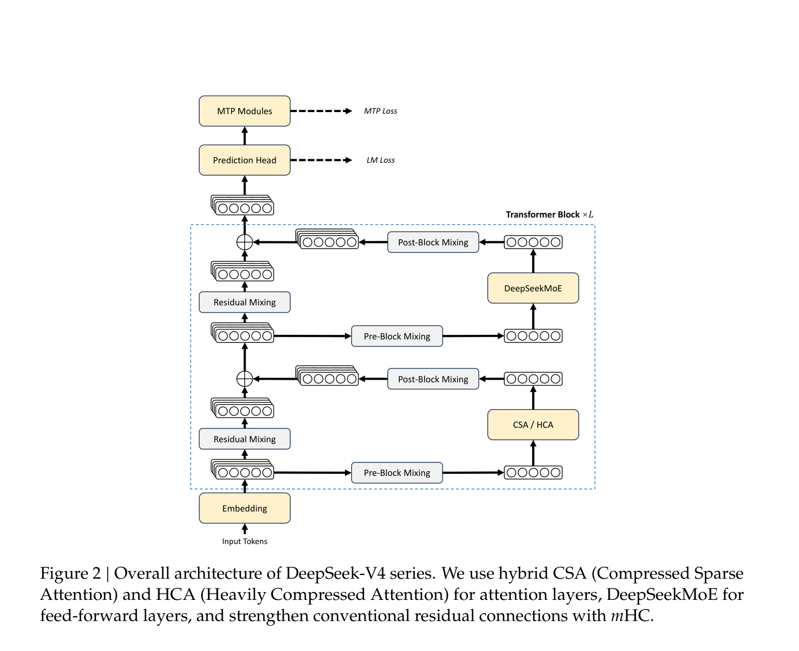
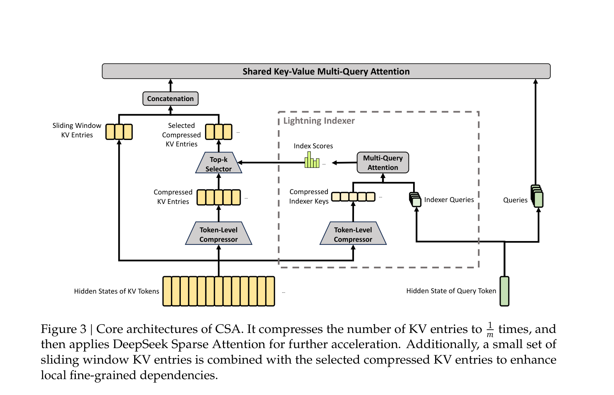
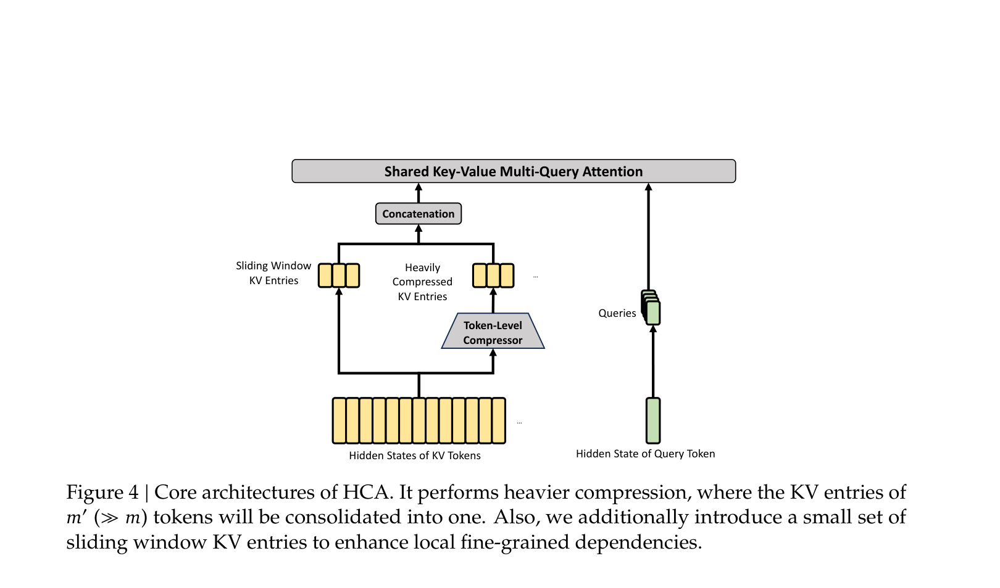
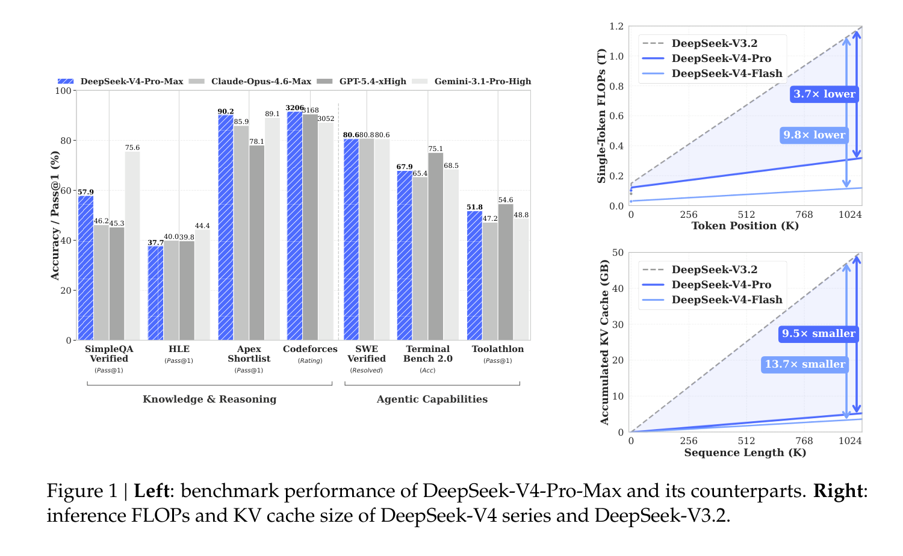

---
tags:
  - papers/LLM
aliases:
  - "DeepSeek-V4"
date: 2026
---

# DeepSeek-V4: Towards Highly Efficient Million-Token Context Intelligence

## 核心信息

- 标题: DeepSeek-V4: Towards Highly Efficient Million-Token Context Intelligence
- 作者: DeepSeek-AI
- 机构: DeepSeek
- 发表时间: 2026
- 期刊/会议: 技术报告（预览版）
- DOI: 未提供
- 源链接: https://huggingface.co/collections/deepseek-ai/deepseek-v4
- 代码仓库: https://huggingface.co/deepseek-ai/DeepSeek-V4-Pro/tree/main/inference（推理实现）；https://github.com/deepseek-ai/DeepGEMM/pull/304（MegaMoE 内核）
- 领域: 大语言模型 / 长上下文推理

## 原文摘要翻译

本文展示了 DeepSeek-V4 系列的预览版本，包含两个强大的混合专家语言模型：DeepSeek-V4-Pro（1.6T 参数，49B 激活）和 DeepSeek-V4-Flash（284B 参数，13B 激活），均支持百万 token 的上下文长度。DeepSeek-V4 系列在架构和优化方面引入了若干关键升级：（1）混合注意力架构，结合压缩稀疏注意力（CSA）和重压缩注意力（HCA）以提升长上下文效率；（2）流形约束超连接（mHC），增强传统残差连接；（3）Muon 优化器，加速收敛并提高训练稳定性。两个模型分别在超过 32T 多样化高质量 token 上进行预训练，随后经过全面的后训练流程来释放和增强其能力。DeepSeek-V4-Pro-Max 重新定义了开源模型的最先进水平，在核心任务上超越其前代模型。同时，DeepSeek-V4 系列在长上下文场景中效率极高——在百万 token 上下文设置下，DeepSeek-V4-Pro 仅需 DeepSeek-V3.2 的 27% 单 token 推理算力和 10% 的 KV 缓存。这使得常态化支持百万 token 上下文成为可能，从而让长周期任务和进一步的测试时计算扩展更加可行。

## 创新点

1. **混合压缩注意力架构（CSA + HCA）**：这是本文最核心的架构创新。CSA 先将每 $m$ 个 token 的 KV 缓存压缩为一个条目，再通过闪电索引器（Lightning Indexer）进行 top-k 稀疏选择；HCA 则以更激进的压缩率 $m'$（$m' \gg m$）将 KV 缓存进一步压缩，但保持密集注意力。两者交替使用，使得百万 token 上下文下的 KV 缓存降至 GQA8 基线的约 2%，从根本上改变了长上下文推理的算力-内存格局。

2. **流形约束超连接（mHC）**：将残差映射矩阵 $B_l$ 约束到双随机矩阵流形（Birkhoff 多面体）上，通过 Sinkhorn-Knopp 算法保证谱范数 $\|B_l\|_2 \leq 1$。这解决了原始超连接在深层堆叠时频繁出现的数值不稳定问题，同时保留了残差宽度作为额外缩放轴的表达能力。

3. **Muon 优化器的大规模工程化**：首次将 Muon 应用于万亿参数 MoE 模型训练。通过混合 Newton-Schulz 迭代（前 8 步快速收敛 + 后 2 步精确稳定）、ZeRO 分桶策略适配、BF16 梯度通信压缩等工程手段，使 Muon 在大规模分布式训练中可行且高效。

4. **MoE 细粒度通信-计算重叠**：将 MoE 层的专家分波调度，通过单一融合内核实现 Dispatch-计算-Combine 的完全流水线化。在 NVIDIA GPU 和华为昇腾平台上实现 1.50~1.96 倍加速。

5. **后训练范式革新——专家独立培养 + On-Policy Distillation**：用多教师 On-Policy Distillation 完全替代了混合强化学习阶段，通过全词汇表 logit 蒸馏和高效教师调度实现超过十个领域专家向单一模型的稳定知识合并。

## 一句话总结

DeepSeek-V4 通过混合压缩注意力（CSA + HCA）从架构层面根本性地解决了百万级上下文的效率瓶颈，配合 mHC 和 Muon 优化器的工程突破，在保持开源模型性能前沿的同时将长上下文推理的算力和内存开销压缩到前代的十分之一量级。

## 研究问题

推理模型（如 DeepSeek-R1、OpenAI o-系列）开启了测试时计算扩展的新范式，但传统注意力机制的二次方复杂度使得超长上下文成为根本性瓶颈。同时，复杂的智能体工作流、大规模跨文档分析等长周期任务对高效超长上下文支持提出了迫切需求。

现有开源模型虽然在通用能力上不断进步，但在处理超长序列时的架构效率问题始终是制约测试时计算扩展和长周期场景探索的核心障碍。DeepSeek-V4 的目标是打破这一效率壁垒，让百万级上下文成为常态而非奢侈。

## 数据与任务定义

### 预训练数据构建

在 DeepSeek-V3 预训练数据基础上，V4 系列进行了多维度增强：

- **网页数据**：增加过滤策略去除批量自动生成和模板化内容，缓解模型塌缩风险
- **数学和编程**：仍为核心组件，额外在中期训练阶段引入智能体数据增强代码能力
- **多语言数据**：扩大规模以捕获不同文化的长尾知识
- **长文档数据**：重点策展科学论文和技术报告等具有独特学术价值的材料
- 词汇表大小保持 128K，沿用 token-splitting 和 Fill-in-Middle 策略，新增 sample-level attention masking

总预训练语料超过 32T tokens。

### 模型配置

| 配置项 | V4-Flash | V4-Pro |
|--------|----------|--------|
| Transformer 层数 | 43 | 61 |
| 隐藏维度 $d$ | 4096 | 7168 |
| 总参数 | 284B | 1.6T |
| 激活参数 | 13B | 49B |
| CSA 压缩率 $m$ | 4 | 4 |
| HCA 压缩率 $m'$ | 128 | 128 |
| 注意力 top-k | 512 | 1024 |
| 路由专家数 / 激活数 | 256 / 6 | 384 / 6 |
| 专家中间维度 | 2048 | 3072 |
| mHC 扩展因子 $n_\text{hc}$ | 4 | 4 |
| 预训练 token 量 | 32T | 33T |

## 方法主线

### 机制流程

DeepSeek-V4 的核心执行链可概括为以下四步：

1. **输入嵌入 → mHC 残差流**：输入 token 经过嵌入层后，进入 mHC 增强的残差流。残差状态被扩展为 $X_l \in \mathbb{R}^{n_\text{hc} \times d}$（$n_\text{hc}=4$），通过输入映射 $A_l$、残差变换 $B_l$（双随机矩阵约束）和输出映射 $C_l$ 实现跨层信号的稳定传播。

2. **混合注意力处理**：前 2 层使用纯滑动窗口注意力（V4-Flash）或 HCA（V4-Pro），后续层 CSA 和 HCA 交替配置。CSA 层先将每 $m=4$ 个 token 的 KV 条目压缩为一个，再通过闪电索引器选出 top-k 个压缩 KV 条目做稀疏注意力；HCA 层以 $m'=128$ 的压缩率做更激进的压缩，但对所有压缩条目做密集注意力。两者共享"KV 条目同时充当 key 和 value"的多查询注意力范式。

3. **DeepSeekMoE 前馈**：每层 FFN 采用 DeepSeekMoE，包含 1 个共享专家和数百个路由专家（激活 6 个）。前 3 层 MoE 使用 Hash 路由确定目标专家，后续层使用可学习路由（激活函数从 Sigmoid 改为 $\sqrt{\text{Softplus}(\cdot)}$）。

4. **MTP 预测输出**：与 DeepSeek-V3 相同的多 token 预测模块。主损失和 MTP 辅助损失联合训练，MTP 损失权重在大部分训练过程中为 0.3，学习率衰减开始后降至 0.1。

### CSA 压缩稀疏注意力

CSA 的核心思路是"先压缩后稀疏"。给定输入隐状态 $H \in \mathbb{R}^{n \times d}$，CSA 先计算两组 KV 条目 $C_a, C_b$ 及其压缩权重 $Z_a, Z_b$，然后每 $m$ 个 KV 条目通过加权求和压缩为一个条目：

$$C_i^\text{Comp} = \sum_{j=mi}^{m(i+1)-1} S_j^a \odot C_j^a + \sum_{j=m(i-1)}^{mi-1} S_j^b \odot C_j^b$$

其中权重 $S$ 通过 Softmax 归一化（含可学习位置偏置），$C_a$ 和 $C_b$ 的索引存在重叠，因此实际序列长度被压缩到 $\frac{1}{m}$。在工程实现上，这意味着百万 token 的 KV 缓存被压缩为 25 万条目。

压缩后，闪电索引器（Lightning Indexer）为每个查询 token 计算索引分数，并通过 top-k 选择器保留最相关的压缩 KV 条目。索引器使用低秩查询分解和 ReLU 门控的加权多头评分：

$$I_{t,s} = \sum_{h=1}^{n_h^I} w_{t,h}^I \cdot \text{ReLU}(q_{t,h}^I \cdot K_s^{I\text{Comp}})$$

选出 top-k 条目后，通过共享 KV 的多查询注意力（MQA）完成核心注意力计算——每个压缩 KV 条目同时充当 key 和 value。

### HCA 重压缩注意力

HCA 的压缩策略与 CSA 类似但更激进：使用 $m'=128$ 的压缩率（CSA 的 32 倍），且不使用重叠压缩和稀疏选择。百万 token 的 KV 缓存被压缩至约 7800 条目，对所有条目执行密集注意力。HCA 同样使用共享 KV 的 MQA 和分组输出投影。

这一设计的关键权衡在于：HCA 虽然压缩更激进，但由于保留了密集注意力，能捕获全局依赖关系；CSA 压缩较温和但通过稀疏选择进一步减少计算量。两者交替使用形成互补。

### 注意力的其他工程细节

- **部分旋转位置编码（RoPE）**：对查询和 KV 条目的最后 64 维应用 RoPE；由于 KV 同时充当键和值，注意力输出会携带绝对位置编码，因此对输出也应用反向 RoPE 使其转为相对位置编码
- **滑动窗口分支**：为 CSA 和 HCA 各引入一个补充滑动窗口注意力分支（窗口大小 $n_\text{win}=128$），弥补压缩导致的局部细粒度依赖缺失
- **注意力沉积（Attention Sink）**：引入可学习的沉积 logit $z'_h$，允许每个注意力头将总注意力分数调整为不等于 1 甚至接近 0
- **混合精度存储**：RoPE 维度使用 BF16，其余维度使用 FP8，KV 缓存大小减半；索引器注意力在 FP4 精度下计算

### mHC 流形约束超连接

标准超连接（HC）通过将残差流宽度扩展 $n_\text{hc}$ 倍来提供额外的缩放轴，但在深层堆叠时会频繁出现数值不稳定。mHC 的核心创新是将残差映射矩阵 $B_l$ 约束到双随机矩阵流形（Birkhoff 多面体）上：

$$B_l \in \mathcal{M} = \{M \in \mathbb{R}^{n \times n} \mid M\mathbf{1}_n = \mathbf{1}_n,\ \mathbf{1}_n^T M = \mathbf{1}_n^T,\ M \geq 0\}$$

这保证了 $\|B_l\|_2 \leq 1$（非扩张映射），且 $\mathcal{M}$ 对矩阵乘法封闭，确保深层堆叠的稳定性。具体实现通过 Sinkhorn-Knopp 算法（20 次迭代）将无约束参数 $\tilde{B}_l$ 投影到 $\mathcal{M}$ 上。

三个映射（$A_l, B_l, C_l$）的参数均采用动态参数化——分解为输入依赖的动态分量和静态偏置的叠加，其中动态分量通过 RMSNorm 归一化后经小门控因子缩放。$A_l$ 和 $C_l$ 通过 Sigmoid 约束为非负有界。mHC 的额外运行时开销仅为流水线阶段的 6.7%。

### Muon 优化器

DeepSeek-V4 对大多数模块使用 Muon 优化器（嵌入层、预测头和 RMSNorm 仍用 AdamW）。Muon 的核心是对梯度动量进行近似正交化：

$$O'_t = \text{HybridNewtonSchulz}(\mu M_t + G_t)$$

混合 Newton-Schulz 迭代分两阶段进行：前 8 步使用系数 $(a, b, c) = (3.4445, -4.7750, 2.0315)$ 驱动快速收敛；后 2 步切换到 $(2, -1.5, 0.5)$ 将奇异值精确稳定到 1。更新矩阵经 RMS 重缩放后与 AdamW 超参数复用。

关键工程适配包括：为密集参数设计背包算法分配 ZeRO 桶以适配 Muon 的全梯度矩阵需求（填充开销不到 10%）；MoE 参数按专家独立优化并自动合并同形状参数以批量执行 Newton-Schulz 迭代；通过 BF16 随机舍入压缩 MoE 梯度通信量减半。

## 关键结果

### 预训练评估

在内部统一评估框架下的关键基准结果：

**V4-Flash-Base vs V3.2-Base 的效率故事**：V4-Flash-Base 仅用 284B / 13B 参数（V3.2 为 671B / 37B），在大多数基准上超越 V3.2-Base。特别是在世界知识任务和长上下文场景上优势显著——MMLU-Pro 从 65.5 提升到 68.3，LongBench-V2 从 40.2 提升到 44.7。

**V4-Pro-Base** 实现了全面碾压性提升，在几乎所有类别上都领先。知识密集型评估上增益尤为剧烈——Simple-QA Verified 从 28.3（V3.2）跃升至 55.2，FACTS Parametric 从 27.1 跃升至 62.6。HumanEval 从 62.8 提升至 76.8，MATH 从 60.5 提升至 64.5。

### 后训练评估

**知识**：V4-Pro-Max 在 SimpleQA-Verified 上达到 57.9，领先所有开源基线约 20 个百分点。中文知识（Chinese-SimpleQA 84.4）接近 Gemini-3.1-Pro（85.9）。但在教育知识类基准（GPQA 90.1 vs Gemini 94.3）仍落后于头部闭源模型。

**推理**：V4-Pro-Max 在 Codeforces 上达到 3206 Rating（人类排名第 23），超越 GPT-5.4 的 3168。LiveCodeBench 达到 93.5（Gemini-3.1-Pro 为 91.7）。在 Apex Shortlist 上达到 90.2，超过 Gemini 的 89.1。但综合推理能力仍落后于 GPT-5.4 和 Gemini-3.1-Pro 约 3-6 个月的发展差距。

**智能体**：V4-Pro-Max 在公开基准上与 Kimi K2.6、GLM-5.1 持平，略弱于头部闭源模型。但在内部研发编程基准上，V4-Pro-Max 达到 67% 通过率，显著超越 Claude Sonnet 4.5（47%）并接近 Opus 4.5（70%）。内部调查中 91% 的开发者认为 V4-Pro 可以作为日常主力编程模型。

**长上下文**：V4-Pro-Max 在 MRCR 1M 上（83.5 MMR）超越 Gemini-3.1-Pro（76.3），但落后于 Claude Opus 4.6（92.9）。在 128K 内检索性能高度稳定，超过 128K 后出现可见衰减但仍保持竞争力。

### 推理模式对比

三种推理模式（Non-Think / High / Max）展现了清晰的计算-性能权衡：

- **HLE**：Non-Think 模式 V4-Pro 仅 7.7%，High 模式 34.5%，Max 模式 37.7%——测试时计算扩展效果显著
- **关键观察**：V4-Pro 在 HLE 上展示出比 V3.2 更高的 token 效率——以更少的 token 达到更高的性能

### 效率指标

在 1M token 上下文下的效率对比是本文最惊人的数字：

| 指标 | V4-Pro vs V3.2 | V4-Flash vs V3.2 |
|------|----------------|-------------------|
| 单 token FLOPs | 27% | 10% |
| KV Cache 大小 | 10% | 7% |
| vs BF16 GQA8 基线 KV Cache | ~2% | 更低 |

## 深度分析

### 真正贡献是什么

DeepSeek-V4 的核心贡献不只是"更好的 benchmark 分数"，而是**从架构层面证明了百万级上下文可以在不显著牺牲质量的前提下被高效支持**。具体来说：

1. CSA + HCA 的混合方案在压缩率和注意力覆盖之间找到了实用的平衡点——CSA 做温和压缩（4x）+ 稀疏选择，HCA 做极端压缩（128x）+ 密集注意力，两者交替确保全局和局部信息都不丢失。
2. mHC 用双随机矩阵约束解决了超连接的训练稳定性问题。这是一个简洁的数学解决方案——$\mathcal{M}$ 对乘法封闭意味着深层堆叠天然稳定，无需额外的梯度裁剪或动态缩放。
3. 将 Muon 优化器从中等规模扩展到万亿参数 MoE 是一个重要的工程验证。

这些创新的组合效果是惊人的：1M 上下文下 KV 缓存降至 GQA8 基线的约 2%。这不是边际改进，而是量级跃变。

### 基础设施工程的隐藏贡献

本文大量篇幅用于描述基础设施优化，这些往往被忽视但对实际可行性至关重要：

- **MoE 细粒度专家并行**：通过将专家分波调度实现通信-计算全重叠，在强化学习采样等长尾小批量场景下也能实现 1.96 倍加速。论文坦诚给出了 $C/B \leq 2d = 6144$ FLOPs/Byte 的理论阈值，表明达到该平衡点后增加带宽收益递减。
- **TileLang 领域专用语言**：用 DSL 取代数百个细粒度 Torch ATen 算子，通过主机端代码生成将 CPU 侧调用开销从数十微秒降至亚微秒级。引入 Z3 SMT 求解器做形式化整数分析以解锁更复杂的编译优化。
- **批次不变性和确定性**：端到端确保 bitwise 可复现性。这需要解决注意力反向传播中的 atomicAdd 非确定性、MoE 反向中的多 rank 写入顺序和 mHC 小矩阵乘法的 split-k 问题。
- **FP4 量化感知训练**：对 MoE 专家权重和 CSA 索引器查询-键路径实施 FP4 量化感知训练。关键洞察是 FP4 到 FP8 的反量化可以无损完成（FP8 有 2 个额外指数位），因此整个流程完全复用现有 FP8 训练框架。
- **推理侧异构 KV 缓存管理**：设计了状态缓存（滑动窗口注意力 + 未压缩尾部 token）和经典 KV 缓存（CSA/HCA 压缩条目）的分层结构，并提出三种磁盘缓存策略在存储和计算之间做灵活权衡。

### 后训练范式：专家独立培养与 OPD 合并

后训练流程分为两阶段：

1. **专家独立培养**：对数学、编程、智能体、指令跟随等领域分别训练独立的专家模型——先 SFT 后 GRPO 强化学习。引入了生成式奖励模型（GRM）替代传统标量奖励模型来处理难以验证的任务。

2. **On-Policy Distillation 合并**：用多教师 OPD 完全替代混合 RL 阶段。OPD 目标函数为：

$$\mathcal{L}_\text{OPD}(\theta) = \sum_{i=1}^{N} w_i \cdot D_\text{KL}(\pi_\theta \| \pi_{E_i})$$

关键技术决策是采用**全词汇表 logit 蒸馏**而非 token 级 KL 估计——后者虽然资源高效但梯度方差高、训练不稳定。工程上通过只缓存教师最后一层隐状态并按需重建 logit、按教师索引排序训练样本等手段使全词汇表 OPD 在超过十个教师模型的规模下可行。

### 训练稳定性的两个实用技巧

1. **预见性路由（Anticipatory Routing）**：在第 $t$ 步用当前参数 $\theta_t$ 做特征计算，但用历史参数 $\theta_{t-\Delta t}$ 的路由索引。本质是解耦骨干网络和路由网络的同步更新。实际实现中在 $t-\Delta t$ 步提前获取第 $t$ 步的数据并缓存路由索引。额外开销约 20%，但通过自动检测机制仅在出现 loss 尖峰时触发。
2. **SwiGLU 截断**：将 SwiGLU 线性分量截断在 $[-10, 10]$ 范围内，门控分量上界截断为 10。论文坦承这两个技巧虽有效但理论机制尚未充分理解。

### 哪些地方容易被误读

1. **效率数字的适用范围**：27% FLOPs 和 10% KV Cache 的数字是在 1M token 上下文下的比较。在短-中等长度文本上，CSA/HCA 的压缩和稀疏选择反而可能引入不必要的开销。论文提到 V4 系列选择了更小的注意力 top-k 来改善短-中等长度效率，但具体权衡幅度并未充分量化。
2. **"开源模型最优"的边界**：V4-Pro-Max 在推理上仍落后于 GPT-5.4 和 Gemini-3.1-Pro 约 3-6 个月。在 HLE（37.7 vs 44.4）和 GPQA（90.1 vs 94.3）上差距明显。智能体任务上也普遍弱于头部闭源模型。
3. **架构复杂度**：论文自身承认，为了最小化风险保留了许多初步验证的组件和技巧，使架构"相对复杂"。未来迭代将进行更原则性的调查来精简架构。这意味着当前版本更多是工程成果的堆叠而非优雅的统一设计。
4. **FP4 的当前效率限制**：论文指出 FP4 × FP8 的峰值算力在现有硬件上与 FP8 × FP8 相同，理论上的 1/3 额外效率提升需要等待未来硬件支持。
5. **预见性路由和 SwiGLU 截断的理论基础缺失**：论文坦承这两个技巧"底层原理尚未充分理解"。

## 局限

1. **架构复杂度过高**：CSA、HCA、mHC、Lightning Indexer、部分 RoPE、注意力沉积、滑动窗口分支、分组输出投影等组件的叠加使得架构理解和复现门槛很高。论文自身明确提到这是需要在未来版本中精简的问题。
2. **短文本效率未充分评估**：论文的效率优势集中在长上下文场景。对于占实际使用大多数的短-中等长度请求，压缩和稀疏注意力的开销-收益比并不清晰。
3. **训练稳定性技巧缺乏理论基础**：预见性路由和 SwiGLU 截断均为经验性发现，无法预测在不同配置或更大规模下是否仍然有效。
4. **预览版本的局限**：论文明确标注为预览版，不包含多模态能力，长周期智能体任务仍有明显改进空间。
5. **评估中的缺失对比**：部分基准上未能获得竞争模型（K2.6、GLM-5.1）的完整结果；GPT-5.4 的长上下文评估因 API 问题缺失。
6. **论文未报告任何明确的消融实验**：CSA vs HCA 的独立贡献、mHC vs 标准残差连接的对比、Muon vs AdamW 的消融均未呈现。读者无法判断各组件的边际贡献。

## 我的笔记

- **最可复用的思路**：mHC 的双随机矩阵约束是一个漂亮的数学解决方案——通过限制残差变换的谱范数来天然保证深层堆叠的数值稳定性，且 Sinkhorn-Kdunopp 算法足够简单，可直接在其他深度网络中尝试。
- **最值得追问的假设**：CSA 的闪电索引器能否真正在极长上下文中保持检索质量？128x 压缩率的 HCA 在保留语义信息方面的下界是什么？论文缺乏对这些核心压缩机制的系统性消融。
- **值得复现的实验**：MoE 细粒度 EP 的波级调度方案有明确的开源实现（MegaMoE），且给出了清晰的通信-计算比阈值分析。可以在自有集群上验证其带宽-计算平衡点分析。
- **关联阅读**：mHC 的完整论文（Xie et al., 2026）值得深入阅读以理解流形约束的理论保证；TileLang（Wang et al., 2026）的领域专用语言设计也值得关注——它可能是取代手写 CUDA 内核的实用方案。

## 引用

- DeepSeek-AI (2024). DeepSeek-V3 Technical Report.
- Xie et al. (2026). mHC: Manifold-Constrained Hyper-Connections.
- Jordan et al. (2024). Muon: An Optimizer for Hidden Layers in Neural Networks.
- Liu et al. (2025). Muon is Scalable for LLM Training.
- Wang et al. (2026). TileLang: Bridge Programmability and Performance in Modern Neural Kernels.
- Lu and Lab (2025). On-Policy Distillation.
- Dai et al. (2024). DeepSeekMoE: Towards Ultimate Expert Specialization in Mixture-of-Experts Language Models.
- Zhu et al. (2025). Hyper-Connections.
