---
tags:
  - papers/LLM
  - systems/GPU
  - compiler
  - megakernel
  - MoE
aliases:
  - "Event Tensor"
  - "ETC"
date: 2026-08-19
---

# Event Tensor：用“事件张量”编译动态 Megakernel

> **论文**：Event Tensor: A Unified Abstraction for Compiling Dynamic Megakernel  
> **会议**：MLSys 2026  
> **作者**：Hongyi Jin、Bohan Hou、Guanjie Wang 等  
> **链接**：[arXiv](https://arxiv.org/abs/2604.13327) / [MLSys PDF](https://proceedings.mlsys.org/paper_files/paper/2026/file/53d3f45797970d323bd8a0d379c525aa-Paper-Conference.pdf)  
> **代码状态**：论文称 ETC 已被并入一个主要开源系统，但正文没有给出明确项目名。  
> **图片说明**：本文图片均截自原论文，Figure/Table 编号沿用论文编号。

## 一句话总结

Event Tensor 把 megakernel 中的细粒度同步事件提升为编译器 IR 的一等张量对象：事件有 shape，task 坐标可以映射到 event 坐标，shape 还可以包含符号变量，映射也可以读取 `topk`、`indptr` 等运行时张量。编译器据此把多个 tiled operators 降低成一个静态或动态调度的 persistent megakernel，在不显式物化完整 task graph 的情况下支持动态 batch、MoE 路由、跨算子流水和计算通信重叠。

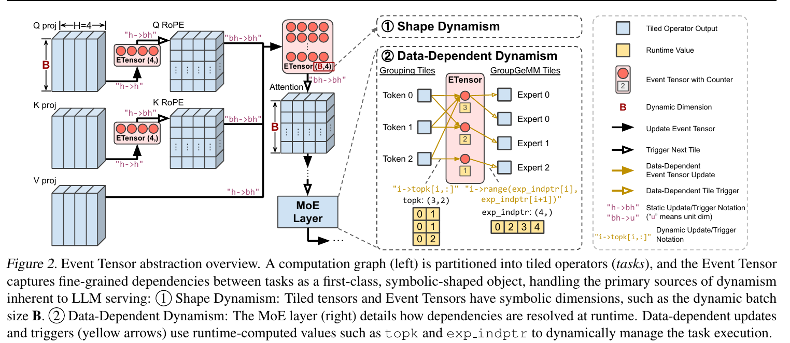

## 论文试图解决的问题

### Kernel launch 已经成为低 batch 推理的显著成本

传统 LLM 推理沿用 kernel-per-operator 执行模式：CPU 依次启动 Attention、RoPE、Norm、GEMM、MoE 等 GPU kernel。同一个 autoregressive decoding step 可能包含数百甚至上千个细粒度操作。论文给出的典型数字是：一次 kernel launch 约为 5-10 μs，而最快的小 kernel 可能只执行约 2 μs。低 batch 时计算量不足以摊薄 launch gap，CPU 调度和 kernel 切换便会进入关键路径。

CUDA Graph 可以将固定 kernel 序列捕获后重放，显著缩小 launch gap，但它保留了 kernel boundary。相邻 kernel 在同一 stream 上仍然表现为粗粒度顺序执行。

### Kernel boundary 隐藏了本来存在的跨算子并行

设算子 A 和 B 都被切成多个 tile。B 的第 0 个 tile 可能只依赖 A 的第 0、1 个 tile，而不依赖 A 的其余输出。传统执行仍要求整个 A 完成后才启动 B；理想执行则应在局部依赖满足后立即启动对应的 B tile。

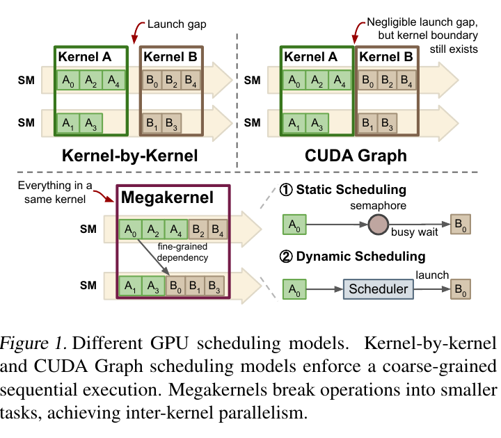

Megakernel 把多个 operator 放入同一个 persistent kernel，再把 operator 分解为 CTA/SM 级 tasks，由 kernel 内调度器安排执行。它同时消除了 launch gap 和 operator barrier。但是，真正用于 LLM serving 时仍有两个难点：

1. **Shape dynamism**：continuous batching 使 batch size、sequence length 和 tile 数不断变化。
2. **Data-dependent dynamism**：MoE 的 token-to-expert 路由只有运行时才能确定，task 的依赖目标和后继 task 数量都不是编译期常量。

此外，手写 megakernel 需要同时处理 task 分解、跨 SM 依赖、信号量、执行队列、负载均衡、shared memory 和寄存器资源，工程复杂度很高。

## Event Tensor 抽象

### 三个核心语言对象

#### Device Function

Device function 定义一组可以在 GPU 上并行启动的 tiled tasks。每个 task 由多维坐标标识，例如 GEMM 的 `(i, j)` tile。task 内部仍然可以使用 Tensor Core、warp specialization、TMA 或手写 PTX。换言之，Event Tensor 不负责取代 TileLang、Triton 或 CuTeDSL 的单 task 实现。

#### Event Tensor

Event Tensor 是由 event 组成的多维数组。一个 event 表示一组 producer tasks 是否已经全部完成。每个元素具有初始 `wait_count`，并支持：

- `notify()`：producer 完成后原子递减计数器；
- `wait()`：consumer 等待计数器变为 0；
- 动态调度中，计数器归零时把 consumer tasks 推入 ready queue。

例如：

```python
E = ETensor((n,), wait_count=4)
```

表示有 `n` 个独立事件，每个事件需要收到 4 次 producer 通知才被触发。

#### Graph Function

Graph function 组织多个 device function，并为每次调用声明输入、输出 Event Tensor 以及 task-to-event 坐标映射。论文用类似 NumPy einsum 的记号表达依赖：

```text
producer task (i, j) --"ij->i"--> E[i]
E[i]                 --"i->i" --> consumer task i
```

它可以被读成：所有具有相同 `i` 的 producer tiles 共同更新 `E[i]`，当其计数器归零后，第 `i` 个 consumer tile 可以执行。

### Event Tensor 的本质：参数化的 Task DAG

语义上，Event Tensor 仍然表示一个 DAG：

```text
producer task -> event -> consumer task
```

它的区别在于不需要枚举每个 task、event 和 edge。传统 task graph 若有 `N×K` 个 producer，可能需要显式生成 `N×K` 个节点和相应边；Event Tensor 只需保存：

```text
E.shape = (N,)
producer mapping = "ij->i"
consumer mapping = "i->i"
```

因此更准确的表述不是“Event Tensor 取代 DAG”，而是：

> Event Tensor 是 task DAG 的 tensorized、symbolic、parametric representation。

### Split-K reduction 示例

论文用两阶段 reduction 展示细粒度依赖。输入 `A` 的 shape 为 `(n×32, 128)`，第一阶段沿 K 轴切成 4 份：

$$
B[i,j] = \sum_{k=32j}^{32j+31} A[i,k], \qquad j\in[0,4)
$$

第二阶段汇总 4 个 partial sums：

$$
C[i] = \sum_{j=0}^{3} B[i,j]
$$

传统 kernel-by-kernel 模式等待整个 B 完成后才启动 C。Event Tensor 为每 32 行建立一个 `E[i]`，初始计数为 4。四个 `B[i,j]` tasks 分别通知 `E[i]`；某个 `E[i]` 归零后，对应 `C[i]` 可以立即执行，不必等待其他行。

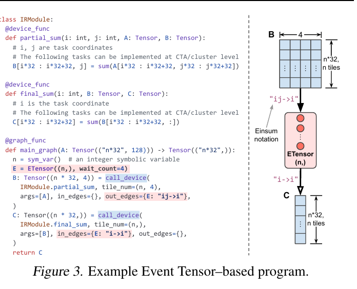

## 两类动态性如何进入依赖表示

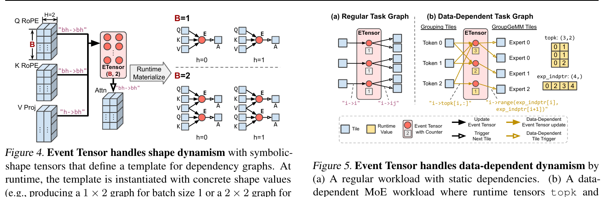

### Shape dynamism：符号 shape 描述一族 task graphs

Event Tensor 的维度可以包含符号变量，例如：

```text
E.shape = (B, H)
```

编译期的 `(B,H)` 不是一个固定大小事件数组，而是依赖图模板。运行时 `B=1` 时实例化为 `1×H`，`B=2` 时实例化为 `2×H`。同一个 AOT binary 因而可以处理多个 batch size，无需为每个 shape 重新编译或重新捕获 CUDA Graph。

这里的关键区别是：动态 shape 不仅改变地址计算或循环上界，还改变 task 和 event 的实例数量。Event Tensor 把 dependency graph 本身参数化了。

### Data-dependent event update：运行时决定通知谁

在 MoE 中，token `i` 的 grouping task 应通知哪些 expert events 由运行时 `topk[i,:]` 决定：

```text
grouping_task[i] -> E[topk[i, :]]
```

每个 expert event 的初始 counter 也根据实际路由给该 expert 的 token 数动态设置。因此编译器不需要提前知道 expert 的 token 分布。

### Data-dependent task triggering：运行时决定启动多少 tasks

每个 expert 所需的 GroupGEMM tile 数由 token 数决定。论文使用 CSR 风格的 `exp_indptr` 保存 expert 对应的 task 区间：

```text
E[expert] -> tasks[exp_indptr[expert] : exp_indptr[expert + 1]]
```

这使 Event Tensor 同时表达了两种动态关系：

1. producer 根据运行时值更新哪个 event；
2. event 根据运行时值触发多少 consumer tasks。

整个计算依然是严格前馈的：

```text
Attention output
    -> TopK routing
    -> Token grouping
    -> GroupGEMM
```

动态性只改变后半段的依赖边和 tile 数量，不引入循环依赖。

## ETC 编译流程

ETC 实现为 Apache TVM 上的一组 compiler passes。输入计算图中：

- operator 已经被分解为 CTA-level tiles；
- tile implementation 由用户 DSL 或 compiler builtin 提供；
- graph 显式包含 Event Tensor 和依赖映射。

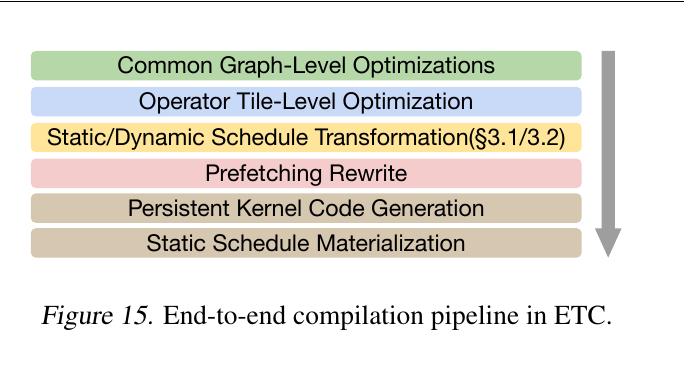

编译流程依次包括：

1. 常规 graph-level optimization 与 memory planning；
2. operator tile-level optimization，例如硬件指令映射和 intra-task pipeline；
3. static 或 dynamic schedule transformation；
4. prefetching rewrite，根据用户注解生成权重预取逻辑；
5. persistent-kernel code generation；
6. 静态调度时生成并物化 per-SM task queue。

Event Tensor 论文的重点是第 3 步：同一份 dependency IR 可以被降低成不同的执行策略。

## 静态调度

静态调度在 kernel 启动前为每个 SM 计算固定任务队列。编译器将多个 device functions 融合为一个 persistent main loop，并在 producer 末尾插入 `notify()`、在 consumer 开头插入 `wait()`。

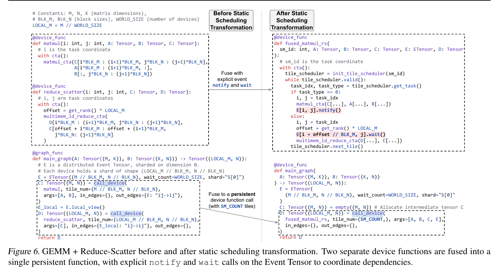

以 GEMM + Reduce-Scatter 为例，如果一个 RS tile 依赖两个 GEMM tiles，则对应 event 的初始 counter 为 2：

1. SM0 完成第一个 GEMM tile，将 counter 从 2 减到 1；
2. 预定在 SM0 上执行的 RS tile 开始 spin wait；
3. SM1 继续执行另一个 GEMM tile；
4. SM1 完成并将 counter 减到 0；
5. SM0 结束等待，开始执行 RS。

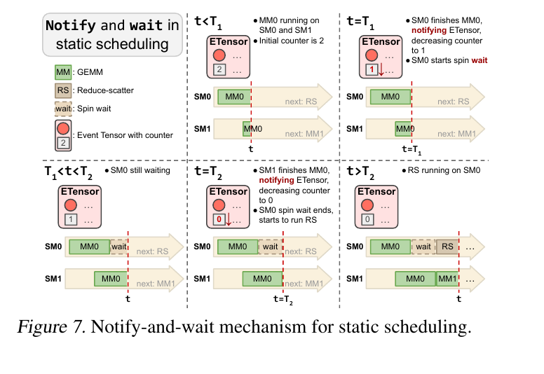

静态调度的特点是：

- 没有运行时 push/pop，调度成本很低；
- 适合规则、可预测、延迟敏感的 workload；
- 如果 task 时间不均，可能出现某个 SM spin wait、其他 SM 无任务可做；
- 动态 shape 使用代表 shape 采样，未采样 shape 复用下一个更大的队列；
- 数据依赖动态性只能保守地退化为较粗同步，因此不规则 MoE 更适合动态调度。

## 动态调度

动态调度在 GPU 上维护 ready-task queue。任意 SM 空闲后 `pop` 一个 task；producer 完成并使 event counter 归零时，关联的 consumers 被 `push` 进队列。

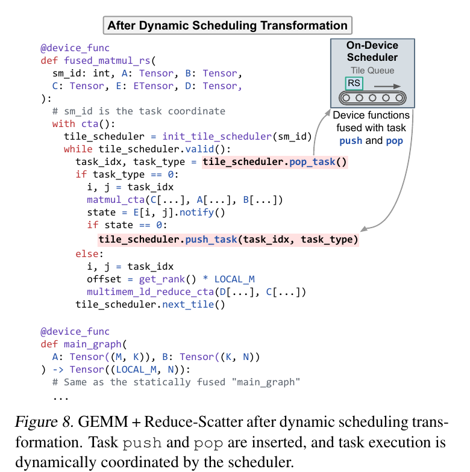

对应执行过程是：

1. SM0 完成一个 GEMM tile，counter 从 2 降到 1；
2. 依赖尚未满足，SM0 不等待，而是从队列取另一个 GEMM tile；
3. SM1 完成第二个 producer，counter 归零；
4. RS tile 被推入 ready queue；
5. 任意空闲 SM 获取并执行 RS。

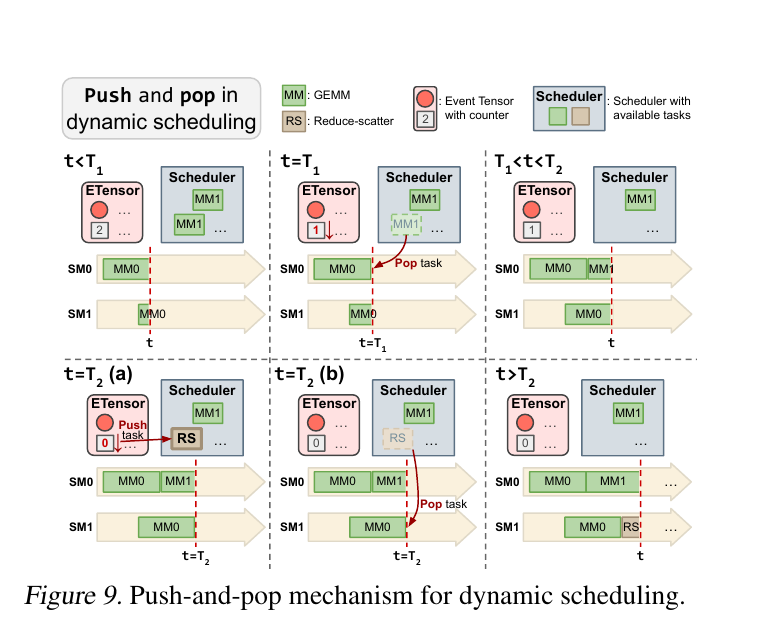

动态调度在运行时已经获得 symbolic shape 和 routing tensors 的具体值，因此自然支持 shape 和 data-dependent dynamism，也能缓解 expert routing、通信抖动等造成的负载不均。

当前实现使用所有 SM 共享的 global-memory centralized queue，优点是简单，缺点是原子 push/pop 可能在规模扩大时产生争用。附录还使用 **early push** 隐藏调度开销：producer tasks 全部被派发后便提前入队 consumer，真正执行 consumer 前再等待 event；这样 push 操作可与 producer 计算重叠。

## Minimal runtime：把控制流编译进 Megakernel

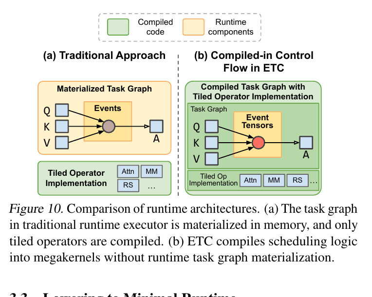

传统 task runtime 通常在 device memory 中物化 task graph，由 generic executor 遍历节点、检查依赖并派发函数。ETC 则把 dispatch、wait、notify 和 push/pop 直接写进生成的 megakernel：

- Event Tensor 降低为普通 integer tensor；
- `notify()` 降低为 atomic decrement；
- `wait()` 降低为等待 counter 归零；
- 运行时可变状态只剩 event counters 与 scheduler queue。

因此 Event Tensor 是 IR 中的一等抽象，但不要求运行时存在重量级 `Event` 对象。它在 lowering 后复用普通 tensor 存储。

## 实验设计与结果

### 实验环境

- 8× NVIDIA B200，NVLink 互连；
- Ubuntu 24.04；
- PyTorch 2.8.0；
- CUDA 13.0；
- Driver 580.82.07。

所有主要结果都来自 B200。抽象本身位于 compiler IR 层，但性能结论是否可直接迁移到 A100/H100、PCIe 或其他互连拓扑，论文没有验证。

### 计算通信融合

论文评估两个 tensor-parallel 基础模式：

- GEMM + Reduce-Scatter：用动态调度吸收通信延迟和网络抖动；
- All-Gather + GEMM：ring 数据到达顺序更可预测，使用静态调度减少开销。

配置固定 TP=8、token 数 8192，MLP shapes 来自 Qwen3、LLaMA 3.1、Gemma 2、GPT-3 等模型。基线包括 cuBLAS+NCCL、TP-Async、Triton Distributed 和 cuBLASMp。

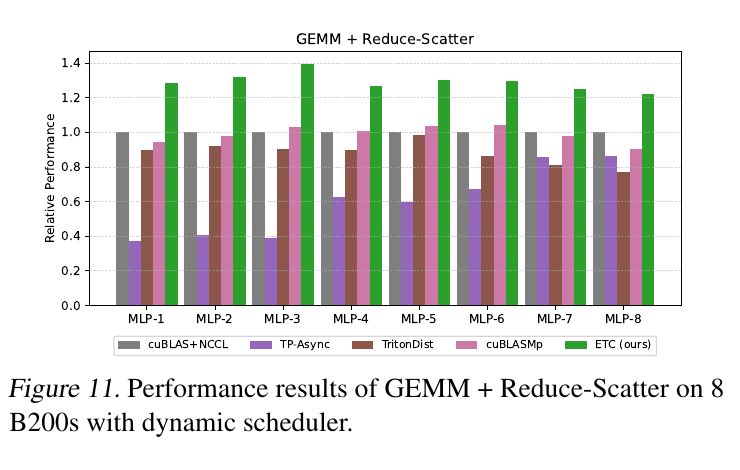

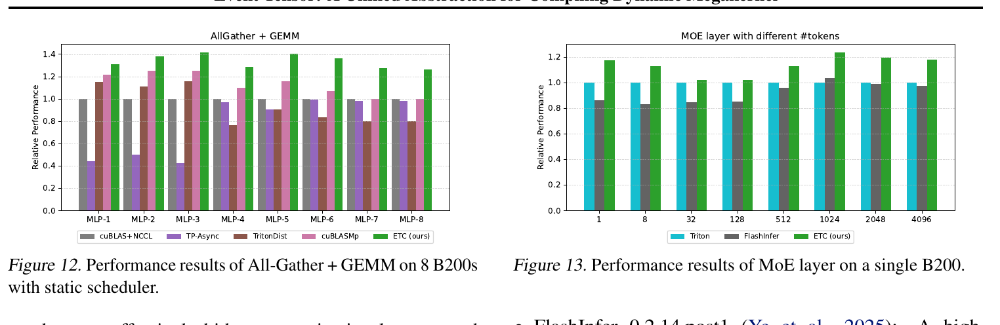

两个通信融合 workload 相对 cuBLAS+NCCL 最高约 **1.40× speedup**。收益不是只消除 launch，而是让局部通信在对应 GEMM tile 就绪后开始，持续重叠 SM 计算和网络传输。

需要注意：论文说明 Triton Distributed 当时对 B200 的支持仍偏实验性，其 Triton GEMM 尚未完全针对 Blackwell 调优，因此 ETC 与该基线的差距不能全部归因于 Event Tensor。

### 完整 MoE layer

MoE 实验采用 Qwen3-30B-A3B：

- 128 experts；
- top-k=8；
- 单张 B200；
- token 数从 1 到 4096；
- 对比 Triton 3.4.0 和 FlashInfer 0.2.14.post1。

ETC 将 grouping、两阶段 GroupGEMM 和动态依赖融合到一个 megakernel，在 1024 tokens 时相对最佳基线最高约 **1.23×**。论文将收益归因于：

1. data-dependent Event Tensor 打破两阶段 GroupGEMM 之间的全局 barrier；
2. 动态调度缓解 token-to-expert 不均衡；
3. 不同 operator tiles 混合填充 SM，减少 wave quantization。

### 端到端低 batch serving

测试覆盖：

- Qwen3-30B-A3B，TP=1；
- Qwen3-32B，TP=1；
- Qwen3-32B，TP=4；
- synthetic prompt length 512；
- 每个请求生成 100 tokens；
- batch size 1-128；
- 指标为 time per output token（TPOT）。

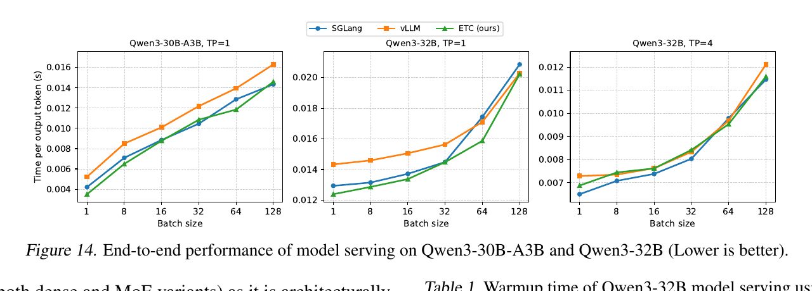

关键结果：

- Qwen3-30B-A3B、batch=1：相对 vLLM 最高 **1.48×**，相对 SGLang **1.20×**；
- Qwen3-32B、TP=1：相对 vLLM 最高 **1.15×**，相对 SGLang 最高 **1.09×**；
- Qwen3-32B、TP=4：相对 vLLM 为 **0.99×-1.06×**，基本持平，但没有全面超过 SGLang。

ETC 覆盖完整 decoding pipeline，包括 Attention、RoPE、KV-cache、Norm、MLP 和 MoE，而不只是 GEMM。论文举出的跨 operator 优化包括：

- Q 分支的 Norm+RoPE 与 K 分支的 Norm+RoPE+CacheAppend 并行；
- MoE GroupGEMM 和 dense MLP GEMM 跨阶段流水；
- activation 到达前预取下一阶段模型权重。

TP=4 下 ETC 没有明显领先，作者将其归因于两项工程因素：部分 compiler-generated GEMM tile 不如 cuBLAS 调优充分，以及 ETC serving engine 的 CPU scheduler 开销高于 SGLang。

### Warmup

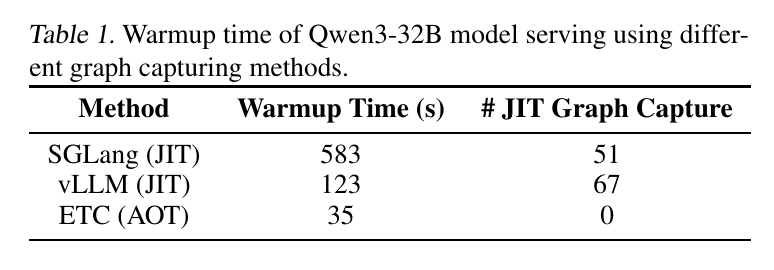

Qwen3-32B 从 engine launch 到首个请求：

| 方法 | Warmup | JIT/CUDA Graph capture 数 |
|---|---:|---:|
| SGLang | 583 s | 51 |
| vLLM | 123 s | 67 |
| ETC | 35 s | 0 |

ETC 的 symbolic Event Tensor 允许离线生成一个 shape-generic binary，因此 serving 启动阶段不做 JIT 或多 shape CUDA Graph capture。论文同时披露 Qwen3-32B 的离线编译需要 107 s。准确理解应是：ETC 把一次性编译成本移出了 serving warmup 关键路径，而不是让编译成本消失。

## 静态与动态调度的消融

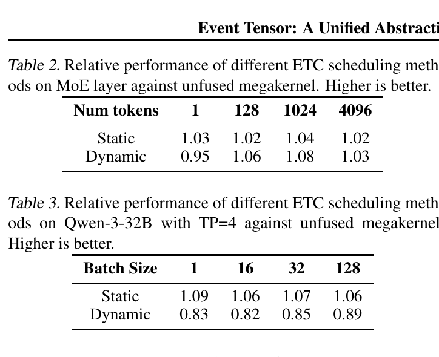

论文构造一个 unfused megakernel 基线：所有 operator code 与 ETC 相同，但 operator 之间只使用单个 event 形成全局 barrier。因而表中的增益主要来自细粒度 inter-operator parallelism，而不是不同的单算子实现。

### MoE：动态调度随 token 数增加更有价值

在 1 token 时，dynamic 为 0.95×，队列开销大于负载均衡收益；在 1024 tokens 时，dynamic 达到 1.08×，比 static 的 1.04× 更好。expert workload 不均衡时，静态 per-SM queue 容易产生 straggler。

### 规则 dense workload：静态调度明显更好

Qwen3-32B、TP=4 中，static 相对 unfused 为 1.06×-1.09×，dynamic 只有 0.82×-0.89×。规则任务不需要动态均衡，而多 GPU push/pop 尤其昂贵。

因此不能将动态调度简单理解为静态调度的升级版：

```text
规则、低延迟、可预测任务       -> static schedule
MoE、通信抖动、不规则执行时间 -> dynamic schedule
```

## 与相关抽象的层级关系

### 与 TileLang、CuTeDSL 的区别

| 维度 | TileLang / CuTeDSL | Event Tensor |
|---|---|---|
| 一等对象 | 数据 tile、layout、copy/MMA、pipeline | synchronization event 的张量 |
| 典型粒度 | warp/warpgroup/CTA 内 | 跨 operator 的 CTA/SM tasks |
| 主要问题 | 一个 task 怎样高效执行 | 多个 tasks 何时、在哪里执行 |
| 动态 shape | kernel 内循环、layout、地址和 domain | dependency graph 的 event/task 数量 |
| 同步重点 | mbarrier、pipeline stage、shared/TMEM | producer completion、consumer readiness |
| 关系 | 可作为 tile implementation DSL | 可组织由这些 DSL 实现的 tasks |

TileLang 中的 tile 是一块数据及其计算；Event Tensor 的元素是一组 producer tasks 已经完成这一事实。二者不竞争同一个抽象层。即使 CuTeDSL 当前已有实验性 Task Scheduling，其 task 通常也是绑定到连续 warp range 的 TMA/MMA/store 角色，依赖围绕 SMEM/TMEM pipeline；Event Tensor 则组织跨 operator、跨 SM 的 tiled tasks。

### 与传统 DAG 的区别

传统 operator DAG 的节点是 MatMul、Attention、MoE 等算子，edge 通常意味着整个 tensor producer 完成，因此过于粗粒度。显式 task DAG 可以表达细粒度关系，但需要实例化大量节点和边。

Event Tensor 使用 tensor shape 与 index mapping 描述同一类依赖：

```text
显式 DAG：枚举 A[0,0]、A[0,1]、...、E[0]、B[0] 以及每条边
Event Tensor：A[i,j] -> E[i] -> B[i]
```

动态 shape 使它表示一族 DAG；`topk`、`indptr` 等运行时索引使边的目标和 fan-out 也可以动态变化。

### 与 Mirage Persistent Kernel（MPK）的区别

两者目标最接近，也有大量作者重合。它们都将模型分解成 SM-level tasks，使用 event 同步，并生成完整模型 persistent megakernel。但设计重点不同：

| 维度 | Event Tensor / ETC | Mirage MPK |
|---|---|---|
| 核心表示 | symbolic-shaped Event Tensor + 坐标映射 | 显式 SM-level `tGraph` |
| 依赖存储 | 以 shape/index rule 隐式表示 | 构造 task/event nodes 后 fusion、normalize、linearize |
| 自动依赖推导 | 当前需要显式 Event Tensor annotations | 自动分析 producer/consumer 数据区域重叠 |
| Task implementation | 假定 DSL/builtin 已提供 | Mirage superoptimizer 自动生成，也可接手写 device function |
| Runtime | integer Event Tensors + static queue 或 centralized dynamic queue | scheduler/worker、per-worker queues、event-driven runtime |
| 调度选择 | 同一 IR 可降低为 static 或 dynamic pass | 混合 AOT/JIT task dispatch |
| 动态性重点 | graph shape、event target、task fan-out 直接参数化 | 固定/实例化 tGraph 上用 meta-tensor 和 task 内 workload refinement |

直观上：

```text
ETC：用张量公式描述大量依赖，再把控制流编译进 kernel
MPK：自动构造显式 tGraph，再将它压缩并交给 in-kernel runtime
```

自动化程度则相反：MPK 更接近从 PyTorch graph 到 task code 和 runtime 的完整 vertical system；Event Tensor 提供了更简洁、DSL-agnostic 的依赖语言，但当前还不能自动从普通计算图生成全部 Event Tensor annotations。

版本上需注意：Event Tensor v2 发布于 2026-04-21；当前 MPK v2 更新于 2026-06-10，已经加入 continuous batching、MoE 和 multi-GPU dynamic workload 支持。因此 Event Tensor related-work 中“现有 megakernel 仅支持 single-batch dense model”的描述不应直接套用于当前 MPK v2。

## 论文的主要贡献

1. **把同步事件 tensorize**：创新不在 atomic counter 本身，而在于让事件具有 shape、索引和坐标映射，进入 compiler IR。
2. **统一两类动态性**：symbolic shape 描述 task graph 模板，runtime tensors 描述 data-dependent update 和 triggering。
3. **让调度成为 compiler transformation**：同一 dependency IR 可以系统化生成 static 或 dynamic persistent kernel。
4. **把 task graph 控制流编译进代码**：不依赖完整 graph materialization 和 generic executor。
5. **在真实 LLM serving 中验证**：不仅测试 microbenchmark，还覆盖通信融合、完整 MoE layer、完整 decoding pipeline 和 warmup。

## 局限与批判性阅读

### Event Tensor graph 仍需人工或上游 compiler 提供

当前 pipeline 从“已经 tile 化并显式标注 Event Tensor 的图”开始。如何从普通 PyTorch/Relax graph 自动选择 tile granularity、推导最小依赖、合并 events 并生成 annotations，仍被留作未来工作。这也是 MPK 当前自动化更强的部分。

### 动态调度器扩展性有限

centralized global-memory queue 会产生原子争用；多 GPU 远程 push 更昂贵。消融中 dynamic scheduler 在规则 TP=4 workload 上下降到 0.82×-0.89×，说明动态调度成本不是可以忽略的常数。

### 静态调度对动态性的支持带有保守性

未采样 shape 复用更大 shape 的执行队列，可能执行冗余调度；data-dependent dependencies 在 static lowering 中采用 worst-case coarse synchronization，可能失去 Event Tensor 原本表达出的并行性。

### 实验硬件和统计报告有限

主要实验只使用 B200；图表没有明显给出误差条、运行次数或方差。Triton Distributed 的 B200 支持尚不成熟，也会影响部分基线比较的解释。

### “SOTA serving latency”不是所有配置都全面领先

ETC 在单 GPU、低 batch 和 MoE 场景最强；Qwen3-32B TP=4 主要是与 vLLM 持平，并受 CPU scheduler 和 GEMM 调优质量影响。论文证明的是 Event Tensor 能在若干重要动态 workload 上达到或超过强基线，而不是所有 serving 配置都占优。

### AOT 只改变成本发生的位置

Warmup 从 123/583 s 降到 35 s 很有部署价值，但 107 s 离线编译仍需发生。收益取决于 binary 是否能跨请求、实例和部署长期复用。

## 我的理解

这篇论文最重要的不是 1.23× 或 1.40× 的具体数字，而是提出了一个适合 tensor compiler 的依赖表示：

```text
数据张量回答：task 计算什么
Event Tensor 回答：task 何时已经具备执行条件
```

传统 megakernel 往往把 semaphore、SM queue 和 operator-specific control flow 混在手写 kernel 中。Event Tensor 将这些同步关系抽到 IR，因而可以对它们执行 symbolic shape、index analysis、schedule transformation 和 code generation。

从系统分层看，理想组合可能是：

```text
PyTorch / Relax graph
       ↓ 自动 task decomposition 与 dependency inference
Event Tensor graph
       ↓ static / dynamic megakernel scheduling
TileLang / CuTeDSL / Triton task implementations
       ↓
Persistent GPU kernel
```

Event Tensor 已经较好地解决了中间两层之间的接口，但“从普通模型图自动生成高质量 Event Tensor graph”仍是决定它能否成为通用后端的关键下一步。

