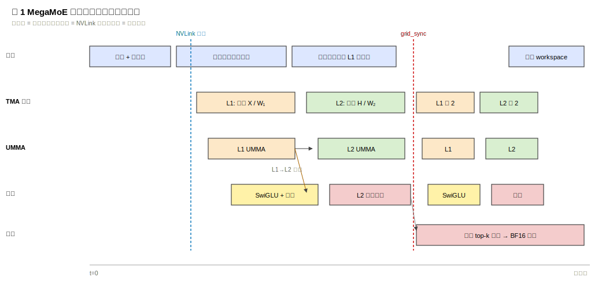
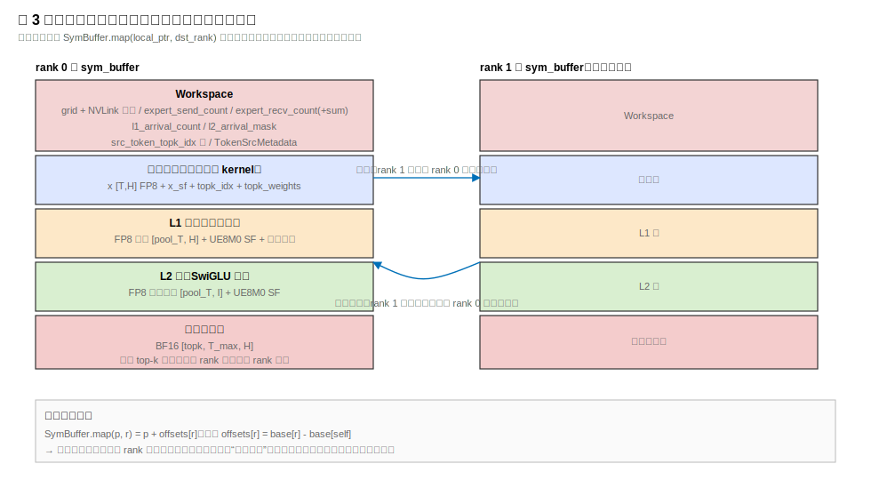
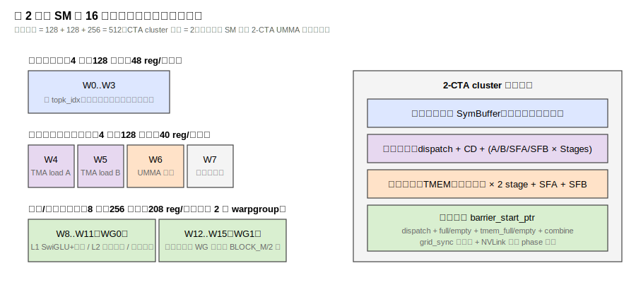
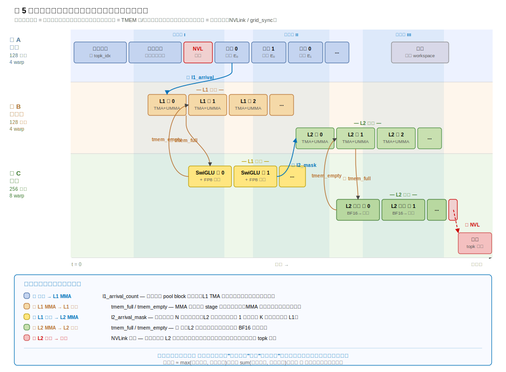
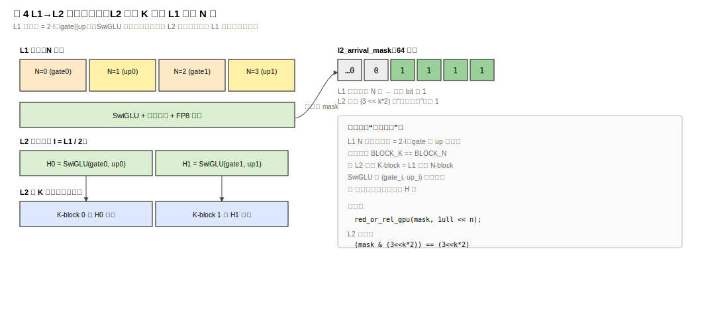

---
tags:
  - papers/LLM
  - systems/GPU
  - MoE
aliases:
  - "MegaMoE"
  - "DeepGEMM Mega MoE"
date: 2026
---

# MegaMoE：把 MoE 前向路径压进一个通信计算融合核

## 执行流程总览

MegaMoE 把传统 MoE 前向的五段独立阶段——分发、Linear1、SwiGLU、Linear2、合并——压缩进一个持久化 CUDA 核函数。下面按时间顺序描述完整执行路径。

### 0. 核外准备

调用方在核函数启动前完成：分配对称显存缓冲区（所有进程结构相同，通过偏移互相映射）；将 FP8 输入词元、packed UE8M0 缩放因子、`topk_idx`、`topk_weights` 拷入缓冲区；将两层专家权重转换为 FP4 布局并附带缩放因子。核函数以 `deep_gemm.fp8_fp4_mega_moe(...)` 一次调用启动。

### 1. 核函数启动与线程分工

每个 SM 上驻留一个持久化 CTA 簇（512 线程 / 16 线程束），按角色固定分成三组：

| 角色 | 线程 | 职责 |
|---|---:|---|
| 分发线程束 | 128 | 路由统计、跨进程索引交换、词元拉取 |
| 异步加载 + MMA 线程束 | 128 | TMA 加载激活/权重，发射 SM100 矩阵乘指令 |
| 尾声 + 合并线程束 | 256 | L1/L2 尾声（SwiGLU、再量化、远端写回）、最终 top-k 归约 |

寄存器按需求不对称分配（分发 48、MMA 40、尾声 208 每线程），总量贴近 SM100 每 SM 上限。

### 2. 分发阶段（核内）

```text
topk_idx ──→ 统计每专家词元数 ──→ 全局累加 expert_send_count
         ──→ 跨进程写源索引表（通过对称显存映射）
         ──→ grid_sync（进程内所有 SM）
         ──→ nvlink_barrier（跨进程全局屏障）
         ──→ 目标进程主动拉取远端词元 + 缩放因子到本地 L1 词元池
         ──→ 记录 TokenSrcMetadata（来源进程、原始词元号、top-k 槽位）
```

拉取阶段用"逐轮剥离最小剩余量"算法把来自不同进程的词元交错排列，让多条 NVLink 链路并行工作。每个专家池分块的词元到齐后递增 `l1_arrival_count`，L1 可以立即开始消费——不必等所有专家全部拉完。

### 3. 波次调度

调度器把本进程的专家切成若干波次。每个波次内先调度所有 L1 分块，再调度所有 L2 分块，然后进入下一波次。波次大小由启发式控制：目标是让每波次的分块数填满所有 SM，同时避免一次包含太多专家导致 L1→L2 等待过长。

### 4. Linear1 GEMM

异步加载线程束把八位激活和四位权重搬入共享内存，矩阵乘线程束发射块缩放低精度矩阵乘指令（交换两个矩阵参数的位置，权重在第一参数侧走张量内存，激活在第二参数侧走共享内存）。多阶段满／空屏障管理生产者消费者流水线。

$$Z_e = X_e W^{(1)\top}_e, \quad W^{(1)}_e \in \mathbb{R}^{2d_{\mathrm{ff}} \times d_{\mathrm{model}}}$$

输出在张量内存中按"门控、上投影"交错排列，为下一步尾声阶段做好准备。

### 5. L1 尾声阶段（SwiGLU + 再量化）

尾声线程束直接从张量内存读 FP32 累加器，不额外转存：

```text
累加器 ──→ 拆出 (gate, up) 对
       ──→ SwiGLU: SiLU(gate) ⊙ up
       ──→ 乘 topk_weight
       ──→ 线程束内 + 跨线程束 amax 归约
       ──→ 动态生成 UE8M0 缩放因子
       ──→ 量化为 FP8 E4M3
       ──→ TMA 写入 L2 词元池 + 缩放因子池
       ──→ 对 L2 到达掩码按位或，通知 L2 可消费
```

### 6. L1→L2 依赖

第二层的每个 K 分块需要等待第一层的两个对应 N 分块（门控加上投影经门控激活缩半后合并）都置位到达掩码后才读取。这把同步粒度细到每个 K 分块，无需在波次边界做全局等待，形成第一层到第二层的生产消费流水。

### 7. Linear2 GEMM

与 L1 结构相同的异步加载 + MMA 流水线，消费 L1 尾声阶段产出的 FP8 中间激活：

$$Y_e = H_e W^{(2)\top}_e, \quad W^{(2)}_e \in \mathbb{R}^{d_{\mathrm{model}} \times d_{\mathrm{ff}}}$$

### 8. L2 尾声阶段（远端写回）

第二层的 32 位浮点累加器转为 BF16，根据分发阶段记录的词元来源元数据（目标进程、原始词元号、top-k 槽位），通过对称显存映射直接写入词元原始所在进程的合并缓冲区对应槽位。第二层计算一产出就开始通信，不必等所有专家计算结束。

### 9. 合并归约

所有 L2 写回完成后，通过 NVLink 屏障确认跨进程缓冲区可见。合并线程束对每个本地词元：

先读路由索引确定有效槽位，然后用异步加载指令逐槽位搬入 BF16 专家输出，在 32 位浮点寄存器中累加所有槽位，最后转回 BF16 写入最终输出。

### 端到端数据流一览

```text
核外：FP8 x, x_sf, topk_idx, topk_weights, FP4 W1/W2
  │
  ▼ ─── 核函数启动 ──────────────────────────────────────────────
  │
  ├─ 分发：统计路由 → 跨进程索引交换 → NVLink 拉词元到 L1 池
  │        （到达 l1_arrival_count，细粒度触发 L1）
  │
  ├─ L1 GEMM：FP8 × FP4 → FP32 累加器（张量内存）
  │
  ├─ L1 尾声：SwiGLU + topk_weight → FP8 中间激活写 L2 池
  │           （到达 l2_arrival_mask，细粒度触发 L2）
  │
  ├─ L2 GEMM：FP8 × FP4 → FP32 累加器
  │
  ├─ L2 尾声：BF16 远端写回 combine_token_buffer
  │           （NVLink 屏障确认可见）
  │
  └─ 合并：top-k 槽位 BF16 累加 → 最终 BF16 输出 y
  │
  ▼ ─── 核函数退出 ──────────────────────────────────────────────
```

以上全部在一个核函数内完成；核内同步靠四层屏障体系（线程束组内 → CTA 内 → 簇内 → 网格/跨进程），通信靠对称显存偏移映射，调度靠持久化波次状态机。传统五段串行路径的阶段边界被细化到分块和词元池级别，通信与计算在核内流水化重叠。

---

## 核心信息

- **项目**: DeepGEMM
- **入口**: [deepseek-ai/DeepGEMM#304](https://github.com/deepseek-ai/DeepGEMM/pull/304)
- **合入提交**: `7f2a703`
- **发布时间**: 2026-04-17
- **类型**: 代码发布 / 系统内核实现
- **相关作者**: LyricZhao、zheanxu、bucket-xv、RayWang96、interestingLSY、kurisu6912、xay5421、yukuai26
- **硬件目标**: NVIDIA SM100
- **软件要求**: PyTorch 2.9 或更高版本，依赖多进程对称显存
- **数值格式**: 激活使用 FP8 E4M3，权重使用 FP4 E2M1，输出为 BF16
- **源码入口**:
  - `deep_gemm/include/deep_gemm/impls/sm100_fp8_fp4_mega_moe.cuh`
  - `deep_gemm/include/deep_gemm/scheduler/mega_moe.cuh`
  - `deep_gemm/include/deep_gemm/layout/mega_moe.cuh`
  - `csrc/apis/mega.hpp`
  - `tests/test_mega_moe.py`

## 证据说明

这不是一篇传统论文，而是 DeepGEMM 的一次公开代码发布。因此本文把“原文摘要翻译”理解为发布说明翻译，而不是论文摘要翻译。本笔记采用代码精读方式，以 PR 描述、README、测试脚本、主核实现、调度器、对称显存布局和主机端封装为证据，重构 MegaMoE 解决的问题、执行路径、关键优化和限制。

## 原文摘要翻译

发布说明（编号 304 的合并请求功能列表）的中文翻译大致是：本次公开版本加入了巨型专家核以及四位索引器，外加若干功能与修复；其中巨型专家核把专家并行的分发、第一层八位激活乘四位权重的矩阵乘、门控激活、第二层八位激活乘四位权重的矩阵乘、以及合并这五段融合到一个核函数中，并在核内重叠跨卡通信与张量核心计算。当前实现仅支持八位激活与四位权重的专家路径，且要求版本不低于 2.9 的 PyTorch 框架。

## 创新点

1. **把专家并行通信和两层专家计算融合进一个巨型核函数**  
   传统 MoE 前向一般拆成专家并行分发、第一层分组矩阵乘、SwiGLU、第二层分组矩阵乘、合并五段。MegaMoE 把这些阶段塞进一个持久化 CUDA 核，让同一个核内部完成跨进程拉取词元、专家本地计算、跨进程写回和前 k 个归约，减少核函数启动、框架调度和阶段间全局同步开销。

2. **让 NVLink 通信和张量核心计算在同一个核内重叠**  
   发布说明明确说目标是重叠跨卡通信和张量核心计算。代码中，分发线程束、异步加载线程束、矩阵乘发射线程束、尾声与合并线程束被固定分工，并通过网格屏障、跨卡屏障、内存屏障和到达计数器串接。它不是简单把五个函数内联，而是在一个核里建立生产者消费者流水线。

3. **面向 DeepSeek-V4 形状的 FP8 × FP4 MoE 专用核**  
   测试默认形状与 DeepSeek-V4-Pro 的专家层配置一致：隐藏维度为 7168，中间维度为 3072，专家数为 384，每个词元选择 6 个专家。第一层权重同时产生门控分支和上投影分支，第二层权重再回到隐藏维度。激活和中间结果用 FP8，权重用 FP4，并配套 UE8M0 缩放因子。

4. **将 SwiGLU、前 k 个权重缩放和中间结果再量化放进第一层尾声阶段**  
   第一层 GEMM 的输出不是先写成 BF16 再由另一个核做激活，而是在尾声阶段里直接读取张量内存累加器，执行 `SwiGLU(门控分支, 上投影分支) * topk_weight`，做最大绝对值归约，生成 FP8 中间激活和缩放因子，再用 TMA 存储写入第二层输入缓冲区。

5. **用专家波次调度处理路由不均衡**  
   调度器把本进程的专家分成若干波次；每个波次先跑 Linear1，再跑 Linear2。`num_experts_per_wave` 由启发式选择：估计每个专家收到的词元数、每专家分块数，再乘以不均衡因子，尽量保证每波有足够 block 填满所有 SM，同时避免一次波次包含过多专家。

## 一句话总结

MegaMoE 面向 SM100 与 DeepSeek-V4 的专家层形状。它把专家分发、两次低精度专家矩阵乘、门控激活、合并和跨进程同步放进一个持久化核；核内依靠线程束分工、对称显存、异步拷贝、张量内存、内存屏障和跨卡屏障，把通信与计算流水化重叠。



---

## 问题背景：为什么 MoE 层适合做巨型核函数？

### MoE 前向的真实瓶颈不只是 GEMM

一个标准 MoE 前向可以写成：

$$
y_t = \sum_{j=1}^{k} g_{t,j} \cdot W^{(2)}_{e_{t,j}} \, \mathrm{SwiGLU}\left(W^{(1)}_{e_{t,j}} x_t\right)
$$

其中输入向量表示词元特征，专家编号表示被路由选中的专家，路由权重控制各专家输出占比，选择个数表示每个词元会激活多少个专家。

在专家并行场景下，一个词元选中的专家可能位于其他 GPU 进程上。于是 MoE 层实际会变成：

1. 根据 `topk_idx` 统计每个专家收到多少词元。
2. 把词元和缩放因子分发到专家所在进程。
3. 每个进程对本地专家执行第一层分组矩阵乘。
4. 执行 SwiGLU，并乘上前 k 个路由权重。
5. 执行第二层分组矩阵乘。
6. 把每个词元的前 k 个专家输出合并回原始进程。
7. 对前 k 个输出求和，得到最终 BF16 输出。

如果这些步骤由多个独立核函数和通信原语完成，瓶颈会来自三类开销：核函数启动、阶段间同步、以及通信和计算不能充分重叠。MoE 层的 GEMM 本身虽然很重，但词元路由带来的小批量、不均衡和跨 GPU 搬运，会让单纯优化分组矩阵乘不够。

### 基线路径是什么？

`tests/test_mega_moe.py` 里的基线很清楚：

1. 用 DeepEP 的 `ElasticBuffer.dispatch` 做专家并行分发。
2. 用 `m_grouped_fp8_fp4_gemm_nt_contiguous` 做第一层分组矩阵乘。
3. 用 TileLang 的 `swiglu_apply_weight_to_fp8` 做 SwiGLU、路由权重缩放和 FP8 再量化。
4. 再用 `m_grouped_fp8_fp4_gemm_nt_contiguous` 做第二层分组矩阵乘。
5. 用 DeepEP 的 `combine` 把专家输出合并回原词元。

MegaMoE 的直接目标就是把这条路径合并成一个 `deep_gemm.fp8_fp4_mega_moe(...)` 调用。

---

## 总体执行模型

### 对称显存是跨进程指针映射的基础

MegaMoE 依赖 PyTorch 的对称显存。主机端会为每个进程分配一块布局相同的缓冲区，然后把所有进程的基址指针收集起来传入核函数。设备端的对称缓冲区结构同时保存本进程的基址，以及一个长度等于进程数的偏移数组，每一项指向其他进程同一逻辑位置相对于本进程的偏移。结构上还带一个映射函数：传入本进程的指针和目标进程编号，返回该指针加上对应偏移后的地址，也就是目标进程上同一逻辑位置的地址。这个映射的本质是把本地逻辑指针加上"目标进程基址减本进程基址"，分发、合并和跨卡屏障都建立在这个映射之上。


### 缓冲区被切成多个逻辑区域

`csrc/apis/mega.hpp` 中的 `get_symm_buffer_size_for_mega_moe` 决定了对称显存布局。它先放工作区，再依次放输入、第一层池化输入、第二层池化输入、合并缓冲区。

逻辑上可以画成：

```text
sym_buffer
  ├── Workspace
  │   ├── grid / NVLink 屏障 counters
  │   ├── expert send / recv counters
  │   ├── L1 arrival counts
  │   ├── L2 arrival masks
  │   ├── source token-topk index table
  │   └── token source metadata
  ├── input x                      FP8, [num_max_tokens_per_rank, hidden]
  ├── input x_sf                   UE8M0 packed scaling factor
  ├── topk_idx                     int64
  ├── topk_weights                 FP32
  ├── L1 token pool                FP8, expert-contiguous
  ├── L1 scaling factor pool       UE8M0
  ├── L1 top-k weight pool         FP32
  ├── L2 token pool                FP8, post-SwiGLU
  ├── L2 scaling factor pool       UE8M0
  └── 合并词元缓冲区         BF16, [topk, num_max_tokens_per_rank, hidden]
```

这里的核心思想是：分发阶段把远端词元拉进本进程的专家连续池；第一层尾声阶段把门控激活后的低精度中间结果写进第二层输入池；第二层尾声阶段把专家输出写回词元原进程的合并缓冲区；最后在原进程上把多个专家槽位累加。

### 容量如何估算？

专家词元池的容量不是简单的 `num_ranks * num_tokens * topk`，还要考虑每个专家按 `BLOCK_M` 对齐产生的填充。代码中的公式是：

$$\mathrm{pool}=\mathrm{align}(R \cdot T_{\max} \cdot \min(k,E_{\mathrm{local}})+E_{\mathrm{local}}\cdot(B_M-1),B_M)$$

其中各符号分别表示进程数、每进程最大词元数、专家选择数、本地专家数和矩阵乘分块大小；额外项表示每个专家尾部对齐最多带来的填充。

---

## 主机端封装：如何调用 MegaMoE？

### Python 侧看到的接口

README 给出的用法大致是：

调用顺序是：先创建 MegaMoE 对称显存缓冲区，再转换两层专家权重布局，然后把输入激活、缩放因子、专家索引和路由权重拷入缓冲区，最后调用 `deep_gemm.fp8_fp4_mega_moe(...)` 生成 BF16 输出。

注意输入需要预先转换到 MegaMoE 需要的格式：`x` 是 FP8，`x_sf` 是 packed UE8M0 缩放因子，权重是 FP4 并经过布局转换。

### 主机端会做严格形状检查

`fp8_fp4_mega_moe` 的检查非常专用：

- `recipe` 必须是 `(1, 1, 32)`。
- 激活函数必须是 `swiglu`。
- 第一层权重形状必须是 `[num_experts_per_rank, 2 * intermediate_hidden, hidden]`。
- 第二层权重形状必须是 `[num_experts_per_rank, hidden, intermediate_hidden]`。
- `hidden` 和 `intermediate_hidden` 必须满足缩放因子对齐要求。
- 当前只支持主版本号为 10 的 CUDA 架构，也就是 SM100 路径。

这说明 MegaMoE 不是一个通用 MoE 运行时，而是一个针对特定数值格式、特定硬件和特定 MoE 前向模式的高性能核。

### JIT 特化参数很多

MegaMoE 通过 JIT 生成模板实例。关键模板参数包括：

- `kNumMaxTokensPerRank`
- `kHidden`
- `kIntermediateHidden`
- `kNumExperts`
- `kNumTopk`
- `kNumExpertsPerWave`
- `BLOCK_M / BLOCK_N / BLOCK_K`
- `STORE_BLOCK_M`
- 缩放因子 block 尺寸
- pool 容量
- pipeline 阶段数
- 分发、MMA、尾声阶段线程数
- SM 数、进程数
- 激活截断和快速数学近似开关

这会增加编译特化成本，但换来核内大量静态展开和布局确定性。例如代码中"K 维分块大小等于 N 维分块大小"以及"存储分块行数是矩阵乘分块行数的一半"这类硬约束都在编译期用静态断言固定下来，让后续尾声阶段用按位掩码同步成为可能。

---

## 核内线程分工

MegaMoE 的核函数启动不是普通一个 CTA 做一个分块，而是每个 SM 上一个持久化 CTA 簇，按线程束角色固定分工。默认线程布局来自 `get_mega_moe_config`：

| 角色 | 线程数 | 主要任务 |
|---|---:|---|
| 分发线程束 | 128 | 统计路由、写源索引、跨进程拉取词元和缩放因子、清理工作区 |
| 非尾声矩阵乘线程束 | 128 | 异步加载激活和权重，并发射 SM100 矩阵乘指令 |
| 尾声和合并线程束 | 256 | 处理 L1/L2 尾声阶段、写回远端合并缓冲区、最终前 k 个归约 |

寄存器也按角色重新分配：

| 角色 | 每线程寄存器 |
|---|---:|
| 分发 | 48 |
| 非尾声矩阵乘 | 40 |
| 尾声阶段 | 208 |

这很符合实际工作负载：分发和异步加载线程束主要做地址计算与搬运，寄存器需求较小；尾声阶段要做门控激活、最大绝对值归约、量化、BF16 打包、合并累加，需要更多寄存器。每个 SM 上一共 16 个线程束（512 线程），三组分配的寄存器总量约等于 48 乘 128 加 40 乘 128 加 208 乘 256，刚好贴近 SM100 的每 SM 最大寄存器额度 64 KiB。



### 屏障体系：核内同步是怎么搭起来的？

把 dispatch、L1、SwiGLU、L2、combine 缝进一个核函数，最关键的就是同步原语的层次划分。MegaMoE 的屏障可以分成四类：

| 层次 | 实现 | 作用范围 | 调用点 |
|---|---|---|---|
| 线程束组内 | 线程束内归约指令与共享内存屏障 | 同一线程束或同一 warpgroup | 尾声阶段聚合各线程对块内 amax 的局部最大值 |
| CTA 内 | 内存屏障到达计数器（`Barrier` 与 `EmptyBarrier` 封装） | 同一 CTA 内不同线程束之间 | 异步加载与矩阵乘指令之间的满／空流水线；尾声阶段与矩阵乘之间的累加器双缓冲 |
| 簇内 | 集群级同步与集群级内存屏障 | 双 CTA 簇 | 张量内存分配器的初始化与释放、跨 CTA 的累加器对齐 |
| 网格内或跨进程 | 网格屏障与跨卡屏障 | 全部 SM 与全部进程 | 分发完成、波次切换、核退出前的清理 |

网格屏障自身只占一个 64 位计数器：所有 SM 上的发起者线程做原子加 1，等待者轮询计数器达到目标值。代码用了一个小技巧——把计数器的高 32 位当作"相位"，低 32 位当作"到达数"——这样多次复用同一计数器不会出现 ABA 问题。跨卡屏障在此之上再加一层：每个进程通过对称显存映射把信号原子加写到所有目标进程的对称地址，再等本地信号到达预期值。它内置 30 秒超时，避免死锁挂死整张卡。

### 三组线程束的协同与重叠逻辑

三组线程束在同一个 SM 上始终同时运行，但它们不必等待彼此完成"所有"工作才继续，而是用"分块级"依赖来尽早解锁下一阶段。五条依赖链构成了完整的重叠：

| 编号 | 依赖方向 | 同步原语 | 粒度 | 含义 |
|:---:|---|---|---|---|
| 1 | 分发 → 第一层矩阵乘 | 第一层到达计数 | 一个词元池块 | 分发拉完某个专家的一块词元就递增计数，加载线程束看到就立即开始——不等所有词元拉完 |
| 2 | 第一层矩阵乘 → 第一层尾声 | 张量内存满屏障／空屏障 | 一个累加器阶段 | 矩阵乘写满累加器的一个阶段后尾声立即读出做门控激活加量化；矩阵乘继续写下一个阶段（双缓冲） |
| 3 | 第一层尾声 → 第二层矩阵乘 | 第二层到达掩码按位或 | 一个 N 分块 | 尾声每完成一个 N 块就置位对应位，第二层加载线程束只要看到相邻两位都为 1 就加载该 K 块——不等整个第一层完成 |
| 4 | 第二层矩阵乘 → 第二层尾声 | 张量内存满屏障／空屏障 | 一个累加器阶段 | 与编号 2 完全对称 |
| 5 | 第二层尾声 → 合并归约 | 跨卡屏障 | 整个波次 | 波次内所有第二层写回完毕后跨卡屏障确认可见性，尾声线程束切换角色做归约累加 |

用时间轴表示：

```text
时间 ──────────────────────────────────────────────────────────────────►

① 分发:   [拉专家0块0] [拉专家0块1] [拉专家1块0] ...         [清理]
② MMA:         [L1 专家0块0] [L1 专家0块1]  [L2 专家0块0] [L2 专家0块1] ...
③ 尾声:             [SwiGLU 块0] [SwiGLU 块1]  [L2写回 块0] [L2写回 块1] ... [合并]
```

三行几乎全程并行，只在每个分块的边界有短暂等待。整个核的执行时间趋近于 max(通信延迟, 计算延迟) 而不是 sum(通信延迟, 计算延迟)——这就是 MegaMoE"重叠通信与计算"的本质。



> [!figure] 图 5 三组线程束的协同与重叠逻辑
> 建议位置：核内线程分工章节最后、进入各阶段详解前
> 放置原因：让读者在进入六个阶段的细节前，先建立"三组角色如何通过五条依赖链并行工作"的全局心智模型
> 当前状态：自绘示意图（已嵌入仓库）
> 上方三行分别展示分发、矩阵乘、尾声三组线程束的工作内容；三段浅蓝竖带标出三个重叠区间；箭头标出五条依赖链的方向和同步原语；下方文字框总结每条依赖的解锁粒度。

### 三个重叠区间的具体含义

上面时间轴中的三段浅蓝色竖带标记了三组线程束并行工作的关键区间：

**重叠区 I：分发拉取与 L1 计算并行。** 分发线程束（组 A）还在通过 NVLink 把远端词元拉到本地 L1 池的同时，MMA 线程束（组 B）已经在对先到齐的 pool block 做 L1 矩阵乘。这靠的是依赖 ❶ 的分块级解锁：分发每拉完一个 pool block 就递增 `l1_arrival_count`，MMA 线程束轮询到计数到位就立即启动该块的 TMA 加载和 UMMA 发射。此区间内，NVLink 带宽和张量核心算力同时被利用。

**重叠区 II：L1 尾声与 L2 加载并行。** 尾声线程束（组 C）还在对刚产出的 L1 累加器做 SwiGLU、再量化并写入 L2 池的同时，MMA 线程束已经可以对先到位的 K 块启动 L2 TMA 加载和矩阵乘。这靠的是依赖 ❸ 的位掩码解锁：L1 尾声每完成一个 N 分块就在 `l2_arrival_mask` 中置一位，L2 TMA 线程束只要看到相邻两位（门控 + 上投影对应的两个 N 块）都为 1，就加载对应的 K 块。此区间内，L1 的后半段和 L2 的前半段在同一个 SM 上并行推进。

**重叠区 III：L2 远端写回与下一波次分发并行。** L2 尾声把当前波次的专家输出通过对称显存写回原词元所在进程的合并缓冲区（NVLink 写），与此同时分发线程束已经可以开始为下一波次清理 workspace 和重新统计路由。此区间内，上一波次的通信尾巴和下一波次的准备阶段重叠。

### 为什么只有依赖 ❺ 是全局级别的？

依赖 ❶ 到 ❹ 都是分块级别的：每完成一个 pool block、一个 TMEM stage、一个 N 分块或一个累加器 stage，就立即解锁下游的对应分块。这让三组线程束几乎不存在"等整个阶段完成"的情况。

但依赖 ❺ 不同——合并归约需要保证当前波次所有专家的所有 L2 分块都已写回远端并且跨进程可见。这必须用 NVLink 屏障做全局同步。因此合并归约是整个流水线中唯一的串行尾部成本，测试脚本也专门估算了它的耗时并从总时间中扣除来评估重叠段效率。

### 传统路径 vs MegaMoE 重叠的对比

传统路径中每个阶段的边界是"完整结束才开始下一个"：

```text
[分发全部结束] → [L1 全部结束] → [SwiGLU 全部结束] → [L2 全部结束] → [合并全部结束]
总耗时 = t_分发 + t_L1 + t_SwiGLU + t_L2 + t_合并
```

MegaMoE 通过分块级依赖让各阶段在时间上大幅重叠：

```text
[分发拉块0][拉块1][拉块2]...
       [L1 块0][L1 块1][L1 块2]...
            [SwiGLU 块0][SwiGLU 块1]...
                  [L2 块0][L2 块1]...
                       [L2写回 块0][L2写回 块1]...  [合并]
总耗时 ≈ max(t_通信, t_计算) + t_合并
```

这就是 MegaMoE 用"核内三组角色 + 五条分块级依赖链"代替"五个串行核函数"所获得的核心收益。

---

## 阶段一：分发如何在核内完成？

### 第一步：每个 SM 统计专家收到的词元数

分发线程束读取 `topk_idx`。每个 lane 负责一个词元的前 k 个槽位；如果专家有效，就对共享内存中的 `smem_expert_count[expert_idx]` 做块内原子加。

随后每个 SM 把自己的统计结果累加到工作区的全局 `expert_send_count`。这里用了一个 64 位计数值：高 32 位像完成标记，低 32 位是词元数。这样调度器可以等待所有 SM、所有进程的专家计数都到齐。

### 第二步：写远端源索引表

分发不是立刻搬词元，而是先把“某个专家收到的第几个词元对应原始词元的哪个前 k 槽位”写到专家所在进程的工作区中。

关键实现是先根据全局专家编号求出目标进程，再用本地原子加获得目标槽位，最后通过对称显存映射把原始词元槽位写入目标进程的源索引表。

这一步把原始 `token_idx` 和 `topk_idx` 合并成 `token_topk_idx`，并写入目标专家所在进程。之后目标进程可以根据这个表把需要的词元从源进程拉过来。

### 第三步：跨进程同步

代码使用两类同步：

- `grid_sync`：同一进程内所有 SM 的同步。
- `nvlink_barrier`：所有进程之间通过对称显存做跨 GPU 屏障。

NVLink 屏障只让 SM0 参与跨进程信号发送。每个进程往所有进程的信号地址做系统范围原子加，然后等待本地信号达到目标值。它还带有 30 秒超时，避免死锁无声挂住。

### 第四步：目标进程主动拉取词元

分发完成索引交换后，专家所在进程根据本地专家的接收表，主动从源进程的输入缓冲区拉取词元和缩放因子。词元通过一维异步拷贝进入共享内存，再写入本地第一层词元池；缩放因子由线程直接搬运并重排到第一层缩放因子池。

这个阶段还会保存 `TokenSrcMetadata`，记录该词元来自哪个进程、原始词元下标、以及在 top-k 中的位置。后续 Linear2 尾声阶段就靠它把专家输出写回原词元所在进程的合并缓冲区。

### 轮转选择进程的意义

分发拉取阶段有一段复杂逻辑，用“逐轮剥离最小剩余量”在各进程之间轮转选择词元。这不是随机复杂化，而是为了把同一个专家内来自不同进程的词元均匀交错，减少长时间只拉一个进程的数据。它根据每个进程对当前专家贡献的词元数，逐轮取所有还没耗尽的进程的最小剩余长度，在这一轮内交错选择进程。

举一个具体例子帮助理解：假设某个本地专家收到来自四个远端进程的词元数分别是 5、3、9、2。朴素做法会把它们按进程顺序首尾相接，前十四个词元的异步加载就只触达两个对端，跨卡路径会闲置。轮转算法则按下面的方式分轮：第一轮每个进程贡献 2 个（取最小剩余 2），第二轮三个进程各贡献 1 个（最小剩余 1），此时四个进程的剩余量变成 2、0、5、0，再取最小剩余 2，最后一轮只剩第三个进程还有 3 个。这样不同进程的词元在专家内的位置被打散，异步加载阶段几乎所有时间都在并行从多个对端读取，进一步贴近双向带宽峰值。

---

## 阶段二：专家波次调度

### 为什么要分波次？

MoE 路由天然不均衡。有的专家可能收到很多词元，有的专家几乎空闲。如果调度器一次处理所有专家，L1 和 L2 之间的依赖会很难高效流水化；如果一次只处理一个专家，又可能因为分块太少而填不满所有 SM。

MegaMoE 的做法是把本地专家切成波次。每个波次内：

1. 先调度这些专家的所有 Linear1 block。
2. 再调度这些专家的所有 Linear2 block。
3. 然后进入下一波次。

`MegaMoEScheduler` 的状态机只区分三种状态：没有任务（kNothing）、第一层（kLinear1）、第二层（kLinear2）。在 `get_next_block()` 中它会根据 `next_phase` 从 L1 或 L2 空间取下一个分块，并在切换波次时更新 `wave_start_expert_idx` 与 `wave_end_expert_idx`。每个分块的坐标是 `(local_expert_idx, m_block_idx, n_block_idx)`，对应专家在词元池里的行偏移和该专家某一行/列方向上的小块。

每波次的专家数由配置启发式给出：当本地专家数较大且每个专家平均行数较少时，每波处理更多专家以提高并发；反之每波处理更少以减少第一层与第二层之间的相互等待。可以把每波次专家数的目标值粗略理解为，让 SM 数乘以分块行数大致等于该波次本地专家词元总数，从而让一个波次的第一层分块数量与 SM 数同量级。

### L1 到 L2 的依赖如何表达？

Linear1 的输出是 Linear2 的输入。MegaMoE 用每个池分块的到达掩码来表达依赖：

- 分发把一个 L1 pool block 的词元全部拉完后，递增 `l1_arrival_count`。
- 第一层尾声阶段完成一个输出分块后，对第二层到达掩码做按位或。
- Linear2 的张量内存异步加载线程束在读取某个 K block 前，等待 mask 中相关 bit 到齐。

由于第一层输出宽度是中间维度的两倍，门控激活后会减半为中间维度。代码要求两个分块宽度相等，因此第二层的一个输入分块需要等待第一层的两个输出分块。实现上，第二层会轮询对应的 64 位到达掩码；只有当第一层的两个相关输出分块都置位后，第二层才读取这个输入分块。这就是核内数据流依赖的关键。




---

## 阶段三：FP8 × FP4 两层 GEMM

### 矩阵形状

对每个专家 $e$，第一层和第二层分别是：

$$
Z_e = X_e W^{(1)\top}_e,\quad W^{(1)}_e \in \mathbb{R}^{2d_{\mathrm{ff}} \times d_{\mathrm{model}}}
$$

$$
Y_e = H_e W^{(2)\top}_e,\quad W^{(2)}_e \in \mathbb{R}^{d_{\mathrm{model}} \times d_{\mathrm{ff}}}
$$

其中 $X_e$ 是分发后属于专家 $e$ 的词元池，$H_e$ 是 SwiGLU 后的中间激活。

测试默认形状是：

| 参数 | 默认值 |
|---|---:|
| `hidden` | 7168 |
| `intermediate_hidden` | 3072 |
| `num_experts` | 384 |
| `num_topk` | 6 |
| `num_processes` | 8 |
| `num_max_tokens_per_rank` | 8192 |

这意味着每进程有 48 个专家，每个词元选择 6 个专家。

### 数值格式

MegaMoE 的数值路径是：

| 数据 | 格式 |
|---|---|
| 输入激活 | FP8 E4M3 |
| 输入激活缩放因子 | packed UE8M0 |
| L1 权重 | FP4 E2M1 |
| L1 权重缩放因子 | packed UE8M0 |
| L1 尾声阶段输出 | FP8 E4M3 |
| L2 权重 | FP4 E2M1 |
| L2 权重缩放因子 | packed UE8M0 |
| L2 尾声阶段输出 | BF16 |
| 最终输出 | BF16 |

主核注释直接把激活类型硬编码为 FP8 E4M3、权重类型硬编码为 FP4 E2M1，并在共享内存侧使用适合矩阵乘指令消费的解包表示，不预留通用化路径。

### 为什么要 swap A/B？

代码中有一段直白的注释，意思是"始终交换两个矩阵参数的位置，使用双 CTA 矩阵乘指令，并且矩阵在 K 维上是连续的"。这是因为 SM100 的块缩放低精度矩阵乘指令对两侧矩阵的角色有非对称约束：第一参数需要按指定方式从张量内存读，第二参数需要从共享内存读，并且两侧的缩放因子分别走第一缩放因子通道与第二缩放因子通道。MegaMoE 把激活放在第二参数位置、把权重放在第一参数位置，让权重侧吃到 K 维连续的共享内存布局，激活侧的缩放因子走第二通道，从而避开了无法满足的对齐和发射粒度约束。

核函数实际发射时把矩阵按 K 维主序布局读入共享内存，再用 UTCCP 把缩放因子搬入张量内存的指定列，最后用 SM100 的块缩放低精度矩阵乘指令发射，把权重、激活以及 SFA / SFB 描述符一起传给指令。

### 张量内存（TMEM）的列分配

张量内存是一块由整个双 CTA 簇共享的快速可寻址区域，相当于另一种"大寄存器"。核函数为每个矩阵乘在张量内存中预留三段：两份累加器，每份占一段固定列宽，存放 32 位浮点累加结果，供尾声阶段与下一次矩阵乘之间做双缓冲；一段第一矩阵缩放因子列，由专用拷贝指令从共享内存搬入；以及一段第二矩阵缩放因子列，由同样的指令搬入。

读累加器时，尾声阶段用一条张量内存加载指令一次拿到 8 个 FP32 寄存器值。这些值在张量内存列方向上自然地按"门控段加上投影段交错"的方式存放，因此第一层尾声阶段不需要再做一次重排，就能成对得到门控激活所需的两路输入。

张量内存的两个屏障（满屏障与空屏障）维护矩阵乘与尾声阶段之间的双缓冲：矩阵乘写满某个阶段后到达满屏障；尾声阶段读完后到达空屏障，把该阶段让出给下一次矩阵乘。

### TMA 加载与 UMMA pipeline

非尾声阶段线程束被分成三类：

- 一个线程束负责 A，也就是词元激活和 SFA。
- 一个线程束负责 B，也就是专家权重和 SFB。
- 一个线程束在 leader CTA 上发射 UMMA。

共享内存中有多阶段的激活、权重和缩放因子缓冲区，使用满屏障和空屏障管理生产者消费者关系：

1. 张量内存异步加载线程束等待 `empty_barrier`。
2. 发起激活、权重和缩放因子的异步拷贝。
3. 到达 `full_barrier`。
4. MMA 线程束等待 `full_barrier`。
5. 发射 UMMA。
6. MMA 线程束到达 `empty_barrier`，释放该阶段。

这就是经典的多阶段 GEMM pipeline，只是它被嵌在更大的分发-compute-合并 pipeline 里。

---

## 阶段四：L1 尾声阶段里完成 SwiGLU 与再量化

### 从张量内存直接取累加器

第一层尾声阶段等待张量内存的满屏障后，用一条张量内存加载指令把 FP32 累加器读到 8 个寄存器中。这 8 个值在通道方向上的排列恰好是"门控、上投影、门控、上投影"交错。原因是第一层权重的形状本身被定义为"两倍中间维度乘以隐藏维度"，让两路结果沿 N 维交错。矩阵乘完成后这种交错保持在张量内存上，因此尾声阶段不需要再做一次重排，相邻寄存器对就是同一通道上需要相乘的那对值。

### SwiGLU 计算

SwiGLU 的数学形式是：

$$
\mathrm{SwiGLU}(a, b) = \mathrm{SiLU}(a) \odot b
$$

其中：

$$
\mathrm{SiLU}(a)=a \cdot \sigma(a)=\frac{a}{1+\exp(-a)}
$$

MegaMoE 还把路由权重乘进去：

$$
h = 路由权重 × 门控激活输出
$$

代码中先把门控分支和上投影分支转换成 BF16，再转回双浮点向量计算指数和乘法；快速数学开关打开时使用近似指数与倒数。

### 激活截断

第一层尾声阶段可选做激活截断，默认截断阈值是 10。代码对门控路只限制上界，防止门控激活在输入很大时近似输入本身，乘上投影路后溢出 FP8 表示范围；对上投影路同时限制上下界，避免对称地把负值过度放大。这不是通用深度学习框架语义，而是为了配合低精度路径的数值稳定性。

### 最大绝对值、缩放因子和 FP8 中间结果

门控激活后的值要作为第二层的低精度输入，因此第一层尾声阶段要计算每个三十二通道组的缩放因子。具体执行顺序是：先在每个线程束内对自己负责的连续三十二通道值取绝对值的最大；再用线程束内异或归约把局部最大值合并；然后用一次共享内存原子最大值在四个线程束之间归约，得到该通道组的全局最大绝对值。接下来调用低精度量化辅助函数：它返回一对值，前者是与最大绝对值最接近的二的整次幂格式（也就是无符号尾数八位幂指数格式），后者是它的倒数。再用倒数把浮点值缩放到 FP8 可表示范围，最后转成 FP8 打包格式，通过共享内存中转后用张量加速器存储指令写入第二层词元池，缩放因子写入第二层缩放因子池，并对第二层到达掩码做按位或，通知第二层可以消费这一段。

这里的关键点是门控激活、路由权重、动态再量化、缩放因子生成和第二层依赖通知都在第一层尾声阶段里完成，没有额外核函数；同时所有跨线程束的归约都用线程束组内屏障与共享内存原子完成，没有进入全局屏障。

---

## 阶段五：L2 尾声阶段把结果写回远端合并缓冲区

第二层矩阵乘的累加结果被转换成 BF16。与第一层不同，第二层输出不再写本地中间池，而是根据分发阶段记录的来源元数据写回词元原始所在进程的合并缓冲区。

写回逻辑需要三个索引：

- `dst_rank_idx`：原词元所在进程。
- `dst_token_idx`：原词元在该进程内的词元行号。
- `dst_topk_idx`：该专家输出属于词元的第几个前 k 个槽位。

目标缓冲区是：

```text
combine_token_buffer[topk_slot][token_idx][hidden]
```

每个专家输出先写入对应前 k 个槽位，最终合并阶段再把这些槽位相加。

这一阶段与传统 DeepEP 合并的区别在于：它不把所有专家输出交给单独通信库阶段处理，而是在 L2 尾声阶段中直接进行远端写回。这样 L2 计算一产出就能开始通信。

---

## 阶段六：合并在核内完成前 k 个归约

所有 L2 尾声阶段写回完成后，尾声阶段线程束通过 NVLink 屏障确认跨进程合并缓冲区都可见，然后开始最终归约。

对每个词元，合并阶段：

1. 读取 `topk_idx`，确定有效前 k 个槽位。
2. 用两个加载阶段交替从 `combine_token_buffer` TMA 加载 BF16 chunk。
3. 在寄存器中用 FP32 累加所有前 k 个槽位。
4. cast 回 BF16。
5. TMA 存储到输出 `y[token_idx]`。

测试脚本中给出了合并归约时间的近似：

$$
t_{\mathrm{归约}} \approx
\frac{T \cdot H \cdot 2 \cdot (1+k)}{6.5 \times 10^{12}}
$$

它把每词元、每个隐藏维度元素的 BF16 读写与前 k 个归约估成一个串行尾部成本。因此测试打印里有一个 `approx_factor`，用于估算扣除归约后的重叠段吞吐。

---

## 性能指标如何解读？

### TFLOPS 计算

测试脚本的 TFLOPS 不是按所有进程输入词元计算，而是按本进程收到的专家词元数 `num_recv_tokens` 计算：

$$
\mathrm{FLOPs} =
2 \cdot N_{\mathrm{recv}}
\cdot \left(H \cdot I \cdot 3\right)
$$

这里的 $3$ 来自三次矩阵乘等价量：

- L1 门控分支：$H \times I$
- L1 上投影分支：$H \times I$
- L2：$I \times H$

所以总量是 $3HI$，矩阵乘有乘加两次浮点操作，因此乘以 2。

### HBM 字节估算

测试脚本估算 HBM 流量为：

| 项目 | 字节估算 |
|---|---|
| 第一层四位权重 | 本地专家数乘两倍中间维度乘隐藏维度再除以二 |
| 第二层四位权重 | 本地专家数乘隐藏维度乘中间维度再除以二 |
| 第一层激活读取 | 接收词元数乘隐藏维度 |
| 第一层输出写入 | 接收词元数乘中间维度 |
| 第二层激活读取 | 接收词元数乘中间维度 |
| 第二层输出写入 | 接收词元数乘隐藏维度再乘二 |

注意这里 FP4 权重按半字节估算，FP8 激活按 1 字节估算，BF16 输出按 2 字节估算。

### NVLink 字节估算

测试脚本把 NVLink 流量估为：

$$
\mathrm{NVLinkBytes}=N_{\mathrm{recv}} \cdot H \cdot 3
$$

直观上包括：

- 分发拉取的 FP8 词元：约 $N_{\mathrm{recv}} \cdot H$
- 合并写回的 BF16 词元：约 $N_{\mathrm{recv}} \cdot H \cdot 2$

这不包含所有元数据和缩放因子的细枝末节，是一个主要数据流估算。

---

## 为什么这是“巨型核函数”而不只是融合尾声阶段？

常见融合核函数可能只是把 GEMM 尾声阶段和激活函数融合。MegaMoE 的融合层级更高：

| 层级 | 普通融合 | MegaMoE |
|---|---|---|
| GEMM + 激活函数 | 可以融合 | 已融合到 L1 尾声阶段 |
| GEMM + 量化 | 可以融合 | 已融合到 L1 尾声阶段 |
| 两个 GEMM 之间的依赖 | 通常跨核函数 | 通过 L2 arrival mask 在核内表达 |
| 分发通信 | 通常单独库调用 | 分发线程束在核内完成 |
| 合并通信 | 通常单独库调用 | L2 尾声阶段远端写回，合并线程束核内归约 |
| 跨进程同步 | 通信库或框架层 | 对称显存 + NVLink 屏障 |
| 调度方式 | 每个核函数独立 | 一个持久化调度器贯穿 L1/L2 |

因此 MegaMoE 更接近“把一个 MoE 层编译成一个 GPU 常驻程序”，而不是把几个逐元素操作贴到矩阵乘后面。

---

## 与传统专家并行路径的差异

### 传统路径的边界清晰，但阶段开销高

传统实现把通信和计算分离，优点是模块化：DeepEP 管通信，DeepGEMM 管分组矩阵乘，TileLang 或 Triton 管激活和量化。缺点是阶段边界固定：

```text
分发完全结束
  -> L1 GEMM 才开始
  -> SwiGLU 完全结束
  -> L2 GEMM 才开始
  -> 合并完全结束
  -> 输出可用
```

如果批量较小、前 k 个较多、专家路由不均衡，阶段边界会放大尾部延迟。

### MegaMoE 的边界被细化到分块和词元池

MegaMoE 的边界更细：

- 某个专家的某个池分块中的词元到齐，L1 就可以消费。
- L1 的某两个 N block 输出到齐，L2 的某个 K block 就可以消费。
- L2 的某个输出分块产生后，就能写回远端合并缓冲区。
- 最后的合并仍需要等远端写回完成，但前面的通信已经尽可能前移。

这种细粒度依赖就是重叠的来源。

---

## 关键限制

### 只支持 SM100

主机端只在检测到目标新架构时才分发到 MegaMoE，否则直接报不支持。PR 评论里有人询问上一代数据中心卡支持，说明社区也关注更广的硬件覆盖，但 #304 的公开实现只提供新架构路径。

### 只支持 FP8 × FP4 MoE

PR 描述明确写着：当前只支持八位激活乘四位权重的专家路径。代码也把激活格式和权重格式固定在这组低精度组合上。它不是全精度专家层或其他低精度组合的通用替代品。

### 依赖 PyTorch 2.9 对称显存

README 中写明要求 PyTorch >= 2.9。核心原因是需要多进程启动和对称显存，让每个进程的缓冲区可以用相对偏移互相映射。

### 输入预处理仍在核外

MegaMoE 假设调用前已经准备好：

- FP8 输入词元。
- 输入缩放因子。
- `topk_idx` 和 `topk_weights`。
- 转换好布局的 FP4 权重和权重缩放因子。

README 也提示：拷贝输入到缓冲区的动作可以融合到前一个核函数，但当前 API 仍要求调用者准备这些缓冲区。

### 调度启发式仍有 TODO

块高选择函数目前直接返回 192，注释写着仍待完善。专家波次数量选择函数也假设每进程专家数不超过 32，并用不均衡因子估算波次大小。这说明 MegaMoE 仍是强工程化实现，不是已经形式化到所有形状都自动最优。

### PR 当时仍在开发中

PR 描述说明 MegaMoE 当时仍在开发和优化中。后续主分支又加入了更多优化和基准测试，说明 #304 是首次公开释放，而不是最终性能形态。

---

## 代码阅读路线

建议按以下顺序阅读源码：

1. `tests/test_mega_moe.py`：先看基线和融合路径的等价关系，理解输入格式、默认形状和性能指标。

2. `csrc/apis/mega.hpp`：看对称显存缓冲区如何切片，哪些张量视图暴露给 Python，主机端做了哪些形状和格式检查。

3. `deep_gemm/include/deep_gemm/layout/mega_moe.cuh`：看工作区、专家计数器、到达掩码、源索引表和元数据的布局。

4. `deep_gemm/include/deep_gemm/scheduler/mega_moe.cuh`：看两层专家计算的波次调度状态机，尤其是任务获取和遍历逻辑。

5. `deep_gemm/include/deep_gemm/impls/sm100_fp8_fp4_mega_moe.cuh`：最后读主核，建议分成分发、异步加载、矩阵乘发射、第一层尾声、第二层尾声、合并六段看。

---

## 复现和实验建议

### 最小验证

如果环境有 SM100 GPU、PyTorch 2.9、DeepEP V2 和相关第三方基线，可以运行：

```bash
python tests/test_mega_moe.py --num-processes 8
```

测试会先构造随机输入，比较融合实现和基线输出是否按位一致。通过后打印每进程的张量核心吞吐、显存带宽估算、跨卡带宽估算、总耗时、归约估算耗时和相对旧路径加速比。

### 性能剖析

主分支后续提供了性能剖析脚本。它使用 Nsight Compute 分析 MegaMoE 主核，采集性能监控采样和源码计数器。由于这个核内部角色复杂，单看总耗时不够，最好结合以下问题看性能剖析结果：

- 分发拉取是否成为前段瓶颈。
- 异步加载激活和权重是否能喂饱矩阵乘单元。
- 第一层尾声阶段的门控激活和低精度再量化是否拖慢张量核心流水线。
- 第二层尾声阶段的远端写回是否和后续波次重叠。
- 最终合并归约是否成为长尾。

---

## 对 DeepSeek-V4 的意义

DeepSeek-V4 的专家层配置结合了大规模专家、多个专家激活和低精度路径。模型论文或技术报告讲的是架构层面如何提高百万上下文效率，而 MegaMoE 解决的是另一个层面的问题：当模型层已经选择了大规模专家结构后，如何把这一层在多 GPU 上真正低延迟跑起来。

如果没有这种系统内核，MoE 层可能被通信、调度、框架边界和低精度格式转换吃掉大量收益。MegaMoE 展示的方向是：大型模型的关键层不再只是调用一组库函数，而是被手写或生成成一个跨通信和计算边界的专用 GPU 程序。

---

## 个人理解

MegaMoE 最值得学习的不是某一个具体 PTX 指令，而是它对 MoE 层边界的重新划分。传统工程会把分发、矩阵乘、激活、合并分给不同库，各自优化；MegaMoE 则认为这些边界本身就是性能问题，所以把它们合并进一个核，用核内同步和对称显存重建执行图。

这类实现的代价也很明显：硬件绑定强、数值格式固定、代码复杂、调试困难、调度启发式高度依赖目标模型形状。但对服务超大 MoE 模型来说，这可能正是系统优化必须付出的复杂度。它代表了一种趋势：模型结构、低精度数值格式、通信拓扑和 GPU 微架构越来越难分开优化，真正的高性能实现会越来越像“为某一层定制的微型运行时”。


---

## 研究问题

MegaMoE 研究的问题是：在专家并行的大规模 MoE 层中，如何减少分发、两次专家矩阵乘、激活函数、合并这几段之间的启动、同步和通信等待成本。它关注的不是改变模型数学定义，而是把既有 MoE 前向路径重写成一个跨通信与计算边界的 GPU 常驻程序。

## 数据与任务定义

任务输入包括低精度词元表示、每个词元的专家选择、路由权重，以及本进程持有的专家权重。任务输出是每个本地词元的 BF16 表示。测试脚本默认使用隐藏维度 7168、中间维度 3072、384 个专家、每词元 6 个专家选择、8 个进程和每进程最多 8192 个词元。

## 方法主线

方法主线可以概括为三步：首先在核内统计路由并把词元拉到专家所在进程；其次用波次调度执行第一层和第二层低精度专家矩阵乘，并在第一层尾声阶段完成 SwiGLU 与再量化；最后把第二层输出写回原进程的合并缓冲区，并在核内完成前 k 个专家输出的归约。

## 关键结果

PR #304 没有给出正式性能表，原文说明性能数字会在后续发布。可直接确认的结果是功能边界：DeepGEMM 新增了公开的 MegaMoE API、SM100 主核、调度器、对称显存布局和测试脚本。测试脚本把融合实现与旧路径做按位一致性比较，并输出张量核心吞吐、显存带宽、跨卡带宽、尾部归约时间和相对旧路径加速比。

## 深度分析

MegaMoE 的本质是把 MoE 层的阶段边界改写成更细粒度的数据依赖。传统路径必须等一次分发完全结束再开始专家计算，而 MegaMoE 可以在某个专家池分块到齐后推进第一层；传统路径把激活和再量化放到单独阶段，而 MegaMoE 把它们放入第一层尾声阶段；传统路径把合并交给独立通信阶段，而 MegaMoE 在第二层尾声阶段直接写回远端槽位。这个设计把复杂度从框架层搬到核内同步和显存布局中，换取更充分的通信计算重叠。

## 局限

当前公开实现强依赖 SM100、FP8 激活、FP4 权重、SwiGLU、对称显存和特定 MoE 前向形状。它不是通用专家系统运行时，也没有在 PR #304 中给出完整公开性能曲线。调度启发式仍有待扩展，输入量化和权重布局转换也仍由调用方提前完成。

## 我的笔记

阅读这份代码时，最重要的线索是先不要从矩阵乘指令开始，而要先看对称显存布局。只要理解每个词元如何从原进程进入专家池、如何在第一层尾声阶段变成第二层输入、又如何从第二层尾声阶段写回原进程，主核里复杂的屏障和线程束分工就有了清晰的主线。

## 引用

- DeepGEMM PR #304: https://github.com/deepseek-ai/DeepGEMM/pull/304
- DeepGEMM repository: https://github.com/deepseek-ai/DeepGEMM
- 主要阅读提交: `7f2a703`
