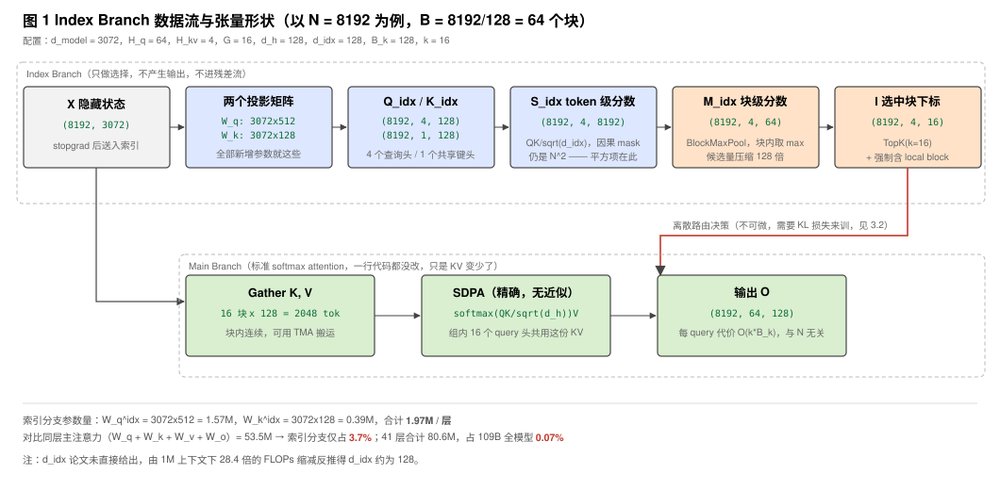
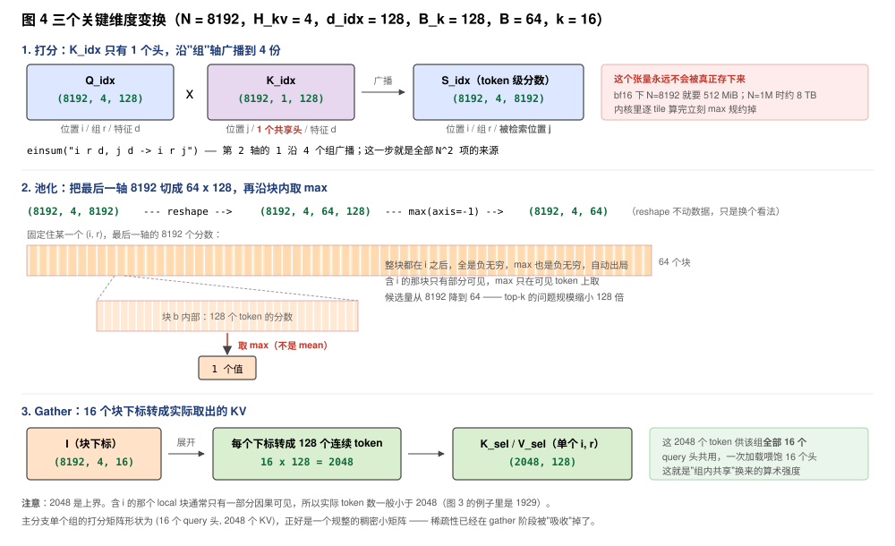
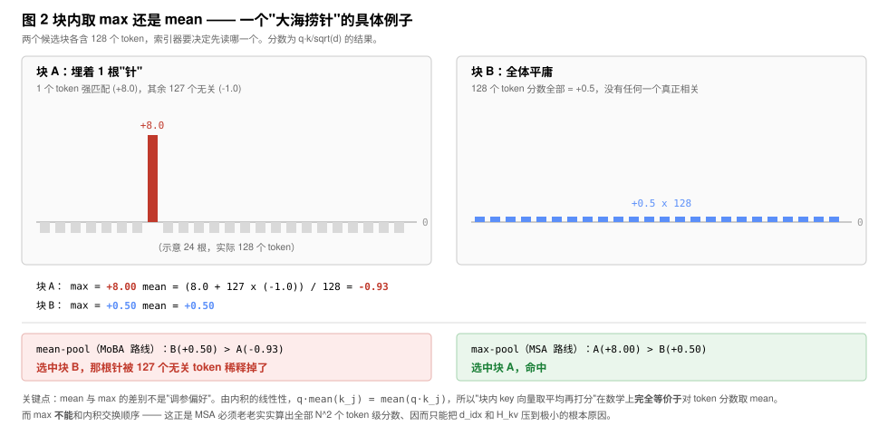
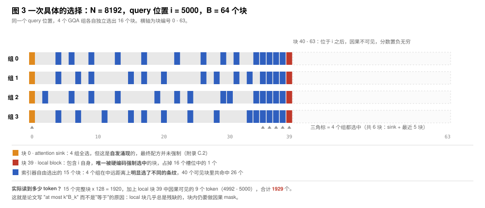
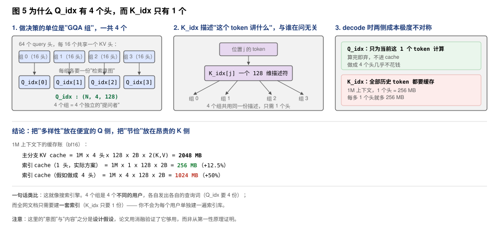
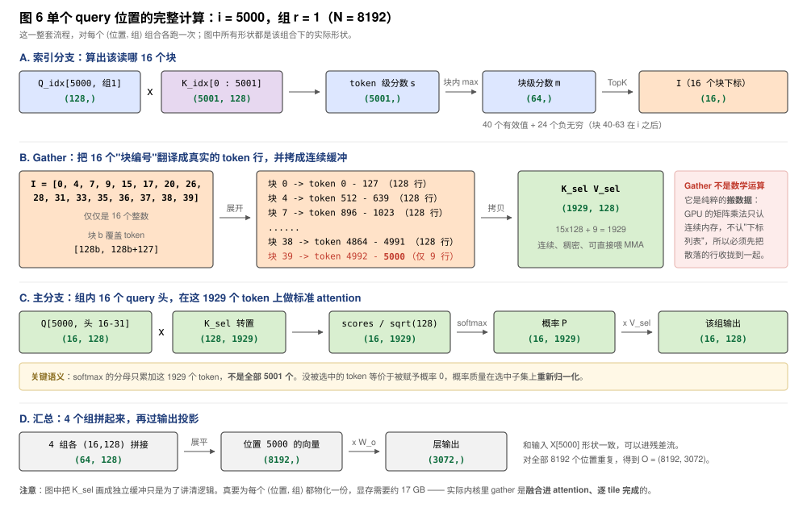
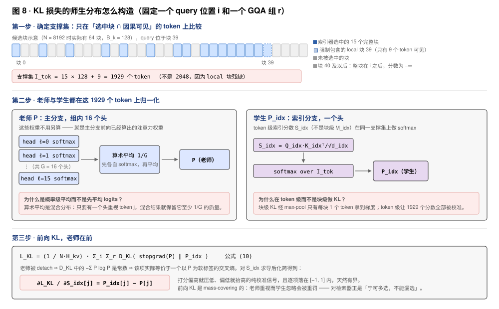
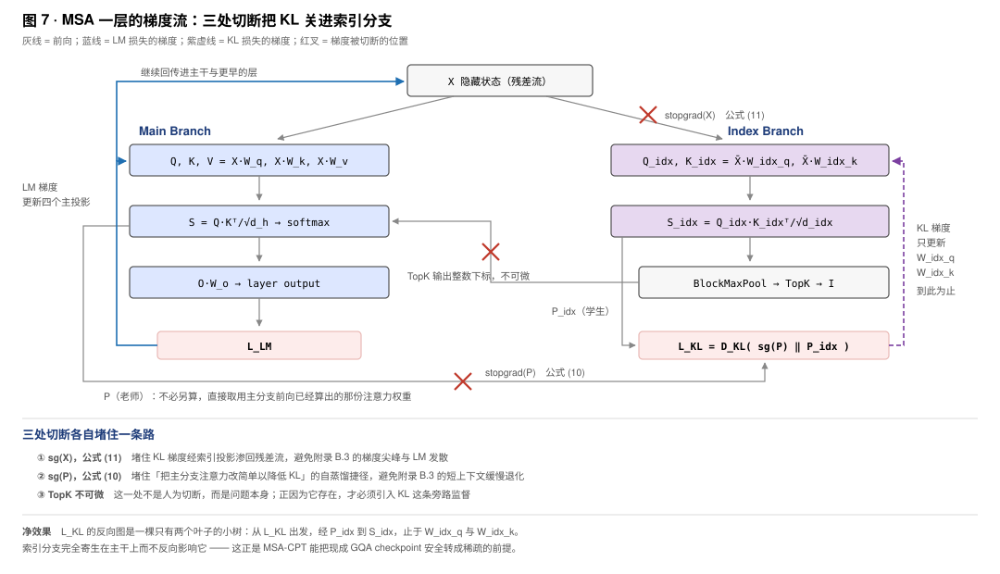
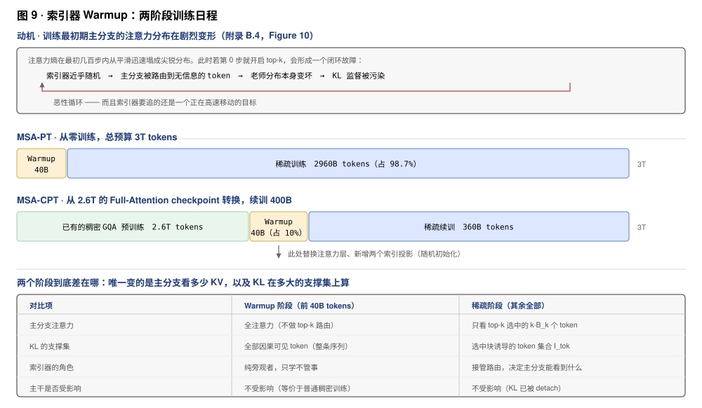
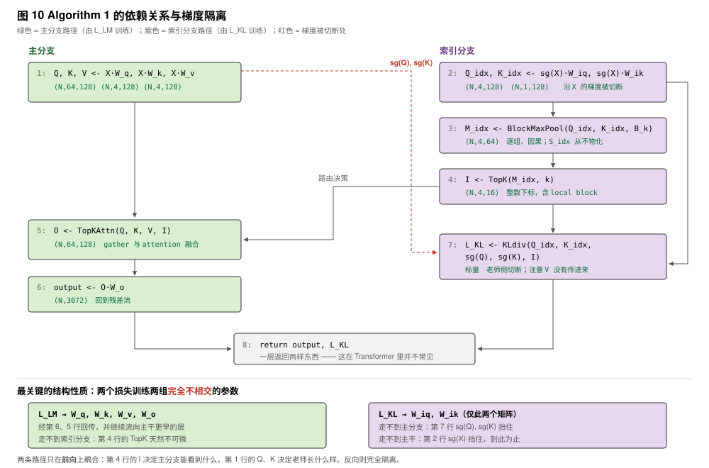

---
tags:
  - papers/LLM
aliases:
  - "MSA"
  - "MiniMax Sparse Attention"
date: 2026
---

# MiniMax Sparse Attention (MSA)

## 核心信息

- **标题**: MiniMax Sparse Attention
- **作者**: Xunhao Lai, Weiqi Xu, Yufeng Yang 等
- **机构**: MiniMax（合作方包括北京大学、NVIDIA、浙江大学等）
- **发表时间**: 2026
- **arXiv**: [2606.13392v2](https://arxiv.org/abs/2606.13392)
- **推理内核**: [MiniMax-AI/MSA](https://github.com/MiniMax-AI/MSA)
- **模型下载**: [MiniMax-M3](https://huggingface.co/MiniMaxAI/MiniMax-M3)
- **领域**: 大语言模型 / 稀疏注意力 / 长上下文推理 / GPU 内核协同设计

---

## 这篇论文在讲什么？（给初学者的概述）

### 背景：为什么长上下文这么贵

大模型正在从"聊几句"转向长周期的 agent 工作流——读整个代码仓库、跨几百步推理和调用工具、维持持久记忆。这些任务动辄需要几十万到一百万 token 的上下文。

但传统 Transformer 的注意力有个致命问题：**每个 token 都要去"看"前面所有 token**，计算量随序列长度**平方增长**。上下文拉到 1M，注意力就成了部署时最卡脖子的开销。

### 一个类比

把长上下文想象成一本 1000 页的书。

- **传统注意力**：每回答一个问题，都把前面所有页重新翻一遍。
- **MSA**：先用一个很快的"目录检索器"找出最相关的 16 个段落块，然后只认真读这些块。

关键在于 **不要乱省，要学会省**。MSA 的索引器不是固定只看附近内容，而是根据当前 token 的**内容**动态选择远处有用的信息。

### 解法：两个分支

1. **Index Branch（索引分支）**：极轻量，只负责打分和选择。把上下文切成固定大小的块（$B_k = 128$），为每个 query token 选出 top-$k$ 个最重要的块（$k = 16$）。
2. **Main Branch（主分支）**：还是**标准的** softmax attention，但只在被选中的块上计算。

每个 query 实际只看 $k B_k = 16 \times 128 = 2048$ 个 token，**这个数字不随上下文长度变化**。

---

## 一句话总结

MSA 通过给标准 GQA 挂载一个"只做选择、不做计算"的轻量索引分支，让每个 GQA 组独立地从上下文中挑出少量 KV 块做精确注意力，在 109B 多模态模型上基本保持能力的同时，把 1M 上下文的单 token 注意力算力降低 **28.4×**，实测 prefill 加速 **14.2×**、decode 加速 **7.6×**。

---

## 主实验配置速览

| 配置项 | 取值 |
|--------|------|
| 模型规模 | 109B 总参数 / 6B 激活参数（MoE） |
| 层数 | 41 层（前 3 层 dense，其余 38 层 MoE） |
| 隐藏维度 $d_\text{model}$ | 3072 |
| Query 头数 $H_q$ | 64 |
| KV 头数 $H_{kv}$ | 4 |
| GQA 组大小 $G = H_q / H_{kv}$ | **16** |
| 头维度 $d_h$ | 128（RoPE 维度 64） |
| KV 块大小 $B_k$ | **128** |
| 每组选中块数 $k$ | **16** |
| 每 query 注意力预算 $k B_k$ | **2048 tokens** |
| 训练预算 | 3T tokens |
| 训练路线 | MSA-PT（从头训） / MSA-CPT（从 full-attention checkpoint 转换） |

---

## 关键效率数据

| 指标 | 结果 |
|------|------|
| 1M 上下文单 token 注意力 FLOPs | 相比 GQA 降低 **28.4×** |
| 1M 上下文 prefill 实测加速（H800） | **14.2×** |
| 1M 上下文 decode 实测加速（H800） | **7.6×** |
| Top-k 内核 vs `torch.topk` | 最高 **5.1×** |
| HELMET-128K / RULER-128K | 与 full attention 差距 **-0.60 / +0.12** |

实测加速小于理论 FLOPs 缩减，因为稀疏注意力额外引入了索引构建、top-k 选择、反向索引物化、query gather、负载均衡等开销，且访存模式不如 dense 规整。

---

## 第 2 章：预备知识

### 2.1 因果注意力与 GQA

标准因果注意力对第 $t$ 个位置的 query，要和前面所有位置 $i \le t$ 的 key 做内积、算 softmax、再加权求和 value：

$$\boldsymbol{o}_t^{(h)} = \sum_{i \le t} \alpha_{t,i}^{(h)} \boldsymbol{v}_i^{(h)}, \qquad \alpha_{t,i}^{(h)} = \frac{\exp\left(\langle \boldsymbol{q}_t^{(h)}, \boldsymbol{k}_i^{(h)} \rangle / \sqrt{d_h}\right)}{\sum_{j \le t} \exp\left(\langle \boldsymbol{q}_t^{(h)}, \boldsymbol{k}_j^{(h)} \rangle / \sqrt{d_h}\right)}$$

代价是 $\Theta(2 H_q N^2 d_h)$ FLOPs，随 $N$ **平方增长**。

**GQA（Grouped-Query Attention）**：用 $H_q$ 个 query 头，但把 KV 头数减少到 $H_{kv}$，相邻的 $G = H_q / H_{kv}$ 个 query 头**共享同一个 KV 头**。每个 KV 头定义一个 **GQA 组**。主实验中 $H_q = 64$、$H_{kv} = 4$，所以 $G = 16$。

> 平方增长的根源只有一句话：**每个 query 必须看完前面所有 key**。想省钱就只有一条路——让 query 只看一部分 key。问题随之而来：**看哪一部分？谁来决定？**

---

### 2.2 稀疏注意力的两阶段抽象

这一节**没有提出任何新方法**，它的作用是给"稀疏注意力"建立一个统一的数学框架，后面 MSA 的所有设计都是往这个框架里填空。

#### 核心公式

$$\mathcal{I}_i = \text{Index}_\phi\left(\boldsymbol{q}_i,\ \boldsymbol{K}_{\le i}\right), \qquad \boldsymbol{o}_i = \text{Attn}\left(\boldsymbol{q}_i,\ \boldsymbol{K}[\mathcal{I}_i],\ \boldsymbol{V}[\mathcal{I}_i]\right)$$

拆成两步：

- **第一步「选」（Index Branch）**：给定当前 query $\boldsymbol{q}_i$ 和它能看到的所有 key $\boldsymbol{K}_{\le i}$，通过函数 $\text{Index}_\phi$ 输出一个**下标集合** $\mathcal{I}_i$，表示"我决定只看这些位置"。
- **第二步「算」（Main Branch）**：在 $\mathcal{I}_i$ 对应的 key/value 上做**完全标准的** softmax 注意力。

> **容易忽略的重点**：第二步**没有任何近似**。它不是线性注意力那种替代品，也不是对 softmax 做数学简化，就是原封不动的 scaled dot-product attention，只是参与运算的 KV 变少了。这正是论文说的"最大化复用已有软硬件基础设施"——主分支还是 FlashAttention 那套骨架。

#### 符号逐个解释

**$\mathcal{I}_i \subseteq \{1, \dots, i\}$**：上界是 $i$ 而不是 $N$，这就是**因果性约束**。一个 token 只能选自己和前面的位置，不能选未来，保证稀疏化后模型仍是自回归的。

**$\phi$**：索引函数的参数。论文特意区分了两种情况：

| 类型 | $\phi$ | 选择依据 | 例子 |
|------|--------|----------|------|
| 固定规则索引器 | 为空 | 位置，与内容无关 | 滑动窗口、attention sink |
| 可训练索引器 | 可学习 | 当前 query 的**内容** | MSA、NSA、MoBA、DSA |

MSA 属于后者，它的 $\phi$ 就是两个投影矩阵 $\boldsymbol{W}^\text{idx}_q$ 和 $\boldsymbol{W}^\text{idx}_k$。

> 这个区分是附录 B.6 消融的直接动机：作者拿 MSA 和一个 **FLOPs 完全相等**的滑动窗口基线对比，预算一模一样，唯一区别是"选哪些 token 由位置决定还是由内容决定"。结果滑动窗口困惑度明显更差 —— **动态选择本身是有价值的，省钱不能靠拍脑袋定规则**。

**每个头可以选不同集合**：论文提到实际应写成 $\mathcal{I}_i^{(h)}$，由"位置 $i$ + 头 $h$"共同确定，公式里省略头下标只为简洁。这个细节引出了全文最核心的设计张力（见下）。

#### 这个框架真正的意义：一张"设计表格"

所有稀疏注意力方法本质上都在回答同样三个问题，区别只在填法：

| 设计维度 | 可选项 | MSA 的选择 |
|----------|--------|-----------|
| 选择的**粒度** | 单个 token / 连续块 | 块，$B_k = 128$ |
| 选择的**共享范围** | 每头独立 / 每 GQA 组共享 / 全部头共享 | 每 GQA 组独立 |
| 索引器**怎么来** | 固定规则 / LM 损失训练 / 辅助损失训练 | 辅助 KL 损失训练 |

论文第 6 章的相关工作就是在这张表上给各家方法定位：

- **DSA**：token 级选择，所有 query 头共享一套下标
- **MoBA**：块级但块很大，且只靠语言建模梯度训练索引器
- **NSA**：三条并行分支（压缩注意力 + 选择注意力 + 滑动窗口）
- **MSA**：**块级粒度 + 每 GQA 组独立选择**两件事同时做

#### 一个必须留意的隐藏成本

框架里有个陷阱：**索引器自己也要花钱**。

注意 $\text{Index}_\phi$ 的输入是 $\boldsymbol{K}_{\le i}$，也就是**完整的历史上下文**。它必须把所有候选扫一遍才能挑出 top-k，所以索引这步的复杂度仍是 $O(N)$ per query，整体还是 $N^2$。

第 3.3 节的 FLOPs 公式把这件事写得很直白：

$$F_\text{MSA}(N) = \underbrace{H_{kv} d_\text{idx} N^2}_{\text{索引分支，仍是平方}} + \underbrace{4 H_q d_h N k B_k}_{\text{主分支，线性}}$$

对比 GQA 的 $F_\text{GQA}(N) = 2 H_q d_h N^2$：

- **平方项没有消失**，只是系数从 $2 H_q d_h$（64 头 × 128 维）压到了 $H_{kv} d_\text{idx}$（4 组 × 很小的索引维度）
- **主分支实现了质变**：每个 query 的代价从 $O(N)$ 变成固定的 $O(k B_k) = 2048$

> 这解释了为什么 MSA 要把索引分支做到极致轻量——只加两个投影矩阵、key 只用一个共享头、推理时连 softmax 都不算（第 4.1 节 exp-free 选择）。**全是被这个公式逼出来的**：索引器设计得太重，省下的钱会被它自己吃掉。

---

### 补充讨论：$\mathcal{I}_i$ 到底在选哪个维度？

这是个很容易混淆的点，单独记一下。

#### 选的确实是序列维度上的索引

$\mathcal{I}_i$ 里装的是 **KV 序列维度上的下标**：

- 在 2.2 的抽象框架里 → token 位置下标，$\mathcal{I}_i \subseteq \{1, \dots, i\}$
- 在 MSA 实际实现里 → **块**下标，$\mathcal{I}_i^{(r)} \subseteq \{1, \dots, B\}$，其中 $B = \lceil N / B_k \rceil$

所以一次选择的产物是 16 个块编号，比如 `[0, 3, 47, 512, ..., 当前块]`，每个编号背后是 128 个连续的 KV token。

#### 是"针对序列 + 针对组"，不是"选头"

选择结果确实**同时随 query 位置和头而变**（记号 $\mathcal{I}_i^{(h)}$ 就是在强调这点）。但"针对头做选择"这个说法有歧义，容易读成"MSA 在挑选哪些头参与计算"——**不是的**。

> **所有 64 个 query 头每一步都照常计算，一个都不省。稀疏化完全发生在 KV 侧。**
>
> 更准确的表述：**头维度是"谁在提问"的轴，序列维度才是"被筛掉"的轴**。query 侧是稠密的（每个位置、每个头都算），只是每个提问者能看到的 KV 变少了。

而且在 MSA 里，提问者的粒度不是单个头，而是 **GQA 组**（公式 3）：

$$\mathcal{I}_i^{(r)} = \mathcal{I}_i^{(h)} = \mathcal{I}_i^{(h')}, \quad h, h' \in \mathcal{H}_r$$

同组的 $G = 16$ 个 query 头**共用一份选择结果**。全模型每层每个位置只有 **4 份**不同的清单，不是 64 份。

#### 完整的形状图景

索引分支的中间产物是一个三维张量：

$$M^\text{idx} \in \mathbb{R}^{N \times H_{kv} \times B}$$

三个轴分别是「query 位置」「GQA 组」「候选 KV 块」。在最后一个轴上取 top-k，得到形状 $(N, H_{kv}, k)$ 的选择结果。

代入 1M 上下文：$N = 1\text{M}$、$H_{kv} = 4$、$B = 1\text{M}/128 = 8192$ 个候选块、$k = 16$。也就是**每个 query 位置产生 4 份清单，每份从 8192 个块里挑 16 个**，命中的 2048 个 token 服务于该组的 16 个 query 头。

#### 为什么共享单位是"组"

**往上看（为什么不是每头独立）**：同组的 16 个 query 头本来就共用同一份 $K^{(r)}, V^{(r)}$（这是 GQA 的定义）。既然 KV 共享，让选择也共享就能做到"一次 KV 块加载，喂饱 16 个 query 头的矩阵乘"。反之若 64 头各选各的，需要 64 次独立 gather，每次加载的 KV 块只服务一个头，算术强度掉到 $1/16$。

**往下看（为什么不干脆全部共享）**：附录 A 的可视化显示，**不同组确实会选出不同的长距离条纹**，只在局部对角线和 sink 列上一致。组间差异是有信息量的，砍掉会损失检索能力。DSA 走的就是全共享路线，MSA 把"每组独立选 + 块级粒度"列为自己的核心差异点。

#### 架构里的佐证

这个"组为单位"的设计到处留有痕迹：

- 索引 query 投影是 $Q^\text{idx} \in \mathbb{R}^{N \times H_{kv} \times d_\text{idx}}$，**每组一个**索引查询头
- 索引 key 投影只有 $K^\text{idx} \in \mathbb{R}^{N \times 1 \times d_\text{idx}}$，**全模型共享一个**索引键头
- KL 损失的 teacher 分布 $P^{(r)}$ 是**对组内 $G$ 个头的注意力分布做概率级平均**再当监督信号——因为一份清单要同时服务这 $G$ 个头，它该对齐的是这些头的"平均口味"，而不是某一个头

---

### 2.3 基于 GQA 的块稀疏注意力

2.2 给了框架，2.3 就是往框架里加**两条工程约束**。这一节只有两个想法，但它们是 MSA 与前人方法的分水岭。

#### 出发点：理想粒度跑不快

论文开篇一句话点题：

> Per-head token-level selection offers the finest granularity, but such fine-grained computation is difficult to map efficiently to GPU matrix operations.

**每头独立 + token 级选择**在表达能力上是最优的：每个头各自挑最相关的单个 token，一个字节的预算都不浪费。但它在 GPU 上是灾难，因为 GPU 快的前提是**大块规整的矩阵乘法**，而这种选法产生的是 64 份互不相同的、离散跳跃的地址列表。

所以 2.3 做了两次"故意变粗"，各解决一个硬件问题。

#### 约束一：组内共享索引（沿"头"轴变粗）

设 $\mathcal{H}_r$ 表示第 $r$ 个 KV 头服务的 $G$ 个 query 头，组内共享索引集合：

$$\mathcal{I}_i^{(r)} = \mathcal{I}_i^{(h)} = \mathcal{I}_i^{(h')}, \quad h, h' \in \mathcal{H}_r \tag{3}$$

**买到了什么**：一次 KV 块加载可以喂饱 $G = 16$ 个 query 头的计算，算术强度提升 16 倍。清单数量从每位置 64 份降到 4 份。

**代价**：组内 16 个头被迫看同一批 KV。论文用 KL 损失里对组内做**概率级平均**的 teacher 来缓解——既然要共享，就对齐组内的平均注意力模式。

#### 约束二：按块选择（沿"序列"轴变粗）

把 KV 序列切成固定大小的连续块（公式 4）：

$$\mathcal{B}_b = \{(b-1)B_k + 1, \dots, \min(b B_k, N)\}, \quad b = 1, \dots, B, \quad B = \lceil N / B_k \rceil$$

$\min(b B_k, N)$ 处理最后一块不满的边界情况。选择集合从 token 下标变成块下标：$\mathcal{I}_i^{(r)} \subseteq \{1, \dots, B\}$。

主分支在选中块的**因果可见 token** 上做注意力——注意"因果可见"这个限定：query $i$ 所在的那个块只有前半部分可见，块内仍需 mask。

**买到了什么**（论文原话是 reduces routing overhead and makes sparse attention more regular）：

| 收益 | 说明 |
|------|------|
| **访存连续** | 128 个 token 的 KV 在显存里连续，可以合并访存 / 用 TMA 批量搬运；token 级则是散点 gather |
| **top-k 问题缩小 $B_k$ 倍** | 1M 上下文下候选从 1M 个 token 变成 8192 个块，这是第 4.1 节能设计专用小 $k$ 内核的前提 |
| **路由元数据变小** | 16 个块下标就覆盖 2048 个 token |
| **对齐 MMA 形状** | $B_k = 128$ 正好匹配 tensor core 的 128 宽 MMA tile |

其中第二条尤其关键，它是第 4.1 节能写专用 top-k 内核的前提。论文明确指出，正因为 $B$ 和 $k$ 都被压得很小，才**落在通用 top-k 内核的甜区之外**——radix select 需要靠大 $B$ 摊销多趟分桶，bitonic sort 是 $O(B \log^2 B)$，两者在小规模下都不划算。于是作者写了个每线程寄存器小顶堆的专用实现，实测比 `torch.topk` 快 **5.1×**。

**代价**：粒度变粗可能"搭便车"。哪怕一个块里只有 1 个 token 真正相关，也得整块 128 个一起算进来，剩下 127 个是浪费掉的预算。

**实测代价有多大**：附录 C.1 在保持选中 token 总数不变的前提下扫了块大小，结论是影响有限——PPL 几乎不变，RULER-8K 甚至微涨，只有 RULER-32K 从 66.1 降到 64.6：

| Benchmark | Block 32 | Block 64 | Block 128 |
|-----------|----------|----------|-----------|
| TAU2 PPL ↓ | 1.176 | 1.176 | 1.176 |
| AgentCompany PPL ↓ | 1.266 | 1.276 | 1.266 |
| RULER-8K | 72.5 | 72.8 | **73.8** |
| RULER-32K | **66.1** | 65.3 | 64.6 |

所以论文选了 $B_k = 128$：内核效率的收益远大于这点质量损失。

#### 小结：两次变粗的定位

| | 沿哪个轴变粗 | 从 → 到 | 解决的硬件问题 |
|---|---|---|---|
| 约束一 | 头 | 64 份清单 → 4 份 | 算术强度太低（MMA 吃不饱） |
| 约束二 | 序列 | token 下标 → 块下标 | 访存不连续 + top-k 候选太多 |

两条约束合起来定义了 MSA 的搜索空间：**在 $(N, H_{kv}, B)$ 这个三维张量上，为每个 (query 位置, GQA 组) 挑 $k$ 个块**。第 3 章要回答的就是剩下的问题——这个选择具体怎么算、怎么训。

---

## 第 3 章：MSA 架构与训练

### 第 3 章导言：三句话承诺

第 3 章开头那段话很短，但它把整章的内容压缩成了对 Index Branch 的**三条承诺**。后面所有设计都是在兑现它们：

> The Index Branch **adds only two projection matrices** to standard GQA, **operates at block granularity**, and **makes selections independently for each GQA group**.

| 承诺 | 兑现在哪 | 可量化的结果 |
|------|---------|-------------|
| 只加两个投影矩阵 | 公式 (5) | 每层 1.97M 参数，占注意力参数 **3.7%**，占全模型 **0.07%** |
| 块粒度运作 | 公式 (6)(7) | top-k 候选从 $N$ 降到 $N/128$；KV 读取连续 |
| 每个 GQA 组独立选择 | $Q^\text{idx}$ 有 $H_{kv}$ 个头 | 每位置 4 份清单而非 1 份或 64 份 |

同时导言也划清了两个分支的职责边界：**Index Branch 只输出下标，Main Branch 只做标准 attention**。第 2 章定下了"在 $(N, H_{kv}, B)$ 张量上为每个「query 位置 + GQA 组」挑 $k$ 个块"这个形状，3.1 讲怎么算出这些下标，3.2 讲这些下标怎么训得准。

---

### 3.1 架构

#### 整体数据流



三个公式对应图中三次形状变换：

$$Q^\text{idx} = X W^\text{idx}_q \in \mathbb{R}^{N \times H_{kv} \times d_\text{idx}}, \qquad K^\text{idx} = X W^\text{idx}_k \in \mathbb{R}^{N \times 1 \times d_\text{idx}} \tag{5}$$

$$S^{\text{idx},(r)}_{i,j} = \frac{Q^{\text{idx},(r)}_i \left(K^\text{idx}_j\right)^\top}{\sqrt{d_\text{idx}}}, \qquad M^{\text{idx},(r)}_{i,b} = \max_{\substack{j \in \mathcal{B}_b \\ j \le i}} S^{\text{idx},(r)}_{i,j} \tag{6}$$

$$\mathcal{I}^{(r)}_i = \operatorname*{TopK}_{b \in \{1,\dots,B\}}\left(M^{\text{idx},(r)}_{i,\cdot},\ k\right) \tag{7}$$

以 $N = 8192$ 为例的形状链条：

| 步骤 | 张量 | 形状 | 说明 |
|------|------|------|------|
| 输入 | $X$ | $(8192, 3072)$ | 隐藏状态，进索引前先 stopgrad |
| 投影 | $Q^\text{idx}$ | $(8192, 4, 128)$ | 每个 GQA 组一个索引查询头 |
| 投影 | $K^\text{idx}$ | $(8192, 1, 128)$ | 全模型**共享一个**索引键头 |
| 打分 | $S^\text{idx}$ | $(8192, 4, 8192)$ | token 级，$N^2$ 项就在这一步 |
| 池化 | $M^\text{idx}$ | $(8192, 4, 64)$ | 块内取 max，候选量压缩 $B_k = 128$ 倍 |
| 选择 | $\mathcal{I}$ | $(8192, 4, 16)$ | TopK + 强制 local block |

#### 逐步维度推导



约定：省略 batch 轴，$N = 8192$，$d_\text{model} = 3072$，$H_q = 64$，$H_{kv} = 4$，$G = 16$，$d_h = 128$，$d_\text{idx} = 128$，$B_k = 128$，$B = 64$，$k = 16$。

**Step 0 · 输入**

$$X \in \mathbb{R}^{8192 \times 3072}$$

8192 个 token，每个用 3072 维向量表示。

**Step 1 · 主分支投影（对照用，后面 gather 要用到）**

$$Q = X W_q,\quad W_q \in \mathbb{R}^{3072 \times 8192} \;\Rightarrow\; Q \in \mathbb{R}^{8192 \times 8192} \xrightarrow{\text{view}} (8192,\, 64,\, 128)$$

$$K = X W_k,\quad W_k \in \mathbb{R}^{3072 \times 512} \;\Rightarrow\; K \xrightarrow{\text{view}} (8192,\, 4,\, 128), \qquad V \text{ 同理}$$

输出维 8192 = $H_q \times d_h = 64 \times 128$，512 = $H_{kv} \times d_h = 4 \times 128$。所谓"多头"只是把一个长向量切成若干段，投影矩阵本身是一整块。

**Step 2 · 索引投影（公式 5）**

$$Q^\text{idx} = \text{stopgrad}(X)\, W^\text{idx}_q,\quad W^\text{idx}_q \in \mathbb{R}^{3072 \times 512} \;\Rightarrow\; (8192,\, 4,\, 128)$$

$$K^\text{idx} = \text{stopgrad}(X)\, W^\text{idx}_k,\quad W^\text{idx}_k \in \mathbb{R}^{3072 \times 128} \;\Rightarrow\; (8192,\, 1,\, 128)$$

三条轴的语义：**位置 / 组 / 特征**。$K^\text{idx}$ 的中间轴是 1，即全模型共享一个索引键头。

**Step 3 · 打分（公式 6 前半）**

$$S^\text{idx} = \frac{Q^\text{idx} \left(K^\text{idx}\right)^\top}{\sqrt{128}}: \quad (8192,\, 4,\, 128) \times (8192,\, 128) \;\longrightarrow\; (8192,\, 4,\, 8192)$$

einsum 写法：`einsum("ird,jd->irj")`。特征轴 $d$ 被内积吃掉，换来一条新的"被检索位置 $j$"轴。$K^\text{idx}$ 的单头沿组轴**广播**成 4 份。

> **这个张量永远不会被真正物化**。bf16 下 $8192 \times 4 \times 8192 \times 2\text{B} = 512$ MiB；$N = 1\text{M}$ 时约 **8 TB**。内核里是逐 tile 算完立刻 max 规约掉的。

**Step 4 · 因果 mask**

$$S^{\text{idx},(r)}_{i,j} \leftarrow -\infty \quad \text{当 } j > i$$

**Step 5 · 块内 max-pool（公式 6 后半）**

$$(8192,\, 4,\, 8192) \xrightarrow{\text{reshape}} (8192,\, 4,\, \underbrace{64}_{B},\, \underbrace{128}_{B_k}) \xrightarrow{\max(\text{axis}=-1)} (8192,\, 4,\, 64)$$

reshape 只是换个看法，不搬动数据。整块位于 $i$ 之后的块全是 $-\infty$，max 也是 $-\infty$，自动出局。

**Step 6 · TopK（公式 7）**

$$(8192,\, 4,\, 64) \xrightarrow{\text{TopK}(k=16)} \mathcal{I} \in \mathbb{Z}^{8192 \times 4 \times 16}$$

只保留下标丢弃数值。int32 下仅 2 MiB——和 512 MiB 的 $S^\text{idx}$ 形成鲜明对比，**这就是索引分支的全部产出**。

**Step 7 · Gather**

固定某个 $(i, r)$，从 $K[:, r, :] \in \mathbb{R}^{8192 \times 128}$ 中取出 16 个块共 2048 行：

$$K_\text{sel},\ V_\text{sel} \in \mathbb{R}^{2048 \times 128}$$

**Step 8 · 主分支注意力（公式 8）**

组 $r$ 的 16 个 query 头一起算：

$$\underbrace{Q[i, \mathcal{H}_r, :]}_{(16,\, 128)} \times \underbrace{K_\text{sel}^\top}_{(128,\, 2048)} \;\longrightarrow\; \underbrace{\text{scores}}_{(16,\, 2048)} \xrightarrow{\text{softmax}} \times \underbrace{V_\text{sel}}_{(2048,\, 128)} \;\longrightarrow\; (16,\, 128)$$

**稀疏性到这一步已经消失了**——主分支面对的是一个规整的稠密小矩阵。

**Step 9 · 汇总与输出投影**

$$O \in \mathbb{R}^{8192 \times 64 \times 128} \xrightarrow{\text{view}} (8192,\, 8192) \times W_o^{(8192 \times 3072)} \;\longrightarrow\; (8192,\, 3072)$$

形状回到与 $X$ 一致，可以进残差流。

#### 各步 FLOPs 分解（$N = 8192$）

| 步骤 | 公式 | FLOPs |
|------|------|-------|
| $Q^\text{idx}$ 投影 | $2 N d_\text{model} H_{kv} d_\text{idx}$ | $2.58 \times 10^{10}$ |
| $K^\text{idx}$ 投影 | $2 N d_\text{model} d_\text{idx}$ | $0.64 \times 10^{10}$ |
| 打分 $S^\text{idx}$（含因果减半） | $H_{kv} d_\text{idx} N^2$ | $3.44 \times 10^{10}$ |
| max-pool / TopK | 比较操作 | 可忽略 |
| 主分支注意力 | $4 H_q d_h N k B_k$ | $54.97 \times 10^{10}$ |
| **MSA 合计** | | $\mathbf{61.6 \times 10^{10}}$ |
| GQA 全注意力 | $2 H_q d_h N^2$ | $109.9 \times 10^{10}$ |

$N = 8192$ 时只快 **1.8×**——因为 $k B_k / N = 2048/8192 = 25\%$，稀疏度才 4 倍。**MSA 的收益完全来自长上下文**，短序列上几乎没有意义。

#### 初学者容易踩的五个坑

1. **$S^\text{idx}$ 的第 3 轴是"被检索位置 $j$"，不是特征维**。特征维在内积里被消掉了。
2. **`reshape` 不搬数据**，只是重新解释同一块内存的下标方式。
3. **$K^\text{idx}$ 的 "1" 是"共享"，不是"缺失"**。它会被广播到 4 个组。
4. **2048 是上界不是精确值**。local 块通常残缺（图 3 的例子里实际是 1929）。
5. **稀疏性在 gather 之后就消失了**。主分支拿到的是稠密的 $(16, 2048)$ 小矩阵——所有"不规则"都被压在了 gather 那一步，这正是第 4 章内核优化的着力点。

#### 承诺一有多轻：把参数量算出来

论文说"只加两个投影矩阵"，代入主实验配置（$d_\text{model} = 3072$，$H_{kv} = 4$，$d_\text{idx} = 128$）：

$$|W^\text{idx}_q| = 3072 \times (4 \times 128) = 1{,}572{,}864, \qquad |W^\text{idx}_k| = 3072 \times 128 = 393{,}216$$

每层合计 **1.97M**。对比同层主注意力的四个矩阵：

| 矩阵 | 形状 | 参数量 |
|------|------|--------|
| $W_q$ | $3072 \times (64 \times 128)$ | 25.17M |
| $W_k$ | $3072 \times (4 \times 128)$ | 1.57M |
| $W_v$ | $3072 \times (4 \times 128)$ | 1.57M |
| $W_o$ | $(64 \times 128) \times 3072$ | 25.17M |
| **合计** | | **53.5M** |

索引分支占注意力参数的 **3.7%**；41 层合计 80.6M，占 109B 全模型的 **0.07%**。

> 但**参数便宜不等于计算便宜**。索引分支的 FLOPs 是 $H_{kv} d_\text{idx} N^2$，在 1M 上下文下占 MSA 注意力总算力的约 **88%**（见 3.3）。这个反差是理解第 4 章内核设计动机的钥匙：0.07% 的参数吃掉了 88% 的算力。

#### 承诺二的关键：为什么块内取 max 而不是 mean



**一个具体例子**。两个候选块各含 128 个 token：

- **块 A**：1 个 token 强匹配（分数 $+8.0$），其余 127 个无关（$-1.0$）
- **块 B**：128 个 token 全部平庸（$+0.5$）

$$\text{块 A：} \quad \max = +8.00, \qquad \text{mean} = \frac{8.0 + 127 \times (-1.0)}{128} = -0.93$$

$$\text{块 B：} \quad \max = +0.50, \qquad \text{mean} = +0.50$$

用 mean 排序会选中块 B，**那根针被 127 个无关 token 稀释掉了**。用 max 排序则命中块 A。长上下文检索（RULER 这类）恰恰全是"大海捞针"，这个差别是致命的。

**和 MoBA 的关系比表面看起来更精确**。MoBA 的做法是"块内 key 向量取平均再打分"，而由内积的线性性：

$$\boldsymbol{q}_i \cdot \left(\frac{1}{B_k}\sum_{j \in \mathcal{B}_b} \boldsymbol{k}_j\right) = \frac{1}{B_k}\sum_{j \in \mathcal{B}_b} \left(\boldsymbol{q}_i \cdot \boldsymbol{k}_j\right)$$

**"块均值 key 打分"在数学上完全等价于"token 分数取 mean"**。所以 MoBA 与 MSA 索引器的差别可以精确地归结为一个算子：mean 还是 max。

而这个算子的选择直接决定了计算量：

| | 池化算子 | 能否与内积交换 | 打分 FLOPs |
|---|---|---|---|
| MoBA | mean | **能**（线性） | 先求 $B$ 个均值向量，只需 $O(N B d)$ |
| MSA | max | **不能**（非线性） | 必须物化全部 token 分数，$O(N^2 d)$ |

max 不能提前折叠，这就是 MSA 的索引器比 MoBA 贵 $B_k = 128$ 倍的根源，也是**为什么 $d_\text{idx}$ 和 $H_{kv}$ 必须被压到极小**——省下来的预算全花在了"不肯做近似"上。

#### 承诺三与因果性：看一次真实的选择



取 $N = 8192$（$B = 64$ 块）、query 位置 $i = 5000$，走一遍：

1. **定位 local block**：$\lfloor 5000 / 128 \rfloor = 39$，块 39 覆盖 token 4992–5119
2. **因果 mask**：块 40–63 整块位于 $i$ 之后 → 分数置 $-\infty$；块 39 只有 4992–5000 共 **9 个** token 可见
3. **打分池化**：每组得到 40 个有效块分数（其余 24 个为 $-\infty$）
4. **TopK**：每组选 16 块，其中块 39 被强制包含，索引器自由支配剩下 15 个
5. **Gather**：$15 \times 128 + 9 = \mathbf{1929}$ 个 token，**不是 2048**

第 5 步解释了论文为什么写 "at most $k B_k$" 而不是"等于"：**local 块几乎总是残缺的，块内仍要做因果 mask**。

图 3 还展示了两件事：

- 4 个组在中远距离上明显选了**不同的条纹**，40 个可见块里共命中 26 个——这就是"每组独立选择"的实际效果（对应附录 A 的可视化）
- 4 组共同选中的只有 6 块：**块 0（sink）+ 最近 5 块**。注意块 0 是**自发涌现**的，最终配方并没有强制它（附录 C.2）

#### 设计点：$Q$ 有 4 个头，$K$ 只有 1 个



这个不对称是刻意的，反映两侧承担的语义不同：

- **Query 侧必须区分组**，因为"每组独立选择"正是 MSA 的核心卖点，不同组要能表达不同的检索偏好（图 3 的不同条纹）
- **Key 侧只是在回答"这个 token 大致讲什么"**——一个与"谁在问"无关的内容描述符，没必要为每组各存一份

共享 key 头还有推理期的实惠：索引器的 KV cache 每 token 只需存**一个** 128 维向量，而不是 4 个，索引 cache 直接省 4 倍。

#### Main Branch：一行都没改



$$O^{(h)}_i = \operatorname{softmax}\left(\frac{Q^{(h)}_i \left(K^{(r)}[\mathcal{I}^{(r)}_i]\right)^\top}{\sqrt{d_h}}\right) V^{(r)}[\mathcal{I}^{(r)}_i] \tag{8}$$

就是标准 SDPA，只是 KV 换成 gather 出来的子集。索引集合组内共享，但**每个头保留自己的 query 投影**——共享的是"读哪些资料"，不是"怎么读"。

单 query 代价从 $O(N)$ 降到 $O(k B_k)$，**且不随序列长度变化**。$N$ 从 8K 涨到 1M，主分支每个 query 读的 token 数始终是约 2048。

---

### 3.2 训练

3.1 解决了"怎么选"，但留下一个致命问题：**这个选法根本没法用普通的语言建模损失训练**。3.2 的四个机制全是为了补上这个洞。

#### 核心难题：TopK 不可微

回顾 Step 6：$\mathcal{I} = \text{TopK}(M^\text{idx}, k)$ 的输出是**整数下标**。整数没有梯度——把某个块分数从 3.7 挪到 3.8，只要排名没变，输出一个比特都不变；一旦排名跨过临界点，输出又是**跳变**的。这种函数的导数处处为 0（除了测度为零的跳变点），链式法则到此彻底断链。

后果是：$W^\text{idx}_q$ 和 $W^\text{idx}_k$ 从 $\mathcal{L}_\text{LM}$ 那里**一滴梯度都收不到**，永远停留在随机初始化状态。

> **打个比方**：索引器像一个帮你选参考书的图书管理员。他选错了书，你的论文分数会变低——但分数本身**不会告诉他哪本书该换成哪本**。你需要一个直接评价"选书质量"的信号。

#### 机制一：KL 对齐损失——给索引器造一个专属老师



> 专题延伸：[MSA 中的 KL 对齐与局部知识蒸馏](msa-kl-distillation.md)——包括 soft-label 视角、$P^\text{idx}-P$ 梯度、支撑集盲区、LSE kernel 优化和训练指标解读。

思路：既然 LM 损失给不了信号，就**直接告诉索引器"主分支实际最关注哪些 token"**，让它去模仿。

**第一步 · 确定支撑集**。记 $\mathcal{I}^{(r)}_{i,\text{tok}}$ 为选中块诱导出的因果可见 token 集合。$i = 5000$ 的例子里就是那 1929 个 token。师生**在同一个支撑集上**比较。

**第二步 · 构造老师与学生**（公式 9）：

$$P^{\text{idx},(r)}_{i,j} = \frac{\exp\left(S^{\text{idx},(r)}_{i,j}\right)}{\sum_{u \in \mathcal{I}^{(r)}_{i,\text{tok}}} \exp\left(S^{\text{idx},(r)}_{i,u}\right)}, \qquad P^{(r)}_{i,j} = \frac{1}{G} \sum_{\ell \in \mathcal{H}_r} \frac{\exp\left(S^{(\ell)}_{i,j}\right)}{\sum_{u \in \mathcal{I}^{(r)}_{i,\text{tok}}} \exp\left(S^{(\ell)}_{i,u}\right)}$$

**第三步 · 前向 KL**（公式 10）：

$$\mathcal{L}_\text{KL} = \frac{1}{N H_{kv}} \sum_{i=1}^{N} \sum_{r=1}^{H_{kv}} D_\text{KL}\left(\text{stopgrad}(P^{(r)}_{i,\cdot}) \,\big\|\, P^{\text{idx},(r)}_{i,\cdot}\right)$$

四个值得单独记的细节：

**① 老师是组内 $G$ 个头的概率级平均，不是 logits 平均。**

先各自 softmax 再算术平均，得到的是一个**混合分布**。它的好处是：只要 16 个头里**有任何一个**重视 token $j$，混合结果就为它保留至少 $1/G$ 的质量。若改成先平均 logits，不同头的 logit 尺度差异会让强势头淹没其他头。

这也呼应了 2.3 的约束——一份清单要同时服务 $G$ 个头，它该对齐的就是这些头的**并集口味**而非某一个头。

**② KL 方向是 $D_\text{KL}(P \| P^\text{idx})$，老师在前。**

教师 $P$ 被 stop-gradient，因此最小化这项 KL 对 Index Branch 等价于最小化 soft-label cross entropy：

$$D_\text{KL}(P \| P^\text{idx}) = -\sum_j P_j \log P_j^\text{idx} - H(P)$$

若学生 logits 为 $z_j=S_{i,j}^\text{idx}$，最关键的梯度是：

$$\frac{\partial D_\text{KL}(P \| P^\text{idx})}{\partial z_j}=P_j^\text{idx}-P_j$$

所以教师认为重要、学生低估的位置会被提高 index logit；学生高估的位置则会被压低。当 $P_j$ 较大而 $P_j^\text{idx}$ 很小时，前向 KL 会产生显著惩罚，这符合稀疏检索不希望漏掉重要位置的直觉。

需要避免一个常见但不严谨的论证：不能把 forward-KL 和 reverse-KL 的**单个位置项**直接比较倍数，因为 KL 只有对完整分布求和后才保证非负，reverse-KL 的单项可以为负。论文也没有报告 KL 方向的专项消融；这里最可靠的依据是完整目标和上面的 $P^\text{idx}-P$ 梯度。

**③ KL 建在 token 级分数 $S^\text{idx}$ 上，不是块级分数 $M^\text{idx}$。**

如果对块级分数算 KL，由于 $M^\text{idx}$ 是 max-pool 的结果，每个块只有**取到最大值的那 1 个 token** 能拿到梯度，另外 127 个完全不被校准。放在 token 级，1929 个分数全部得到监督。

**④ 老师复用了主分支已有的归一化信息。**

$P^{(r)}$ 需要的归一化常数就是主分支前向已经算出的 LSE。4.3 节把这些 LSE 直接写到显存，使实现能够跳过一个独立、重复计算 softmax 的 KL-forward kernel，再在自定义 backward 中根据 logits 与 LSE 重建概率并注入梯度。

#### 机制二：梯度截断——把 KL 关进索引分支



$$Q^\text{idx} = \text{stopgrad}(X) W^\text{idx}_q, \qquad K^\text{idx} = \text{stopgrad}(X) W^\text{idx}_k \tag{11}$$

一层里一共有**三处切断**，各堵一条路：

| 切断位置 | 堵住的路径 |
|---|---|
| $\text{stopgrad}(X)$（公式 11） | KL 梯度经索引投影渗回残差流、再污染整个主干 |
| $\text{stopgrad}(P)$（公式 10） | KL 梯度反向流进主分支的 $W_q, W_k$ |
| TopK 本身不可微 | LM 梯度流进索引分支（这条是天然断的，不是设计出来的） |

三处合起来的净效果：$\mathcal{L}_\text{KL}$ **只更新 $W^\text{idx}_q$ 和 $W^\text{idx}_k$ 这两个矩阵**，成为每层索引器的纯局部监督信号。

附录 B.3 记录了不截断时的两种翻车方式：

| 失败模式 | 现象 |
|---|---|
| **梯度尖峰** | KL 系数稍大，尖峰传进主干，几百步内梯度范数爆炸、LM loss 发散 |
| **自蒸馏作弊** | 即使系数调到稳定区间，短上下文 benchmark 仍缓慢退化 |

第二个尤其阴险：主干发现降低 KL 有一条捷径——**把主分支的注意力分布变得更平滑、更好模仿，而不是把索引器变聪明**。相当于学生考不好，学校的对策是让老师把题出简单点。KL 数字确实降了，模型能力却被牺牲了。截断之后这条捷径被彻底堵死。

#### 机制三：索引器 Warmup



**动机**（附录 B.4，Figure 10）：训练最初期主分支的注意力熵**急剧下降**，分布在几百步内从平滑塌成尖锐。此时若第 0 步就开 top-k，会形成一个闭环故障：

$$\text{索引器近乎随机} \rightarrow \text{主分支被路由到无信息 token} \rightarrow \text{老师分布本身变坏} \rightarrow \text{KL 监督被污染}$$

而且索引器要追的还是一个**正在高速移动的目标**。

**做法**：前 $T_\text{warm}$ 步**两个分支都跑全注意力**，索引器用 KL 对齐**全序列**的主分支分布，纯当旁观者只学不管事。之后才切到稀疏，KL 改为只在 $\mathcal{I}_\text{tok}$ 上算。

两阶段的差别只有两点：

| 对比项 | Warmup 阶段 | 稀疏阶段 |
|---|---|---|
| 主分支注意力 | 全注意力，不做 top-k 路由 | 只看选中的 $k B_k$ 个 token |
| KL 的支撑集 | 全部因果可见 token | 选中块诱导的 $\mathcal{I}_\text{tok}$ |
| 索引器角色 | 纯旁观者 | 接管路由 |

主实验中两条路线的 warmup 都是 **40B tokens**，但占比差别很大：

- **MSA-PT**：3T 总预算里的 40B，占 **1.3%**，其余 2960B 全程稀疏
- **MSA-CPT**：从 2.6T 的 dense checkpoint 出发续训 400B，warmup 占 **10%**

对 CPT 尤其关键：新加的两个索引投影是随机初始化的，必须先对齐好，再让它去接管一个已经训好的主干的路由权。

#### 机制四：强制 Local Block（以及被砍掉的先验）

早期版本强制选中两类块：序列首块（attention sink）+ 固定大小的局部窗口。附录 C.2 的消融发现**这些先验不需要硬编码**——去掉后模型自己照样学出来，指标几乎不变（RULER-32K 从 65.8 降到 61.5 是唯一较明显的差距）。

所以最终配方**只强制包含 query 自身所在的那个 incomplete self block**，不强制首块，也不强制大局部窗口。

> 附录 A 的可视化印证了这点：即使不强制，学出来的索引器仍在所有层所有头上给首块很高的选择概率。**sink 是自发涌现的，不是被规定的**（图 3 里 4 个组都选中块 0，正是这个现象）。

#### Algorithm 1 逐行解剖



原文（`sg` = `stopgrad`）：

```
Require: hidden states X (N, d_model); block size B_k, number of selected blocks k

1: Q, K, V      <- X W_q, X W_k, X W_v            // (N,H_q,d_h), (N,H_kv,d_h), (N,H_kv,d_h)
2: Q_idx, K_idx <- sg(X) W_idx_q, sg(X) W_idx_k   // (N,H_kv,d_idx), (N,1,d_idx); detached
3: M_idx        <- BlockMaxPool(Q_idx, K_idx, B_k) // (N,H_kv,B); per-group, causal
4: I            <- TopK(M_idx, k)                  // 选中块下标；含 local block
5: O            <- TopKAttn(Q, K, V, I)            // (N,H_q,d_h)
6: output       <- O W_o                           // (N,d_model)
7: L_KL         <- KLdiv(Q_idx, K_idx, sg(Q), sg(K), I)  // 在 I 诱导的 token 上
8: return output, L_KL
```

整体损失由训练循环拼装：$\mathcal{L} = \mathcal{L}_\text{LM} + \lambda \sum_\text{layers} \mathcal{L}_\text{KL}$（论文未给出 $\lambda$ 取值）。

##### 逐行要点

| 行 | 操作 | 输出形状（N=8192） | 值得注意的地方 |
|---|---|---|---|
| 1 | 主分支投影 | (8192,64,128) 等 | 与第 2 行**互相独立**，可并行 |
| 2 | 索引投影 | (8192,4,128) / (8192,1,128) | `sg(X)`：**切断点一** |
| 3 | 块级打分 | (8192,4,64) | 签名里**没有 S_idx**——融合的显式声明 |
| 4 | 选块 | (8192,4,16) | 整数；`local block included` 折叠进 TopK |
| 5 | 稀疏注意力 | (8192,64,128) | gather 与 attention **融合成一个算子** |
| 6 | 输出投影 | (8192,3072) | O 需先展平成 (8192, 8192) |
| 7 | 辅助损失 | 标量 | `sg(Q), sg(K)`：**切断点二** |
| 8 | 返回 | 两个值 | 层要往外吐辅助损失，非常规设计 |

##### 五个从措辞里读出来的信息

**① 第 3 行的函数签名本身就是"禁止物化"的声明。**

`BlockMaxPool(Q_idx, K_idx, B_k)` 直接吃 $Q^\text{idx}, K^\text{idx}$ 吐出 $(N, H_{kv}, B)$，中间那个 $(N, H_{kv}, N)$ 的 $S^\text{idx}$ **在接口层面就不存在**。作者用 API 形状把"必须融合"这条约束写进了算法描述里——1M 上下文下它是 8 TB，根本不可能落地。第 5 行的 `TopKAttn` 同理，把 gather 藏进了算子内部。

**② 第 7 行没有传 V。**

`KLdiv(Q_idx, K_idx, sg(Q), sg(K), I)` 的参数表里只有 Q 和 K。因为老师分布 $P^{(r)}$ 只需要**注意力权重**，不需要注意力输出。这也解释了 4.3 节为什么能把 KL 前向完全省掉——它需要的归一化常数 LSE，主分支前向已经算过了。

**③ 第 2 行的 `sg` 与第 7 行的 `sg` 堵的是两条不同的路。**

第 2 行挡住"KL 梯度经索引投影渗回残差流"，第 7 行挡住"KL 梯度反向流进主分支投影"。少任何一个，附录 B.3 的两种翻车方式就会复现。

**④ Warmup 不在算法里。**

Algorithm 1 描述的是 warmup **之后**的稳态。Warmup 期间第 5 行是全注意力、第 7 行在整条序列上算 KL——那是训练循环级别的日程，不是层级别的逻辑，所以被排除在外。同理，`λ` 和跨层求和也交给了训练循环（见标题：*assembled by the training loop*）。

**⑤ 推理时第 2、7 行直接消失。**

`sg` 在推理期无意义，KL 更是不需要。所以推理只剩 1、3、4、5、6 五行，且第 3 行连 softmax 都不用算（4.1 节的 exp-free 选择）。

##### 最关键的结构性质：两个损失训练两组不相交的参数

| 损失 | 更新哪些参数 | 为什么走不到另一侧 |
|---|---|---|
| $\mathcal{L}_\text{LM}$ | $W_q, W_k, W_v, W_o$（并继续流向主干） | 第 4 行 TopK 天然不可微 |
| $\mathcal{L}_\text{KL}$ | **仅** $W^\text{idx}_q, W^\text{idx}_k$ | 第 7 行 `sg(Q),sg(K)` + 第 2 行 `sg(X)` |

两条路径**只在前向上耦合**：第 4 行的 $\mathcal{I}$ 决定主分支能看到什么，第 1 行的 $Q, K$ 决定老师长什么样。反向则完全隔离。

这构成一种**无梯度干扰的协同演化**：主干照常按语言建模目标进化，索引器一路追踪它当前的注意力模式。代价是二者形成"移动靶"关系——这正是必须引入 warmup 的深层原因。

##### 与第 4 章内核的对应

算法里三行重活各自对应第 4 章一节：

| 算法行 | 对应内核 | 第 4 章小节 |
|---|---|---|
| 3 + 4 | exp-free 打分 + 寄存器小顶堆 TopK | 4.1 |
| 5 | KV-outer 稀疏注意力、热点块切分、两阶段 combine | 4.2 |
| 7 | LSE 融合、持久化负载均衡 | 4.3 |

##### 一个论文没写清楚的地方

Algorithm 1 没有提及 RoPE。主分支的 $Q, K$ 显然要加（模型 RoPE 维度 64），但**索引分支的 $Q^\text{idx}, K^\text{idx}$ 是否加 RoPE，正文与算法均未说明**。这会影响索引器能否感知相对位置，是复现时需要查开源内核确认的细节。

#### 小结：四个机制各自堵哪个洞

| 机制 | 解决的问题 |
|---|---|
| KL 对齐损失 | TopK 不可微 → 索引器收不到任何梯度 |
| 梯度截断 | KL 渗进主干 → 梯度尖峰 + 自蒸馏作弊 |
| 索引器 Warmup | 冷启动时目标高速移动 + 随机选择污染监督 |
| 强制 Local Block | 退化选择漏掉最近邻上下文 |

这四条合起来说明了一件事：**3.1 把索引分支做得极轻（只有两个矩阵），代价就是它弱到无法自学；3.2 必须专门造一整套监督机制去喂它**。轻量化与可训练性之间的这个张力，是整个第 3 章设计的来源。

---

### 3.3 计算复杂度

$$F_\text{GQA}(N) = 2 H_q d_h N^2, \qquad F_\text{MSA}(N) = \underbrace{H_{kv} d_\text{idx} N^2}_{\text{索引分支}} + \underbrace{4 H_q d_h N k B_k}_{\text{主分支}} \tag{12}$$

论文说 FLOPs 差距在 $k B_k \ll N$ 且 $H_{kv} d_\text{idx} \ll H_q d_h$ 时随 $N$ 增长。

#### 反推 $d_\text{idx}$ 并验证 28.4×

论文正文没有给出 $d_\text{idx}$，但可以从 28.4× 反推。代入 $H_q=64$、$H_{kv}=4$、$d_h=128$、$k B_k = 2048$、$N = 1\text{M}$，取 $d_\text{idx} = 128$：

| 项 | FLOPs |
|---|---|
| $F_\text{GQA}$ | $2 \times 64 \times 128 \times N^2 = 1.638 \times 10^{16}$ |
| MSA 索引分支 | $4 \times 128 \times N^2 = 5.12 \times 10^{14}$ |
| MSA 主分支 | $4 \times 64 \times 128 \times N \times 2048 = 6.71 \times 10^{13}$ |
| MSA 合计 | $5.79 \times 10^{14}$ |
| **比值** | **28.3×** ✓ 与论文的 28.4× 吻合 |

#### 两个重要推论

**推论一：1M 上下文下，索引分支占了 MSA 注意力 FLOPs 的约 88%。**

$5.12 \times 10^{14}$ vs $6.71 \times 10^{13}$——主分支反而是小头。这解释了为什么第 4.1 节要不惜工本地优化索引路径（exp-free top-k、专用堆排序、共享 key 头）：**真正的瓶颈已经从"算注意力"转移到了"选注意力"**。

**推论二：两项的交叉点正好在 128K。**

令 $H_{kv} d_\text{idx} N^2 = 4 H_q d_h N k B_k$，解得

$$N^* = \frac{4 H_q d_h k B_k}{H_{kv} d_\text{idx}} = \frac{4 \times 64 \times 128 \times 2048}{4 \times 128} = 131072 = 128\text{K}$$

- $N < 128\text{K}$：主分支占主导，稀疏化收益直接
- $N > 128\text{K}$：索引分支占主导，MSA **整体仍是 $O(N^2)$**

这是理解 MSA 边界的关键：它**没有把复杂度降到线性**，只是把平方项的系数压小了 $\frac{2 H_q d_h}{H_{kv} d_\text{idx}} = 32$ 倍。所以加速比不会无限增长，最终会收敛到 32× 这个天花板附近——28.4× 已经相当接近了。

> 想再往上走，就得动索引分支本身（更小的 $d_\text{idx}$、分层索引、或者让索引器也稀疏化）。论文的 Outlook 提到"更丰富的索引器打分函数"是未来方向，但那是往质量方向走，不是往这个复杂度天花板方向走。

---

## 第 4 章：Kernel Design

### 4.2 为什么 Sparse Attention Forward 采用 KV-outer

> 论文中的术语是 **KV-outer**，不是 KV-owner。`outer` 表示把 `(KV block, KV head)` 放在 kernel 的外层遍历维度。
>
> 独立专题笔记：[MSA 为什么采用 KV-outer Sparse Attention Forward](msa-kv-outer-forward.md)。该笔记进一步记录了完整 I/O 推导、reverse-index 数据结构、two-phase combine 证明、负载均衡和适用边界。

KV-outer 不改变 MSA 的数学语义，只改变稀疏 attention 在 GPU 上的**循环顺序和工作分配方式**：

```text
Q-outer：固定 query，逐个读取它选择的 KV blocks

KV-outer：固定 KV block，找出所有选择它的 queries 并一起计算
```

论文选择 KV-outer 的根本原因是：

> **MSA 的多个 query 经常选择相同的 KV block。固定 KV block 后，可以让一批 queries 复用同一次 K/V tile 加载，并把它们拼成更大的 Tensor Core MMA。**

#### 1. 从一个选择例子看重复读取

假设四个 query 的 Top-k 结果是：

```text
q0 -> block A, C
q1 -> block A, D
q2 -> block A, C
q3 -> block A, B
```

Q-outer 的访问顺序是：

```text
q0: load A, C
q1: load A, D
q2: load A, C
q3: load A, B
```

block A 被重复读取 4 次，block C 被重复读取 2 次。真实 MSA 中 attention sink、local blocks 和其他热门语义块都可能产生这种复用机会。

KV-outer 先把 q2k 关系反转为 k2q：

```text
A -> q0, q1, q2, q3
B -> q3
C -> q0, q2
D -> q1
```

然后加载 block A 的 K/V tile，把 `q0...q3` gather 进来共同计算。严格地说，热门 block 可能被 scheduler 拆给多个 CTA，因此不是“全局永远只读取一次”，而是：

> **每次 K/V tile 加载可以在一批 gathered queries 之间摊销。**

#### 2. Q-outer 的 I/O 为什么太高

设：

- $H_q$：query head 数；
- $H_{kv}$：KV head 数；
- $G=H_q/H_{kv}$：GQA ratio；
- $N$：序列长度；
- $d_h$：head dimension；
- $B_k$：KV block size；
- $k$：每个 query/group 选择的 block 数。

两种遍历顺序执行相同数量的 attention 计算：

$$\mathrm{FLOPs}=4H_qNd_hkB_k. \tag{13}$$

论文按每个元素 2 bytes 估算 Q-outer 的 I/O：

$$
\mathrm{IO}_{Q\text{-outer}}
=
\underbrace{2\cdot2\cdot H_qNd_h}_{\mathrm{read}(Q)+\mathrm{write}(O)}
+
\underbrace{2\cdot2\cdot H_{kv}NkB_kd_h}_{\mathrm{read}(K+V)}.
\tag{14}
$$

长序列下第二项占主导：每个 query 都重新 gather 自己选择的 $kB_k$ 个 K/V token。因此算术强度近似为：

$$
\frac{\mathrm{FLOPs}}{\mathrm{IO}}
\approx
\frac{H_q}{H_{kv}}
=G.
$$

主实验配置中 $G=64/4=16$，所以 Q-outer 的算术强度约为 16。

#### 3. KV-outer 用较小的 Q/partial 流量替换大量重复 K/V 流量

KV-outer 的 FLOPs 不变，但 I/O 变成：

$$
\begin{aligned}
\mathrm{IO}_{KV\text{-outer}}
={}&
\underbrace{2\cdot2\cdot H_{kv}Nd_h}_{\mathrm{read}(K+V)} \\
&+
\underbrace{2\cdot2\cdot H_qNkd_h}_{\mathrm{read}(Q)+\mathrm{write}(O_{buf})} \\
&+
\underbrace{2\cdot H_qN(k+1)d_h}_{\mathrm{read}(O_{buf})+\mathrm{write}(O)}.
\end{aligned}
\tag{16}
$$

最关键的变化是 K/V 读取项：

$$
O(NkB_kd_h)
\quad\longrightarrow\quad
O(Nd_h).
$$

代价是增加了 query gather、partial output 写回和 combine，但这些流量按 $d_h$ 计，而被避免的重复 K/V 流量按 $B_kd_h$ 计。由于 $B_k=128$，这个交换非常划算。

论文得到：

$$
\frac{\mathrm{FLOPs}}{\mathrm{IO}}
\approx
\frac{2}{3}B_k.
$$

代入主实验配置：

$$
\text{Q-outer}\approx G=16,
\qquad
\text{KV-outer}\approx\frac{2}{3}\times128=85.3.
$$

KV-outer 的估计算术强度约为 Q-outer 的 $85.3/16\approx5.3$ 倍。这个数字**不是 wall-clock 加速比**，只说明每搬运一个字节可以执行更多计算，更有机会利用 Tensor Core，而不是被 HBM 带宽限制。

#### 4. KV-outer 使 Query Concatenation 成为可能

固定一个 KV head 后，一个 query 位置只贡献 $G=16$ 个 query heads。单独处理时 score GEMM 大致是：

$$
\underbrace{Q}_{16\times128}
\times
\underbrace{K^\top}_{128\times128}
\longrightarrow
\underbrace{S}_{16\times128}.
$$

MMA 的 $M$ 维只有 16，Tensor Core tile 填不满。

Q-outer 下，不同 query 通常选择不同 KV 子集，不能简单沿序列维拼接。但在 KV-outer 中，当前 gathered queries 都选择了**同一个 KV block**，共享相同的 $K$ operand。

论文把：

$$
\left\lceil\frac{128}{G}\right\rceil
=
\frac{128}{16}
=8
$$

个 query positions 拼接起来。每个位置贡献 16 个 heads：

$$
8\times16=128,
$$

最终形成规整的：

$$
Q_{cat}^{128\times128}(K_{block}^{128\times128})^\top,
$$

即 $128\times128$ score MMA。一次连续 K/V block 加载可以喂给更多计算，矩阵形状也更适合 Tensor Core。

#### 5. 从 q2k 到 k2q：KV-outer 需要 Reverse Sparse Index

Top-k 原始输出回答：

```text
对于 query q，它选择了哪些 KV blocks？
```

即：

$$
(i,r)\longrightarrow\mathcal I_i^{(r)}.
$$

KV-outer kernel 需要反过来回答：

```text
对于 (KV block, KV head)，有哪些 queries 选择了它？
```

因此 forward 前需要构造类似 CSR 的 reverse index：

```text
q2k Top-k indices
        ↓ histogram / prefix sum / scatter
k2q reverse sparse index
        ↓
KV-outer scheduler
```

这会带来额外的索引构造和 query gather 开销，但换来了 K/V tile 复用和更大的 MMA。

#### 6. KV-outer 为什么必须使用 Two-phase Forward

一个 query 选择的 $k=16$ 个 blocks 可能被 16 个不同 CTA 分别处理。单个 CTA 只看到其中一个 block，不能直接得到所有 selected tokens 上的全局 softmax。

所以 forward 分成两个 kernel。

**K1：计算每个 block/chunk 的局部 attention。** 对 partial $s$：

$$
L_s=\log\sum_{j\in\mathcal J_s}\exp S_j,
$$

$$
O_s
=
\sum_{j\in\mathcal J_s}\exp(S_j-L_s)V_j.
$$

写入 HBM buffer：

$$
O_{buf}[s,i,h],
\qquad
LSE_{buf}[s,i,h].
$$

**K2：对一个 query 的所有 partials 做精确合并。**

$$
L=\log\sum_s\exp L_s,
\qquad
w_s=\exp(L_s-L),
$$

$$
O=\sum_sw_sO_s.
$$

将 $w_sO_s$ 展开：

$$
\sum_s\sum_{j\in\mathcal J_s}\exp(S_j-L)V_j,
$$

正好等于所有 selected tokens 上的一次全局 softmax。因此 two-phase 只是执行分解，**没有引入额外的 attention 数值近似**。

#### 7. 热门 KV block 的负载均衡

不同 block 的 query 数可能相差几个数量级：

- sink block 可能被几乎所有 query 选择；
- 普通远程 block 可能只被少量 query 选择。

如果一个 `(KV block, KV head)` 固定映射到一个 CTA，热门 block 会形成严重长尾。论文的 scheduler 因此沿 gathered-query 维把热门 tile 切成多个 chunk，每个 chunk 最多约 $2kB_k$ 个 queries，并分发给多个 CTA。

Scheduler 还会预先给每个 `(query, chunk)` 分配 $O_{buf}$ slot，使 K1 可以直接写入预定位置，不需要对输出做 atomic accumulation；K2 根据每个 query 的 slot count 合并有效 partials。

#### 8. 收益与代价总结

| 维度 | Q-outer | KV-outer |
|---|---|---|
| 外层遍历 | Query | `(KV block, KV head)` |
| 主要复用对象 | Q | K/V block |
| 不规则读取 | K/V gather | Query gather |
| 热门 K/V block | 被多个 queries 重复读取 | 在 gathered queries 间摊销 |
| 算术强度 | $\approx G=16$ | $\approx\frac{2}{3}B_k=85.3$ |
| Score MMA | 单位置只有 $M=16$ | 8 个位置拼成 $M=128$ |
| Softmax | 可在 query 内直接完成 | 需要 partial + exact combine |
| 额外成本 | 较低 | reverse index、scheduler、HBM buffer、K2 |

所以论文的取舍不是“KV-outer 没有代价”，而是：

> **用 reverse index、query gather 和 two-phase combine 的额外成本，换取更少的重复 K/V 流量、更高的算术强度和更饱满的 Tensor Core MMA。**

这个分析针对论文第 4.2 节的 **sparse prefill（query length 与 KV length 相等）**，不能直接假设 decoding 阶段采用完全相同的调度方式。

更详细的论文—实现对应见：[Equations (13)–(16)：Q-outer 与 KV-outer](MiniMax%20Sparse%20Attention：论文算法与代码实现精确对应.md#411-equations-13-16q-outer-与-kv-outer)。

---

## 待续

- 第 4 章其余部分：exp-free top-k、稀疏 KL 反向
- 第 5 章：109B 实验（MSA-PT vs MSA-CPT vs Full Attention）
- 附录 B/C：消融（梯度来源、KL 梯度截断、warmup、可学习 sink、块大小、强制 sink/local、索引 value 头）
